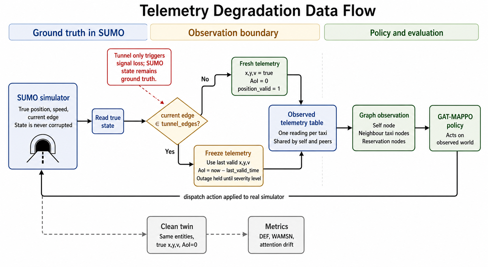
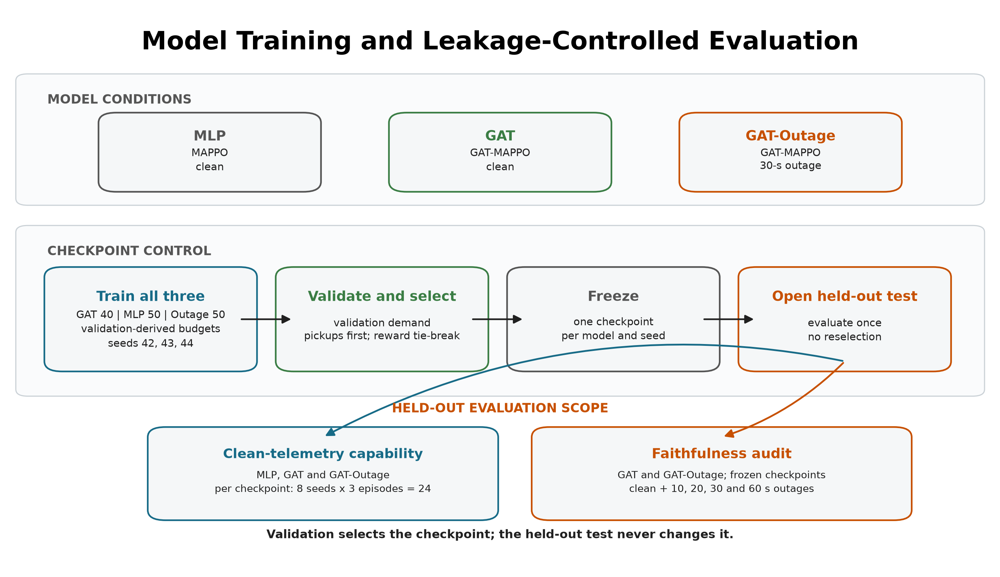
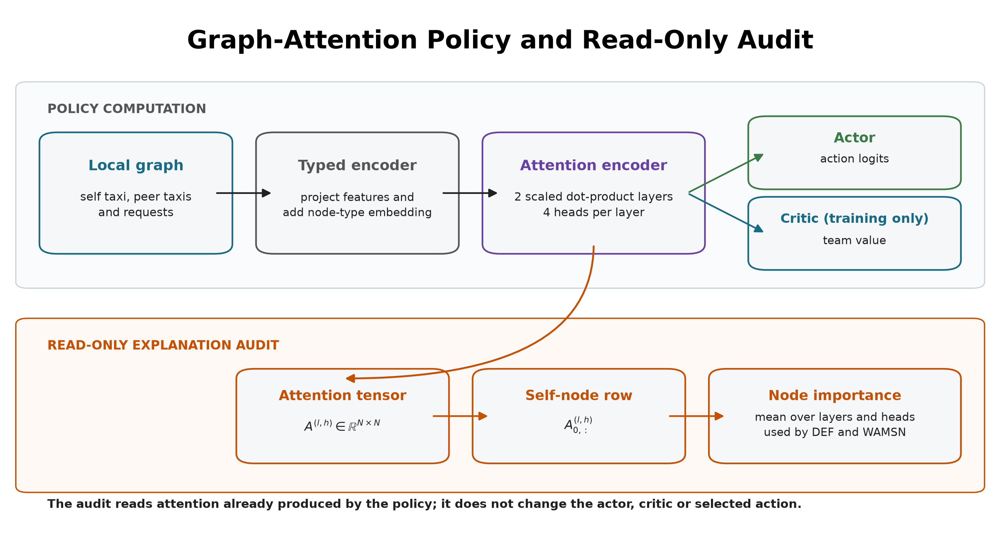

# When Explanations Outlive Their Data: Faithfulness Decoupling in Graph-Attention MARL Fleet Dispatch under Telemetry Degradation

Hongwei Lin  
De Montfort University, Dubai  
P2982757@my365.dmu.ac.uk

## Abstract

Graph-attention policies are attractive for fleet dispatch because they can
reason over nearby vehicles and pending requests. They also produce attention
weights, which are easy to turn into visual explanations. This paper asks a
simple question: when vehicle telemetry becomes stale, do those attention
explanations still describe the decision?

This question is studied in a SUMO taxi-dispatch benchmark built on a
tunnel-rich road network in Chongqing. Tunnel entry triggers simulated signal
loss, but SUMO remains the ground-truth traffic world. Degradation is applied
only when observations are built for the policy: the policy receives a taxi's
last valid position and speed while its Age of Information (AoI) grows. The
main model is a GAT-MAPPO dispatcher, evaluated with two explanation metrics:
Dispatch Explanation Faithfulness (DEF), based on counterfactual occlusion,
and Weighted Attention Mass on Stale Nodes (WAMSN), which measures how much
attention is placed on stale vehicle telemetry.

The main finding is that the built-in attention channel is not a reliable
explanation even before telemetry is degraded. Under the original uniform
random occlusion baseline, clean margin-DEF appears strongly worse than random
(-0.541). A construct-validity audit shows that this is mostly a protocol
artifact: reservation nodes also correspond to actions, so occluding one can
delete an action from the decision problem. With a type-matched random
baseline, clean margin-DEF is near zero (-0.009). Under tunnel degradation,
attention shifts toward stale vehicle nodes (WAMSN rises from 0 to about
0.013, p < 0.001), and decisions with more stale-node attention are less
faithful within episodes. However, aggregate faithfulness and task performance
remain flat. Degradation-aware training does not fix the channel, and a
decoupled occlusion-distilled explainer gives only a small clean-data
improvement. The practical lesson is that attention maps can keep looking
reasonable while the data behind them ages, so they should be audited before
being used as explanations.

**Index Terms** — explainable reinforcement learning, graph attention,
multi-agent reinforcement learning, fleet dispatch, Age of Information,
faithfulness, SUMO.

## I. Introduction

Fleet dispatch is a relational decision problem. A taxi should not choose a
request by looking only at itself; it also needs to consider nearby taxis,
nearby passengers, and the current state of the road network. Graph neural
networks fit this structure naturally, and graph attention networks go one
step further by assigning weights to the entities in the graph.

Those weights help the model compute a decision, but they are easy to
misinterpret. A dashboard can show that a model "attended to" a particular
taxi or reservation, and the display can look like an explanation. The problem
is that attention is not automatically faithful. It may help the model compute
an action without showing what actually caused that action.

This risk becomes sharper when telemetry is stale. In a fleet system, a
vehicle may lose signal in a tunnel or an urban shadow zone. The vehicle keeps
moving, but the dispatch system may only have its last known position. An
attention map may still look tidy and confident, even though part of the
graph is now built from old data. This is **faithfulness decoupling**:
the explanation can become unreliable, or change its content, without a clear
warning in task performance.

This paper asks:

> Do attention-based explanations in a GAT-MARL fleet dispatcher remain
> faithful when telemetry becomes stale?

The answer from this study is mostly no. Under a corrected faithfulness
baseline, the attention channel is already near random on clean telemetry.
Under degradation, it shifts toward stale nodes without becoming a more
trustworthy explanation.

The contributions are:

1. A SUMO-based fleet-dispatch benchmark with tunnel-triggered AoI
   degradation.
2. A clear separation between SUMO ground truth and the degraded observation
   seen by the policy.
3. A graph-attention dispatch policy whose attention weights can be audited
   per decision.
4. A construct-validity audit showing that naive occlusion baselines are
   confounded when explanation nodes also represent action candidates.
5. Empirical evidence that stale telemetry changes attention content while
   performance and aggregate faithfulness remain flat.

## II. Related Work

### A. Reinforcement Learning for Fleet Dispatch

Reinforcement learning has been widely studied for ride-hailing and fleet
management [1], [2]. Multi-agent methods are especially natural because many
vehicles act in the same city at the same time. This work uses MAPPO [5] as a
practical backbone, but the aim is not to introduce a new dispatch algorithm.
In this work, the learned dispatcher is used as a controlled setting for
studying explanation faithfulness.

### B. Attention as Explanation

The claim that attention explains a model's decision has been debated for
several years. Jain and Wallace argued that attention can be weakly related to
feature importance [12]. Later work refined the debate: attention may or may
not be explanatory depending on the model, the task, and the faithfulness test
[13], [14], [17]. This paper follows the stricter view: attention is treated
as a candidate explanation, not as proof of explanation.

Perturbation tests such as comprehensiveness and sufficiency are common in
faithfulness evaluation [16]. They ask whether removing or keeping the
explanation-selected inputs changes the model output. In this project, that
idea needs special care because reservation nodes are also dispatch actions.
Removing a reservation node can change the action set, not only the input
evidence. That detail becomes central to the audit in Section IV.

### C. Age of Information

Age of Information measures how old a received state update is [21]. It is a
natural way to describe stale telemetry. Here AoI is used in two ways: as the
severity variable for simulated signal loss, and as the node-level freshness
signal used by WAMSN.

## III. Experimental Design

The experiment has three moving parts: the simulator, the graph-attention
policy, and the degradation layer.



**Fig. 1. Telemetry degradation data flow.** SUMO remains the ground-truth
world. Tunnel edges only trigger signal loss; the degradation itself is
implemented when observations are built for the policy.

### A. SUMO Dispatch Environment

The benchmark uses SUMO [22] on a real OpenStreetMap extract of Central Park
in Chongqing's Yubei district. The area contains real tunnel edges, which are
used as physically grounded signal-loss zones. Each episode has 20 taxis, 50
ride requests, and 1,200 simulated seconds. Demand is generated from fixed
seeds and split into train, validation, and held-out test variants.

Each idle taxi is an agent. At each decision step, the taxi can either do
nothing or accept one of its five nearest pending reservations:

```text
action 0     = no-op
actions 1-5 = accept one candidate reservation
```

### B. Why Several Model Conditions Are Used

The main model is B2, a GAT-MAPPO dispatcher. The other conditions are not
extra models for their own sake. Each one answers a specific control question:
what happens without learning, without graph attention, without AoI features,
or with degradation-aware training?



**Fig. 2. Model conditions and training process.** B2 is the main audited
attention model. B0, B1, B3, and H5' are included to separate task
performance, graph attention, AoI input, and degradation-aware training.

**Table I. Model Conditions**

| Condition | Trained? | Training telemetry | Purpose |
|---|---:|---|---|
| B0 SUMO greedy | No | Not trained | Non-learning dispatch reference |
| B1 MLP-MAPPO | Yes | Clean | RL baseline without graph attention |
| B2 GAT-MAPPO | Yes | Clean | Main attention model under audit |
| B3 GAT-MAPPO without AoI | Yes | Clean | Control for explicit freshness input |
| H5' degradation-aware GAT | Yes | Tunnel-freeze degradation | Test whether degraded training helps |

B1, B2, and B3 are trained on clean telemetry. H5' is trained with
tunnel-triggered freeze degradation. After training, checkpoints are frozen
and evaluated on held-out test demand under clean telemetry and the AoI
severity ladder.

### C. Graph-Attention Policy

For each acting taxi, the environment builds one self-centred graph. The graph
contains the taxi itself, up to five nearby taxis, and up to five candidate
reservations. One graph therefore corresponds to one taxi decision.


**Fig. 3. Observation graph for one dispatch decision.** The policy sees the
acting taxi, nearby taxi context, and candidate reservations in a single small
graph.



**Fig. 4. Simplified graph-attention design.** The policy first embeds the
self, taxi, and reservation nodes into a shared space. Valid nodes then attend
to each other. The final embeddings produce dispatch actions, while the
attention map is kept for faithfulness testing.

The node types are:

**Table II. Observation Graph**

| Node type | Main features | Role |
|---|---|---|
| Self taxi | position, time, velocity, AoI | The acting vehicle |
| Peer taxi | relative position, availability, distance, AoI | Local fleet context |
| Reservation | pickup/drop-off vectors, waiting time | Candidate action |

The graph is fully connected over valid nodes. This is manageable because the
graph has at most 11 nodes. Padding masks remove missing neighbours or
reservations from attention and from the action logits.

The GAT uses two layers and four attention heads. The actor reads the final
self embedding to score the no-op action, and the final reservation embeddings
to score reservation actions. The attention tensor is returned by the forward
pass and used as the **coupled explanation channel**.

This design is compact and easy to audit, but it creates a methodological
trap:

```text
reservation node <-> reservation action
```

Because each reservation node maps to an action, occluding a reservation node
can delete that action. This is the key artifact found later in the results.

### D. Telemetry Degradation

Tunnel degradation is implemented as freeze semantics. If a taxi is on a
tunnel edge, the degradation layer keeps returning its last valid position and
speed. AoI grows as:

```text
AoI = current time - last valid update time
```

The SUMO state is not changed. The taxi keeps moving in the simulator, and
dispatch actions still apply to the real SUMO state. Only the policy's
observation is stale.

The severity ladder is:

```text
clean, 5 s, 15 s, 30 s, 60 s
```

Each degraded level means the outage is held until the taxi's AoI reaches that
level. Long tunnel transits can still create higher empirical AoI.

### E. Training

All learned models use the same MAPPO training structure. Each epoch runs one
complete SUMO episode, stores every acting taxi's observation, sampled action,
log probability, value estimate, and team reward, then updates the shared
policy with PPO.

The team reward is:

```text
R = 10 * pickups + 0.5 * successful dispatches - 0.001 * mean pending wait
```

Generalised Advantage Estimation uses gamma = 0.99 and lambda = 0.95. PPO
uses a clip ratio of 0.2, four PPO epochs, minibatches of 256, and entropy
regularisation. The best checkpoint is selected by rolling mean training
pickups, because the policies often suffer entropy collapse and the final
epoch is not always the best one.

### F. Faithfulness Metrics

For a decision with selected action `a*`, DEF asks whether the top-k nodes
chosen by the explanation actually matter to the decision.


**Fig. 5. DEF occlusion protocol.** The same decision is evaluated before and
after removing or keeping the explanation-selected nodes, then compared with a
matched random baseline.

Comprehensiveness removes the explanation nodes:

```text
Comp = f(a* | G) - f(a* | G without R_k)
```

Sufficiency keeps only the explanation nodes:

```text
Suff = f(a* | G) - f(a* | R_k)
```

Both are compared with random explanations of the same size:

```text
DEF = 0.5 * ((Comp - Comp_rand) + (Suff_rand - Suff))
```

The original probability-based DEF is reported, but the main analysis uses
margin-DEF because the trained policies are often softmax-saturated. The
margin looks at how far the chosen action is ahead of the next-best action:

```text
margin = logit(a*) - max logit(other action)
```

WAMSN measures how much vehicle-node attention is placed on stale telemetry:

```text
WAMSN = sum_i alpha_i * (AoI_i / AoI_max) / sum_i alpha_i
```

Reservations have no AoI, so WAMSN is computed only over the self and
peer-taxi nodes.

### G. Statistical Testing

The main sweep evaluates B2 over clean telemetry and four max-AoI levels, with
eight environment seeds and three held-out test episodes per cell. One in
eight decisions is scored for faithfulness, giving about 18,000 scored
decisions.

Because decisions are clustered inside episodes and seeds, the confirmatory
tests use episode-level or cell-level statistics:

- H1 and H3: episode-block permutation trend tests.
- H2: paired sign-flip test over severity cells.
- H4: within-episode WAMSN-DEF association.
- Holm correction across H1-H4.

## IV. Results

### A. Performance Context

The learned dispatchers are weak compared with SUMO's greedy matcher. The
greedy baseline completes about 32 pickups per episode. The learned policies
complete about 6-8 pickups, with B2 at 6.7 +/- 1.9.

This matters for interpretation. The results should not be read as evidence
for a deployable dispatcher. They describe explanation behaviour in the
learned-policy regime actually achieved.

**Table III. Performance Context**

| Policy | Role | Pickups per episode |
|---|---|---:|
| SUMO greedy | Non-learning reference | ~32 |
| B2 GAT-MAPPO | Main audited policy | 6.7 +/- 1.9 |
| Learned-policy range | B1/B2/B3/H5' | 6-8 |

### B. Attention Is Near-Random on Clean Telemetry

The first result looked dramatic at first. Under the original uniform random
occlusion baseline, B2's clean margin-DEF was -0.541, with a 95% confidence
interval of [-0.556, -0.527]. That seems to say attention is worse than
random.

The audit showed that this reading was misleading. Uniform random occlusion
hit reservation nodes much more often than attention top-k occlusion did. In
this architecture, hitting a reservation node can delete an action, so the
random baseline was not a fair comparison.

With a type-matched random baseline, clean margin-DEF moved from -0.554 to
-0.009, with a 95% confidence interval of [-0.016, -0.001]. In practical
terms, the attention channel is not meaningfully faithful on clean telemetry.
It is near random, slightly below the corrected random baseline.


**Fig. 6. Clean-data faithfulness audit.** The apparent worse-than-random
result collapses to near zero when the random baseline is matched to the node
types selected by attention.

**Table IV. Construct-Validity Audit**

| Quantity | Value | Interpretation |
|---|---:|---|
| Uniform clean margin-DEF | -0.541 | Apparent worse-than-random result |
| Paired uniform baseline | -0.554 | Before correction |
| Type-matched baseline | -0.009 | Corrected, near-zero result |
| Artifact share | 98.3% | Most of the deficit is protocol artifact |
| Clamp rate, random baseline | 14.6% | Random occlusion deletes actions often |
| Clamp rate, attention top-k | 1.8% | Attention top-k deletes actions less often |

The same pattern holds across the available capability spectrum. Under the
uniform baseline, margin-DEF swings from -1.35 to +1.78 across checkpoints.
Under the type-matched baseline, every checkpoint is near zero. This is strong
evidence that the uniform metric is unstable in candidate-action settings.

### C. Under Degradation, Attention Moves Toward Stale Nodes

H1 predicted that faithfulness would decrease as telemetry became more stale.
That was not supported. Margin-DEF stayed flat. The reason is a floor effect:
the attention channel was already near random on clean telemetry.

H3 was supported. WAMSN rose from 0 in the clean condition to about 0.013 as
soon as staleness existed (rho = +0.092, p < 0.001, cluster CI
[+0.052, +0.128]). The pooled number is small because only a small fraction of
decisions expose stale vehicle nodes. Conditional on exposure, stale nodes
received about 14% of vehicle-node attention.

H4 was also supported. Within episodes, decisions with more stale-node
attention were less faithful. The WAMSN-DEF correlation was negative in 89% of
episodes, with mean within-episode rho = -0.140 and p < 0.001.

H2 was supported under the rate framing, but it is the weakest result:
faithfulness-degradation rates exceeded performance-degradation rates over 32
cells after Holm correction (p = 0.039). The stronger evidence is H3/H4: stale
telemetry changes where attention goes, and stale-node attention is associated
with lower faithfulness.


**Fig. 7. Silent stale-attention drift.** Margin-DEF and pickups stay flat
across the severity ladder, while WAMSN rises when staleness is introduced.

**Table V. B2 Severity Sweep**

| Max AoI (s) | Margin-DEF | Pickups | WAMSN |
|---:|---:|---:|---:|
| 0 | -0.541 | 6.67 | 0.000 |
| 5 | -0.546 | 7.42 | 0.015 |
| 15 | -0.544 | 6.79 | 0.012 |
| 30 | -0.541 | 6.54 | 0.013 |
| 60 | -0.542 | 7.42 | 0.013 |

**Table VI. Hypothesis Outcomes**

| Hypothesis | Result | Reading |
|---|---|---|
| H1: severity lowers DEF | Not supported | DEF already at floor |
| H2: faithfulness drops faster than performance | Supported cautiously | p = 0.039, rate framing |
| H3: severity increases WAMSN | Supported | WAMSN rises under staleness |
| H4: WAMSN relates negatively to DEF | Supported | More stale attention, lower faithfulness |
| H5: degraded training changes faithfulness | No useful mitigation | H5' remains near zero |

### D. Mitigation Does Not Restore Faithfulness

H5' tested whether training with tunnel-freeze degradation makes attention
more faithful. It did not. Under the corrected type-matched baseline, H5'
remained near zero, like B2.

The decoupled explanation head performed slightly better. On clean telemetry,
coupled attention scored -0.013 and the decoupled head scored +0.010, a gain
of +0.023 margin-DEF (n = 983, p < 0.001). Under tunnel degradation at max-AoI
60 s, the gain fell to +0.005 and was not significant (n = 878, p = 0.21).


**Fig. 8. Coupled vs decoupled explanation.** Directly training an explanation
head helps a little on clean telemetry, but the improvement is small and does
not survive degradation.

**Table VII. Mitigation Results**

| Condition | Coupled attention | Mitigated channel | Delta | p |
|---|---:|---:|---:|---:|
| H5' degradation-aware training | ~0 | ~0 | ~0 | no effect |
| Decoupled head, clean | -0.013 | +0.010 | +0.023 | <0.001 |
| Decoupled head, tunnel 60 s | -0.006 | -0.000 | +0.005 | 0.21 |

## V. Discussion

The result is not simply "telemetry degradation makes explanations worse."
The story is more uncomfortable than that. The built-in attention channel is
not meaningfully faithful on clean telemetry. When telemetry becomes stale,
attention still shifts toward stale nodes, but the aggregate faithfulness
score cannot fall much further because it is already near the floor.

For an operator, this is exactly the dangerous case. The dashboard may still
show a neat attention map. Pickups may look unchanged. The faithfulness metric
may look flat. Yet the content of the explanation has quietly moved toward
stale telemetry.

The most transferable contribution is the occlusion audit. In any model where
input entities also represent possible actions, a perturbation test can change
the decision problem. This applies beyond taxi dispatch: pointer networks,
matching systems, assignment policies, and action-graph policies can all have
the same issue. Random baselines must be matched to the structure of the
explanation being tested.

## VI. Limitations

The study has clear limits.

First, the learned policy is much weaker than SUMO greedy. The findings
therefore describe the achieved learned-policy regime, not a production-grade
dispatcher.

Second, the benchmark is small: one district, 20 taxis, 50 requests, and
1,200 s episodes. Tunnel exposure is also sparse, so pooled WAMSN values are
small.

Third, the main B2 policy is one training seed. The severity sweeps use eight
environment seeds, and H5' uses multiple training seeds, but a stronger
multi-seed policy study would be better.

Fourth, faithfulness is measured through occlusion. The audit fixes a major
occlusion artifact, but other attribution methods may reveal different
failure modes.

Finally, the frozen summaries are archived, but full raw-cell reanalysis
requires rerunning the sweeps from the recorded manifests and checkpoints.

**Table VIII. Limitations and Impact**

| Limitation | Impact |
|---|---|
| Learned policy below greedy baseline | Claims are scoped to low-capability learned dispatch |
| One city district | Multi-city generality remains open |
| Sparse tunnel exposure | Conditional WAMSN is more informative than pooled WAMSN |
| One main B2 training seed | Stronger training replication is future work |
| Occlusion-based faithfulness | Other attribution tests should be studied |

## VII. Conclusion

This paper studied whether graph-attention explanations remain faithful when
fleet telemetry becomes stale. In the studied system, they do not. After
correcting the occlusion baseline, the coupled attention channel is near
random on clean telemetry. Under tunnel-triggered degradation, attention moves
toward stale vehicle nodes, and decisions with more stale-node attention are
less faithful, while performance and aggregate faithfulness remain flat.

Training with degradation does not repair the channel. A decoupled
occlusion-distilled head helps slightly on clean data, but not enough to solve
the problem under degradation.

The practical conclusion is straightforward: attention maps should not be
treated as explanations just because they are available. In fleet dispatch,
especially under stale telemetry, they need the same kind of audit as any
other explanation method.

## References

[1] K. Lin, R. Zhao, Z. Xu, and J. Zhou, "Efficient large-scale fleet
management via multi-agent deep reinforcement learning," in *Proc. ACM SIGKDD
Int. Conf. Knowledge Discovery and Data Mining*, 2018, pp. 1774-1783.

[2] Z. Qin, H. Zhu, and J. Ye, "Reinforcement learning for ridesharing: An
extended survey," *Transportation Research Part C: Emerging Technologies*,
vol. 144, 2022.

[3] R. Lowe et al., "Multi-Agent Actor-Critic for Mixed Cooperative-Competitive
Environments," in *Advances in Neural Information Processing Systems*, 2017.

[4] T. Rashid et al., "Monotonic value function factorisation for deep
multi-agent reinforcement learning," *Journal of Machine Learning Research*,
vol. 21, no. 178, pp. 1-51, 2020.

[5] C. Yu et al., "The surprising effectiveness of PPO in cooperative
multi-agent games," in *Advances in Neural Information Processing Systems*,
2022.

[6] F. Scarselli, M. Gori, A. C. Tsoi, M. Hagenbuchner, and G. Monfardini,
"The graph neural network model," *IEEE Transactions on Neural Networks*,
vol. 20, no. 1, pp. 61-80, 2009.

[7] P. Velickovic et al., "Graph Attention Networks," in *Proc. International
Conference on Learning Representations*, 2018.

[8] S. Iqbal and F. Sha, "Actor-Attention-Critic for Multi-Agent Reinforcement
Learning," in *Proc. International Conference on Machine Learning*, 2019.

[9] A. Vaswani et al., "Attention is all you need," in *Advances in Neural
Information Processing Systems*, 2017.

[10] A. Heuillet, F. Couthouis, and N. Diaz-Rodriguez, "Explainability in deep
reinforcement learning," *Knowledge-Based Systems*, vol. 214, 2021.

[11] P. Madumal, T. Miller, L. Sonenberg, and F. Vetere, "Explainable
reinforcement learning through a causal lens," in *Proc. AAAI Conference on
Artificial Intelligence*, 2020.

[12] S. Jain and B. C. Wallace, "Attention is not Explanation," in *Proc.
NAACL-HLT*, 2019, pp. 3543-3556.

[13] S. Wiegreffe and Y. Pinter, "Attention is not not Explanation," in *Proc.
EMNLP-IJCNLP*, 2019, pp. 11-20.

[14] S. Serrano and N. A. Smith, "Is attention interpretable?" in *Proc. ACL*,
2019, pp. 2931-2951.

[15] Y. Liu et al., "Rethinking attention-model explainability through
faithfulness violation test," in *Proc. ICML*, 2022.

[16] J. DeYoung et al., "ERASER: A benchmark to evaluate rationalized NLP
models," in *Proc. ACL*, 2020, pp. 4443-4458.

[17] A. Jacovi and Y. Goldberg, "Towards faithfully interpretable NLP systems:
How should we define and evaluate faithfulness?" in *Proc. ACL*, 2020,
pp. 4198-4205.

[18] M. T. Ribeiro, S. Singh, and C. Guestrin, "'Why should I trust you?':
Explaining the predictions of any classifier," in *Proc. ACM SIGKDD*, 2016,
pp. 1135-1144.

[19] D. Alvarez-Melis and T. S. Jaakkola, "On the robustness of interpretability
methods," arXiv:1806.08049, 2018.

[20] Z. C. Lipton, "The mythos of model interpretability," *Queue*, vol. 16,
no. 3, pp. 31-57, 2018.

[21] S. Kaul, R. Yates, and M. Gruteser, "Real-time status: How often should
one update?" in *Proc. IEEE INFOCOM*, 2012, pp. 2731-2735.

[22] P. A. Lopez et al., "Microscopic traffic simulation using SUMO," in
*Proc. IEEE International Conference on Intelligent Transportation Systems*,
2018, pp. 2575-2582.
