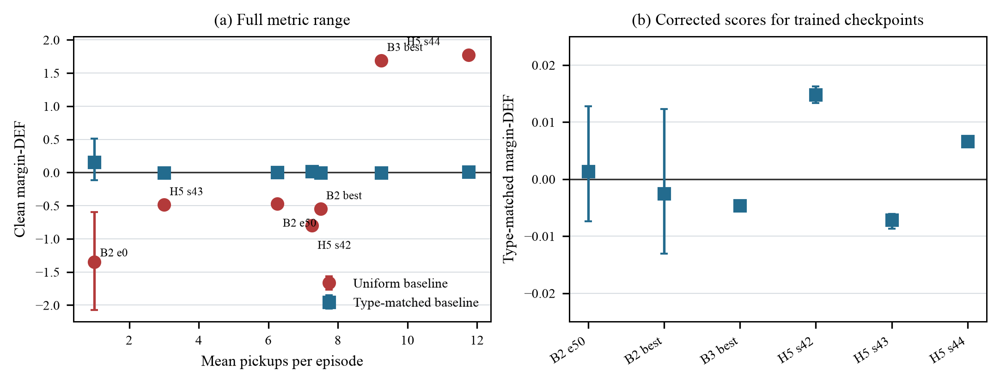
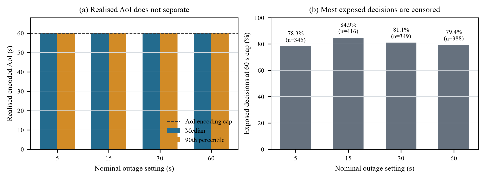

::: {.paper-front}

# When Explanations Outlive Their Data: Faithfulness Decoupling in Graph-Attention MARL Fleet Dispatch under Telemetry Degradation

Hongwei Lin  
De Montfort University, Dubai  
P2982757@my365.dmu.ac.uk

## Abstract

Graph-attention policies expose weights that are easy to display as
explanations, but those explanations may remain plausible after the telemetry
beneath them becomes stale. This dissertation studies that risk in multi-agent
fleet dispatch. In a SUMO benchmark, tunnel entry triggers signal loss:
vehicles continue to move, while the policy receives their last valid state
and their Age of Information (AoI) increases. Decision-level explanation
faithfulness (DEF) measures explanation quality, and weighted attention mass on
stale nodes (WAMSN) measures attention to outdated vehicle information.

On clean telemetry, a standard random occlusion baseline gives margin-DEF of
-0.541. This comparison is unfair because removing a passenger-request node
also removes its dispatch action. Matching the random baseline to the same
mixture of vehicle and request nodes changes the score to -0.009 [-0.016,
-0.001]. Built-in attention is therefore approximately uninformative, not
actively worse than random.

Under degradation, pooled WAMSN rises from 0 to 0.014. When a stale vehicle
node is visible, it receives 13.4-14.8 % of vehicle-node attention. Pickups and
aggregate faithfulness remain broadly flat, while decisions with more
stale-node attention are less faithful within episodes (margin-DEF rho =
-0.045; probability-DEF rho = -0.149). This is the observed faithfulness
decoupling: explanation content shifts toward stale information without a
warning from performance or aggregate faithfulness. Because the intended
severity ladder did not produce distinct realised staleness levels, the
evidence supports a clean-versus-degraded comparison rather than an AoI
dose-response claim.

Degradation-aware training has no detectable effect. A separate explanation
head improves clean margin-DEF by +0.023, but not detectably under degradation.
The study shows how attention explanations can outlive their data and why the
faithfulness test must itself be validated.

**Index Terms** — explainable reinforcement learning, faithfulness
evaluation, construct validity, graph attention, multi-agent reinforcement
learning, fleet dispatch, Age of Information, SUMO.

:::

## I. Introduction

Fleet dispatch systems depend on timely vehicle locations, speeds and
availability. In practice, those updates can be delayed by tunnels, signal
loss and dense urban infrastructure. A dispatcher may continue to produce a
decision from the last available state, but an explanation of that decision
can then refer to information that is no longer current. Stable task
performance alone does not show that the explanation remains trustworthy.

This dissertation studies that problem in a graph-attention multi-agent
reinforcement learning (MARL) dispatcher. Fleet dispatch is relational: a taxi
chooses among passenger requests while considering nearby vehicles and
competing demand. Graph attention networks [7] provide a compact way to model
those relationships and expose per-node attention weights. Because the weights
are easy to visualise, they are tempting to present as explanations. Previous
work has shown, however, that attention is not automatically faithful to a
model's decision [12]-[15].

The central concern is **faithfulness decoupling**. In this study the term has
a specific meaning: the content of the explanation shifts toward stale data,
while task performance and aggregate faithfulness provide no corresponding
warning. This is narrower than claiming that increasing AoI directly causes a
monotonic loss of faithfulness. The experiments do not support that stronger
dose-response claim.

Three research questions organise the study:

1. **RQ1:** Is the GAT attention channel a faithful explanation of dispatch
   decisions under clean telemetry?
2. **RQ2:** How does stale telemetry affect explanation content and its
   relationship with task performance?
3. **RQ3:** Can degradation-aware training or a separate explanation head
   reduce the problem?

Answering RQ1 requires validating the faithfulness test itself. Perturbation
tests normally remove the inputs selected by an explanation and compare the
effect with removing random inputs [16]. In this dispatcher, however, a
passenger-request node is also a dispatch action. Removing a nearby-taxi node
only hides context; removing a request node also deletes an available action.
A random baseline that removes more requests than the attention explanation
therefore creates an unfair comparison. The study audits this effect and uses
a type-matched baseline that removes the same mixture of vehicle and request
nodes on both sides.

The experiment is conducted in SUMO [22] on a tunnel-rich road network in
Chongqing. Tunnel entry triggers simulated signal loss, but SUMO continues to
move the vehicle using the true state. Only the observation supplied to the
policy is degraded: its last valid position and speed are retained while Age
of Information (AoI) [21] grows. This separation keeps the physical traffic
world intact and isolates the effect of stale information on the policy and
its explanation.

The corrected clean-telemetry result is that built-in attention is
approximately uninformative: type-matched margin-DEF is -0.009. Under degraded
telemetry, attention moves onto stale vehicle nodes while pickups and aggregate
faithfulness remain broadly flat. Decisions with more stale-node attention are
also less faithful within episodes. Degradation-aware training does not change
this result, and a decoupled explanation head provides only a small improvement
on clean telemetry.

The intended `{5, 15, 30, 60}` s AoI ladder did not create distinct realised
staleness levels because tunnel transit time dominated the lower settings and
the observation encoded AoI with a 60 s cap. The degradation evidence is
therefore reported as a clean-versus-degraded comparison. The learned policy
also performs well below SUMO's greedy matcher, so the degradation findings are
scoped to the experimental policy rather than a production-ready dispatcher.

The contributions are:

1. A controlled SUMO study showing that stale telemetry shifts graph attention
   toward stale vehicle nodes without a corresponding change in pickups or
   aggregate faithfulness.
2. Evidence that greater stale-node attention is associated with lower
   decision-level faithfulness within episodes.
3. A construct-validity audit showing why standard random occlusion is unfair
   when explanation units are also candidate actions, together with a
   type-matched correction.
4. An evaluation of training-side and explanation-side mitigations, neither of
   which restores meaningful faithfulness under degraded telemetry.
5. A reproducible experimental design that separates SUMO ground truth from
   the degraded observation and reports the failed severity manipulation
   explicitly.

## II. Related Work

### A. Reinforcement Learning for Fleet Dispatch

Reinforcement learning is widely used in ride-hailing and fleet management
[1], [2]. Multi-agent methods fit this problem because many vehicles act in
the same city at the same time [3]-[5]. This study uses MAPPO [5] with one
shared policy for all taxis. It does not propose a new dispatch algorithm. The
dispatcher provides a controlled setting in which each explanation can be
tested. As Section IV-A shows, it performs well below a greedy matcher.

Graph neural networks encode relationships between vehicles and requests [6].
Graph attention adds a weight for each related entity [7] and has also been
used in multi-agent critics [8]. In this study, the important point is that
these weights are visible and could be shown to an operator as an explanation.

Recent dispatch research shows how strongly the field is moving toward
graph-based MARL at city scale. BMG-Q combines graph attention with bipartite
vehicle-order matching [26], CoopRide learns cooperation between city grids
[27], and DualG-MARL jointly models vehicle-state and passenger-task graphs
[28]. These studies evaluate dispatch quality, scalability and coordination.
The present work asks a complementary question: whether the attention exposed
by such models can be trusted as an explanation when vehicle telemetry is
stale. It is therefore positioned as an explanation-reliability study, not as
a performance comparison with these larger dispatch systems.

### B. Attention as Explanation

Whether attention explains a decision has been debated for several years. Jain
and Wallace argued that attention can be weakly related to feature importance
[12]; Wiegreffe and Pinter replied that this depends on what one asks of an
explanation [13]; Serrano and Smith found attention only partially identifies
the representations that matter [14]. Liu et al. formalised the pattern as a
faithfulness violation test and found violations widespread across
attention-based explainers [15]. Jacovi and Goldberg's framing is adopted
here: faithfulness is a property to be tested, not asserted, and it is
distinct from plausibility [17]. Attention is therefore treated throughout as
a *candidate* explanation.

This debate has been conducted mostly on text classifiers. For graph models
the analogous literature is a family of dedicated explainers — GNNExplainer
[23], PGExplainer [24], and subsequent work surveyed by Yuan et al. [25] —
which exist partly because raw attention was found inadequate. Those methods
are evaluated with the same perturbation logic audited here, and inherit the
same vulnerability whenever the graph entities they rank are also action
candidates. The audit is therefore not specific to attention as an explanation
channel; it applies to the evaluation protocol.

### C. Perturbation-Based Faithfulness and Its Baselines

Comprehensiveness and sufficiency [16] are the standard perturbation tests:
remove the explanation-selected inputs, or keep only those, and measure the
change in model output. Because absolute effect sizes are not comparable
across models, the result is normalised against the same operation on randomly
selected inputs. Related concerns about perturbation-based attribution include
sensitivity to the removal operator [18] and instability under small input
changes [19]; Lipton's broader critique of interpretability as an
underspecified goal [20] applies directly to the practice of reporting a
single faithfulness scalar without validating the metric.

Less attention has been paid to *what kinds of nodes* the random control
removes. Most earlier critiques compare masking with resampling or ask whether
the perturbed input remains realistic. The problem here is different. Some
graph nodes are also actions, while others only provide context. A random
control can therefore change the action set more often than the explanation
does. Existing explainable-RL surveys [10], causal approaches [11], and local
surrogate methods such as LIME [18] do not directly address this case.

### D. Age of Information

Age of Information measures how old a received state update is [21]. It is a
natural description of stale telemetry and is used here in two ways: as the
severity variable for simulated signal loss, and as the node-level freshness
weight inside WAMSN. Section IV-C reports a consequence of the second use that
is easy to overlook — because AoI enters the observation normalised and
clipped, the metric cannot distinguish degrees of staleness beyond the
normalisation constant.

## III. Experimental Design

The experiment has three moving parts: the simulator, the graph-attention
policy, and the degradation layer.

::: {.figure-block}


**Fig. 1. Telemetry degradation data flow.** SUMO remains the ground-truth
world. Tunnel edges only trigger signal loss; the degradation itself is
implemented when observations are built for the policy.
:::

### A. SUMO Dispatch Environment

The benchmark uses SUMO [22] on a real OpenStreetMap extract of Central Park
in Chongqing's Yubei district. The area contains real tunnel edges, which are
used as physically grounded signal-loss zones. Each episode has 20 taxis, 50
ride requests, and 1,200 simulated seconds. Demand is generated from fixed
seeds and split into train, validation, and held-out test variants.

Each idle taxi is an agent. At each decision step, the taxi can either do
nothing or accept one of its five nearest pending reservations:

```text
action 0     = no-op
actions 1-5 = accept one candidate reservation
```

### B. Why Several Model Conditions Are Used

The main model is B2, a GAT-MAPPO dispatcher. The other conditions are not
extra models for their own sake. Each one answers a specific control question:
what happens without learning, without graph attention, without AoI features,
or with degradation-aware training?

::: {.figure-block}


**Fig. 2. Model conditions and training process.** B2 is the main audited
attention model. B0, B1, B3, and H5' are included to separate task
performance, graph attention, AoI input, and degradation-aware training.
:::

**Table I. Model Conditions**

| Condition | Trained? | Training telemetry | Purpose |
|---|---:|---|---|
| B0 SUMO greedy | No | Not trained | Non-learning dispatch reference |
| B1 MLP-MAPPO | Yes | Clean | RL baseline without graph attention |
| B2 GAT-MAPPO | Yes | Clean | Main attention model under audit |
| B3 GAT-MAPPO without AoI | Yes | Clean | Control for explicit freshness input |
| H5' degradation-aware GAT | Yes | Tunnel-freeze degradation | Test whether degraded training helps |

B1, B2, and B3 are trained on clean telemetry. H5' is trained with
tunnel-triggered freeze degradation. After training, checkpoints are frozen
and evaluated on held-out test demand under clean telemetry and the AoI
severity ladder.

### C. Graph-Attention Policy

For each acting taxi, the environment builds one self-centred graph. The graph
contains the taxi itself, up to five nearby taxis, and up to five candidate
reservations. One graph therefore corresponds to one taxi decision.

::: {.figure-block}


**Fig. 3. Observation graph for one dispatch decision.** The policy sees the
acting taxi, nearby taxi context, and candidate reservations in a single small
graph.
:::

::: {.figure-block}


**Fig. 4. Simplified graph-attention design.** The policy first embeds the
self, taxi, and reservation nodes into a shared space. Valid nodes then attend
to each other. The final embeddings produce dispatch actions, while the
attention map is kept for faithfulness testing.
:::

The node types are:

**Table II. Observation Graph**

| Node type | Main features | Role |
|---|---|---|
| Self taxi | position, time, velocity, AoI | The acting vehicle |
| Peer taxi | relative position, availability, distance, AoI | Local fleet context |
| Reservation | pickup/drop-off vectors, waiting time | Candidate action |

The graph is fully connected over valid nodes. This is manageable because the
graph has at most 11 nodes. Padding masks remove missing neighbours or
reservations from attention and from the action logits.

The GAT uses two layers and four attention heads. The actor reads the final
self embedding to score the no-op action, and the final reservation embeddings
to score reservation actions. The attention tensor is returned by the forward
pass and used as the **coupled explanation channel**.

This design is compact and easy to audit, and it instantiates the structural
property this paper is about:

```text
reservation node <-> reservation action
```

Each reservation node *is* an action. Occluding it therefore removes a
candidate from the action set rather than withholding evidence about it. Peer
taxi nodes carry no action, so occluding one is evidence removal in the
intended sense. A single occlusion protocol thus performs two categorically
different operations depending on which node type it happens to hit, and the
proportion of each type in a subset determines what is being measured. This is
the mechanism audited in Section IV-B.

### D. Telemetry Degradation

Tunnel degradation is implemented as freeze semantics. If a taxi is on a
tunnel edge, the degradation layer keeps returning its last valid position and
speed. AoI grows as:

```text
AoI = current time - last valid update time
```

The SUMO state is not changed. The taxi keeps moving in the simulator, and
dispatch actions still apply to the real SUMO state. Only the policy's
observation is stale.

The intended severity ladder is:

```text
clean, 5 s, 15 s, 30 s, 60 s
```

Each degraded level holds the outage until the taxi's AoI reaches that level.
Two facts about this design turn out to matter, and both are established
empirically in Section IV-C rather than assumed here. First, a taxi still
inside a tunnel when its outage expires immediately re-triggers, so tunnel
transit time places a floor under realised AoI that is independent of the
nominal level. Second, AoI reaches the policy only through the normalised
observation feature `clip(AoI / AOI_MAX_S, 0, 1)` with `AOI_MAX_S = 60 s`, and
WAMSN reuses that same clipped quantity as its staleness weight. Staleness
beyond 60 s is therefore not representable, either to the policy or to the
metric. The manipulation check in Section IV-C shows these two facts combine to
flatten the ladder into a single degraded condition.

### E. Training

All learned models use the same MAPPO training structure. Each epoch runs one
complete SUMO episode, stores every acting taxi's observation, sampled action,
log probability, value estimate, and team reward, then updates the shared
policy with PPO.

The team reward is:

$$
\begin{aligned}
R ={}& 10(\text{pickups}) + 0.5(\text{successful dispatches}) \\
     &- 0.001(\text{mean pending wait}).
\end{aligned}
$$

Generalised Advantage Estimation uses gamma = 0.99 and lambda = 0.95. PPO
uses a clip ratio of 0.2, four PPO epochs, minibatches of 256, and entropy
regularisation. The best checkpoint is selected by rolling mean training
pickups, because the policies often suffer entropy collapse and the final
epoch is not always the best one.

### F. Explanation Metrics and Validity Check

For a decision with selected action `a*`, DEF asks whether the top-k nodes
chosen by the explanation actually matter to the decision.

One distinction is essential before the equations. Removing a nearby-taxi
node hides contextual information, but the set of dispatch actions remains the
same. Removing a passenger-request node also removes that request from the
available actions. A fair random baseline must therefore remove the same mix
of vehicle and request nodes as the explanation; matching only the number of
removed nodes is not enough.

::: {.figure-block}


**Fig. 5. DEF occlusion protocol.** The same decision is evaluated before and
after removing or keeping the explanation-selected nodes, then compared with a
matched random baseline.
:::

Comprehensiveness removes the explanation nodes:

$$
\mathrm{Comp} = f(a^* \mid G) - f(a^* \mid G \setminus R_k).
$$

Sufficiency keeps only the explanation nodes:

$$
\mathrm{Suff} = f(a^* \mid G) - f(a^* \mid R_k).
$$

Both are compared with random subsets of the same size:

$$
\mathrm{DEF} = \frac{1}{2}
\left[(\mathrm{Comp}-\mathrm{Comp}_{rand})
+(\mathrm{Suff}_{rand}-\mathrm{Suff})\right].
$$

Two DEF variants are computed from the same counterfactual forwards.
Probability-DEF uses `f = pi(a*)`. Margin-DEF uses the logit gap between the
chosen action and its closest competitor:

$$
\mathrm{margin} = \mathrm{logit}(a^*)
- \max_{a \ne a^*}\mathrm{logit}(a).
$$

**Margin-DEF is the primary metric.** The trained policies often assign a
probability close to 1 to the chosen action, so probability-DEF changes very
little after occlusion. Margin-DEF retains more signal. Probability-DEF is
still reported when it gives a different result; Section IV-C shows one such
case. Margins are limited to +/-10 logits because removing the chosen action's
node sends its logit to negative infinity. The clamp rate is reported because
frequent clamping indicates that occlusion is deleting actions.

**Random-baseline composition.** Two sampling schemes are used for the control
subsets. *Uniform* draws size-k subsets uniformly from all valid non-self
nodes; this is the standard protocol and what the original analysis used.
*Type-matched* draws subsets with the same taxi/reservation composition as the
attention top-k set, so the control withholds the same mixture of evidence and
actions that the explanation does. The comparison between the two is the audit.

WAMSN measures how much vehicle-node attention is placed on stale telemetry:

$$
\mathrm{WAMSN} =
\frac{\sum_i \alpha_i\,\mathrm{clip}(\mathrm{AoI}_i/\mathrm{AoI}_{max},0,1)}
{\sum_i \alpha_i}.
$$

Reservations carry no AoI, so WAMSN runs over the self and peer-taxi nodes
only. The clip is the censoring discussed in Section III-D: at
`AoI_max = 60 s` every node past one minute of staleness receives weight
exactly 1.0, so WAMSN is a *stale-attention share* rather than an
AoI-weighted mean whenever outages are long.

### G. Statistical Testing

The main sweep evaluates B2 over clean telemetry and four max-AoI levels, with
eight environment seeds and three held-out test episodes per cell. One in
eight decisions is scored for faithfulness, giving 17,764 scored decisions
(17,444 with at least one valid reservation).

Decisions are clustered inside episodes, which share demand, geography and
policy state, so no test treats decisions as independent:

- H1 and H3: episode-block permutation trend tests, where level labels are
  permuted between whole episodes and never within them.
- H2: paired sign-flip test over severity cells.
- H4: Spearman association computed *inside* each episode and aggregated
  across episodes, with a sign test on the episode-level coefficients. Ties
  are corrected by average ranks; this is not cosmetic, since WAMSN is exactly
  zero for roughly 90 % of decisions and uncorrected ranks reverse the sign of
  the coefficient.
- Confidence intervals: cluster bootstrap resampling episodes, 10,000 draws.
- Holm correction across the H1-H4 family.

Permutation tests use 10,000 draws, so the smallest attainable p-value is
1/10,001. Results at that floor are reported as `p <= 1e-4` rather than as
`p < 0.001`, which would misstate the available resolution.

Two sweeps are referenced and are kept distinct throughout. `B2_aoi_ladder` is
the source of the preregistered H1-H4 statistics. `B2_aoi_ladder_v2` is the
re-run with clamp, exposure and AoI instrumentation added, and is the source of
every diagnostic quantity. Where both are available the numbers agree to
within 0.01 margin-DEF.

## IV. Results

### A. Performance Context

The learned dispatchers are weak compared with SUMO's greedy matcher. The
greedy baseline completes about 32 pickups per episode; the learned policies
complete 6-8, with B2 at 6.7 +/- 1.9. The training runs suffer entropy
collapse, and two of three H5' seeds reach their best rolling performance at
epochs 17-22.

This is stated first because it bounds every claim that follows. Nothing here
is evidence for a deployable dispatcher. It matters less for the
methodological result than it might appear, however, and Section IV-B
establishes why: the metric pathology is demonstrated across seven checkpoints
spanning 1.0 to 11.8 pickups per episode, including an untrained one, so it is
not a property of weak policies.

**Table III. Performance Context**

| Policy | Role | Pickups per episode |
|---|---|---:|
| SUMO greedy | Non-learning reference | ~32 |
| B2 GAT-MAPPO | Main audited policy | 6.7 +/- 1.9 |
| Learned-policy range | B1/B2/B3/H5' | 6-8 |
| Capability spectrum (Table V) | Seven audited checkpoints | 1.0-11.8 |

### B. RQ1: Clean-Telemetry Faithfulness and Metric Validation

#### 1. Why Uniform Occlusion Is Unfair

With the standard uniform random baseline, B2's clean margin-DEF is -0.541
[-0.556, -0.527]. Taken alone, this suggests that attention is much worse than
random node selection.

The clamp rate shows why this reading is wrong. It measures how often occlusion
deletes the chosen action and forces the decision margin to its limit. Random
sets clamp in 14.8 % of decisions, compared with 2.2 % for attention top-k
sets. The random control removes request actions much more often than the
attention explanation. The two sides are therefore not comparable.

Matching the random set to the same mix of taxi and request nodes removes
almost all of the effect. Across 1,199 paired decisions, margin-DEF changes
from -0.554 to **-0.009 [-0.016, -0.001]**. The unfair baseline accounts for
**98.3 % of the original deficit.**

Two independent controls agree with the corrected value:

- **Clamp-free subset.** When neither side deletes the chosen action,
  margin-DEF is **+0.000 [-0.003, +0.003]** (n = 90). This subset is small and
  contains easier decisions, so it supports but does not replace the
  type-matched result.
- **Chosen-action exclusion variant.** Protecting the chosen request node on
  both sides changes an apparent +0.586 to -0.024 [-0.025, -0.023]. This test
  applies to only 136 of 17,444 decisions, so it is supporting evidence.

The corrected conclusion is simple: attention is **approximately
uninformative**. It performs close to a random explanation that selects the
same kinds of nodes. The original score mainly measured the link between
request nodes and dispatch actions.

::: {.figure-block}


**Fig. 6. Clean-data faithfulness audit.** The apparent worse-than-random
result collapses to near zero when the random baseline is matched to the node
types selected by attention.
:::

**Table IV. Construct-Validity Audit**

| Quantity | Value | n | Interpretation |
|---|---:|---:|---|
| Uniform clean margin-DEF | -0.541 [-0.556, -0.527] | 3,565 | Apparent worse-than-random result |
| Paired uniform baseline | -0.554 [-0.581, -0.529] | 1,199 | Same decisions, before correction |
| **Type-matched baseline** | **-0.009 [-0.016, -0.001]** | 1,199 | Corrected: uninformative, not adversarial |
| Artifact share | 98.3 % | — | Fraction of the deficit that is protocol |
| Clamp-free subset | +0.000 [-0.003, +0.003] | 90 | Independent control, no modelling assumption |
| Chosen-action exclusion variant | -0.024 [-0.025, -0.023] | 136 | Apparent +0.586 on the same decisions |
| Clamp rate, random baseline | 14.8 % (16.4 % per level) | 17,444 | Random occlusion deletes actions often |
| Clamp rate, attention top-k | 2.2 % (4.0 % per level) | 17,444 | Attention rarely selects the chosen action's node |

#### 2. Stability Across Policy Capability

Seven checkpoints were tested to check whether the result depends on one weak
policy. They cover 1.0 to 11.8 pickups per episode, two architectures, and
three H5' training seeds.

**Table V. Capability Spectrum Under Both Baselines** (clean test demand)

| Checkpoint | Epoch | Pickups | Entropy | n | Uniform margin-DEF | Type-matched margin-DEF |
|---|---:|---:|---:|---:|---:|---:|
| B2 untrained | 0 | 1.00 | 1.560 | 56 | -1.352 | +0.158 [-0.120, +0.509] |
| B2 mid-training | 50 | 6.25 | 0.040 | 678 | -0.468 | +0.001 [-0.007, +0.013] |
| B2 best | 91 | 7.50 | 0.062 | 641 | -0.549 | -0.003 [-0.013, +0.012] |
| B3 best (no AoI input) | 25 | 9.25 | 0.087 | 537 | **+1.687** | -0.005 [-0.005, -0.004] |
| H5' seed 42 best | 17 | 7.25 | 0.061 | 578 | -0.802 | +0.015 [+0.013, +0.016] |
| H5' seed 43 best | 91 | 3.00 | 0.035 | 654 | -0.488 | -0.007 [-0.009, -0.006] |
| H5' seed 44 best | 22 | 11.75 | 0.103 | 552 | **+1.775** | +0.007 [+0.006, +0.007] |

::: {.wide-figure}
{width=100%}

**Fig. 7. Capability spectrum under both occlusion baselines.** The uniform
score changes from strongly negative to strongly positive as checkpoint
performance changes. After node types are matched, every trained checkpoint
stays close to zero.
:::

Under the uniform baseline the score ranges from -1.352 to +1.775 — from "far
worse than random" to "far better than random". Under the type-matched
baseline the six trained checkpoints span -0.007 to +0.015, all within 0.015
of zero despite a fourfold spread in task performance. The untrained
checkpoint reads +0.158, but on only 56 scored decisions with a confidence
interval spanning zero, so it is uninformative rather than anomalous.

The uniform baseline gives opposite conclusions for channels that all score
near zero after correction. B3 and H5' seed 44 even appear strongly positive
under the uniform protocol and also have the highest pickup counts. This could
lead a reader to conclude that better dispatchers have more faithful
attention. The type-matched result shows that this conclusion is false.

This capability check strengthens the correction used to answer RQ1. It shows
that the artifact is not limited to one weak checkpoint, architecture or
training seed. It also shows why the uniform score cannot be repaired by a
different threshold or sign convention: it gives sharply different verdicts
for channels that all sit near zero under the fair comparison.

### C. RQ2: Stale Telemetry Changes Explanation Content

Before reporting the degradation hypotheses, the manipulation must be checked,
because the check changes what can be concluded.

**The severity ladder did not vary realised staleness.** AoI reaches both the
policy and WAMSN only through `clip(AoI / 60 s, 0, 1)`, so staleness past 60 s
is not representable. Independently, a taxi still inside a tunnel when its
outage expires re-triggers immediately, so transit time places a floor under
realised AoI. The two effects combine:

**Table VI. Manipulation Check: Realised AoI by Nominal Level**

| Nominal level | Realised p50 | Realised p90 | At censoring cap | n exposed |
|---:|---:|---:|---:|---:|
| 5 s | 60.0 s | 60.0 s | 78.3 % | 345 |
| 15 s | 60.0 s | 60.0 s | 84.9 % | 416 |
| 30 s | 60.0 s | 60.0 s | 81.1 % | 349 |
| 60 s | 60.0 s | 60.0 s | 79.4 % | 388 |

::: {.wide-figure}
{width=100%}

**Fig. 8. Manipulation check for the nominal AoI ladder.** The median and
90th percentile remain at the 60 s encoding cap for every degraded setting.
Most exposed decisions are censored, so the four settings cannot be read as a
dose-response experiment.
:::

Median and 90th percentile are identical at every level, and 81 % of exposed
decisions sit at the cap. The `{5, 15, 30, 60}` s ladder collapses to a single
degraded condition.

**Consequence for H1.** The preregistered hypothesis — that faithfulness
declines as severity rises — is **untestable on this data**, not unsupported.
The trend test returns rho = -0.001 (p = 0.87), but a null result against an
unmanipulated factor is uninformative: there was no severity gradient for the
metric to respond to. The earlier reading, that flat DEF reflected a floor
effect from the near-zero clean baseline, is superseded; near zero is the fair
random level, not a floor, and margin-DEF had ample room to move downward. What
the data supports is the binary clean-versus-degraded contrast, which is well
powered.

**H3, restated.** WAMSN rises from exactly 0 on clean telemetry to 0.014
pooled the moment staleness exists. On the preregistered sweep the
episode-block trend is rho = +0.092, p <= 1e-4, cluster CI [+0.052, +0.128]
(instrumented sweep: +0.081, p <= 1e-4). Within the degraded conditions,
however, there is no trend at all: rho = +0.002, p = 0.88, n = 14,154. The
entire association is the clean-versus-degraded step. The supported claim is
therefore **WAMSN rises when staleness appears and is flat thereafter** —
consistent with Table VI, and narrower than "severity increases WAMSN".

**Exposure.** The pooled WAMSN is small because most decisions never see a
stale node, and two distinct exposure rates were previously conflated:

| Quantity | Value | Meaning |
|---|---:|---|
| Acting-agent degradation rate | ~2 % | the deciding taxi's own telemetry is stale |
| Stale-node visibility | 9.8-11.7 % per level | the decision's graph contains a stale vehicle node |
| Stale node in attention top-3, given exposure | 7.7-9.3 % | a stale node reached the displayed explanation |
| WAMSN given exposure | 13.4-14.8 % | share of vehicle-node attention on stale telemetry |

Conditional on exposure is the informative framing: when a stale vehicle node
is visible at all, it takes roughly one seventh of the attention the policy
distributes over vehicles.

**H4 is supported, and is metric-dependent.** Within episodes, decisions with
more stale-node attention are less faithful. On the primary metric,
margin-DEF, mean within-episode rho = **-0.045**, negative in 64.6 % of the 96
usable episodes (`B2_aoi_ladder`: -0.043, 74.0 %). On probability-DEF the same
estimator gives rho = **-0.149**, negative in 92.7 % of episodes
(`B2_aoi_ladder`: -0.140, 88.5 %). Both replicate across sweeps, and the
preregistered one-sided sign-flip test reaches its resolution floor
(p <= 1e-4) for both; an exact two-sided sign test on the episode-level
coefficients gives p = 0.006 for margin-DEF and p < 1e-5 for probability-DEF.

The direction is robust, but the effect is roughly three times larger on the
secondary metric. The margin-DEF value is quoted as primary for consistency
with Section III-F. The divergence is itself interpretable: probability-DEF
responds mainly to decisions where occlusion collapses a saturated softmax,
which is exactly where stale peer nodes are most likely to be attended, so it
registers a stronger association than the margin does.

**H2 is the weakest result.** Faithfulness-degradation rates exceeded
performance-degradation rates across 32 cells: Holm-adjusted p = 0.039 on
probability-DEF (raw p = 0.0195; raw p = 0.028 on margin-DEF). Given that the
severity factor was not manipulated, this rate framing should be read as a
clean-versus-degraded difference and not as a dose-response. H3 and H4 carry
the degradation argument.

::: {.figure-block}


**Fig. 9. Silent stale-attention drift.** Margin-DEF and pickups stay flat
across the nominal severity ladder, while WAMSN rises the moment staleness is
introduced. Per Table VI the ladder is a single degraded condition, so the flat
profiles should be read as clean versus degraded rather than as a
dose-response.
:::

**Table VII. Degradation Exposure and Performance**

Pickups and WAMSN are cell means over eight seeds from `B2_aoi_ladder`;
stale-node visibility and conditional WAMSN come from the instrumented
`B2_aoi_ladder_v2`. The conditions are labelled *nominal* because Table VI
shows that the four degraded settings did not produce distinct realised AoI
levels. Artifact-prone uniform DEF values are omitted from this main table.

| Nominal condition | Pickups | WAMSN | Stale-node visibility | WAMSN given exposure |
|---:|---:|---:|---:|---:|
| Clean | 6.67 | 0.000 | 0.0 % | — |
| 5 s | 7.42 | 0.015 | 9.8 % | 0.139 |
| 15 s | 6.79 | 0.012 | 11.7 % | 0.148 |
| 30 s | 6.54 | 0.013 | 10.0 % | 0.140 |
| 60 s | 7.42 | 0.013 | 10.8 % | 0.134 |

**Table VIII. Hypothesis Outcomes**

| Hypothesis | Result | Reading |
|---|---|---|
| H1: severity lowers DEF | **Untestable** | Severity not manipulated (Table VI); rho = -0.001, p = 0.87 against an unmanipulated factor |
| H2: faithfulness drops faster than performance | Supported cautiously | Holm p = 0.039 (prob-DEF); clean-vs-degraded, not dose-response |
| H3: staleness raises WAMSN | Supported, restated | Step at onset (rho = +0.092, p <= 1e-4); no trend within degraded levels (rho = +0.002, p = 0.88) |
| H4: WAMSN relates negatively to DEF | Supported | margin-DEF rho = -0.045 (64.6 % of episodes); prob-DEF rho = -0.149 (92.7 %) |
| H5: degradation-aware training helps | No effect | H5' ~ B2 ~ 0 under the fair baseline, three seeds |

### D. RQ3: Mitigation Does Not Restore Faithfulness

Two mitigations were tested: training with degraded telemetry and using a
separate explanation head.

**Degradation-aware training (H5').** B2's exact configuration retrained with
tunnel-freeze degradation active reaches 7.80 +/- 1.33 pickups on clean test
demand, so degraded training costs nothing in performance. Under the uniform
baseline it appeared *worse* than B2 at every level (-0.77 versus -0.54), which
was originally reported as evidence that degraded training harms
interpretability. Under the type-matched baseline that finding disappears: H5'
sits at approximately zero across three training seeds (+0.02, -0.01, +0.01 in
Table V), which is similar to B2. The earlier negative result came from the
unfair baseline. The supported conclusion is that **degradation-aware training
has no detectable effect on explanation faithfulness.**

**Decoupled explanation head.** An occlusion-distilled explainer trained
directly to predict occlusion effects (validation Spearman +0.60) was compared
against coupled attention, paired per decision. Under the uniform baseline it
appeared to gain +0.107 on clean telemetry and +0.113 under tunnel degradation.
Under the type-matched baseline, roughly 80 % of that advantage disappears.
The remaining clean-data gain is small: the decoupled head scores
+0.010 against coupled attention's -0.013, a paired gain of +0.023 (n = 983,
p <= 1e-4), and it is the **only channel tested that scores above the fair
random baseline**. Under tunnel degradation at max-AoI 60 s the gain falls to
+0.005 and is not detectable (n = 878, p = 0.21).

::: {.figure-block}


**Fig. 10. Coupled vs decoupled explanation.** Training an explanation head
directly helps on clean telemetry, but the improvement is small and does not
survive degradation.
:::

**Table IX. Mitigation Results (type-matched baseline)**

| Condition | Coupled attention | Mitigated channel | Delta | n | p |
|---|---:|---:|---:|---:|---:|
| H5' degradation-aware training, clean | ~0 | ~0 | ~0 | 3 seeds | no effect |
| Decoupled head, clean | -0.013 | **+0.010** | **+0.023** | 983 | <= 1e-4 |
| Decoupled head, tunnel 60 s | -0.006 | -0.000 | +0.005 | 878 | 0.21 |

The uniform baseline gave gains of +0.107 on clean data and +0.113 in the
tunnel condition. These values are about five times larger than the corrected
effect and should not be used to judge the mitigation.

## V. Discussion

The three research questions lead to one coherent interpretation. Built-in
attention is not a faithful clean-data explanation, stale telemetry changes
the content of that explanation without changing the aggregate warning
signals, and neither tested mitigation restores meaningful faithfulness under
degradation. The measurement audit is important because it establishes which
parts of that interpretation survive a fair comparison.

### A. Metric Validation for RQ1

A perturbation test is valid only when both sides change evidence in the same
way. If removing a node also removes an action, the policy is solving a
different decision problem. Explanation-selected and random nodes can then be
compared only when they remove the same kinds of entities.

Three practical consequences follow.

First, **the random baseline must match the relevant structure**. Here, it must
match node type. Matching only the number of removed nodes is not enough.

Second, **the evaluation should report how often occlusion makes a score
undefined.** The 14.8 % versus 2.2 % clamp rates revealed the problem. A single
average faithfulness score did not.

Third, **the metric should be checked across several policies.** Across seven
checkpoints, the uniform score ranged from -1.35 to +1.78 even though the
corrected scores were near zero. Testing only one checkpoint would have hidden
this instability.

The problem can affect any model that chooses among entities in its input.
Examples include pointer networks, retrieval rankers, and matching or
scheduling policies. Graph explainers [23]-[25] face the same risk when they
are evaluated by removing nodes that also define available actions.

### B. Interpreting Faithfulness Decoupling

The degradation result is specific. Aggregate faithfulness does not clearly
fall. Instead, the explanation shifts toward stale data while pickups and
aggregate margin-DEF remain broadly flat. When a stale vehicle node is
visible, it receives about one seventh of vehicle-node attention. Decisions
with a larger stale-attention share are also less faithful.

This matters because an operator watching task performance or aggregate
faithfulness would see no warning. WAMSN detects the change because it measures
*what the explanation uses*, not only how well the explanation scores. A
practical monitoring system should therefore report both explanation quality
and explanation content.

In this paper, "faithfulness decoupling" means that explanation content moves
toward stale data while performance and aggregate faithfulness remain stable.
It does not mean that higher AoI was shown to cause a steady fall in
faithfulness.

### C. Learning from Negative Results

Two post-hoc checks found limits in the original experiment design.

First, the severity ladder did not create different realised AoI levels. The
60 s input cap also became the measurement cap, while tunnel travel time
dominated the lower settings. Future work should check realised severity
before running the full sweep.

Second, H4 is about three times larger with probability-DEF than with the
primary margin-DEF metric. Both are now reported and clearly labelled. Their
difference shows that policy saturation affects the measured effect size.

## VI. Limitations

**Severity was not manipulated as intended.** Table VI shows no separation in
realised AoI between the four nominal degraded levels. H1 is therefore
untestable, and H2 can only be read as a clean-versus-degraded contrast. A
genuine dose-response study would need a higher AoI encoding cap and a new
sweep based on realised rather than nominal severity.

**Corrected DEF is unavailable for the intermediate degraded conditions.** The
type-matched control has been run on clean and tunnel-60 s conditions, but not
on the intermediate cells. It requires new counterfactual forward passes and
cannot be reconstructed from the saved uniform-DEF scalars. For this reason,
Table VII omits DEF and the degradation argument rests primarily on WAMSN,
exposure, and the within-episode H4 association. H2 should be treated as
secondary evidence.

**The learned policy is far below the greedy baseline.** Claims are scoped to
the learned-policy regime achieved. The capability spectrum in Section IV-B
mitigates this specifically for the metric result, which holds across 1.0 to
11.8 pickups and an untrained checkpoint, but not for the degradation result,
which rests on B2.

**Training instability.** Entropy collapses from 1.56 to 0.03, and best
checkpoints land at epochs 17-22 for two of three H5' seeds. Checkpoint
selection by rolling mean pickups is a workaround, not a fix; the reward scale
(`10 x pickups` against `0.001 x mean wait`) leaves the waiting-time term
numerically inert between sparse pickup events, which is the likely cause.

**One training seed for the main policy.** The severity sweeps use eight
environment seeds and H5' uses three training seeds, but B2 itself is one run.

**Sparse and geographically constrained exposure.** Stale-node visibility is
9.8-11.7 % of decisions, and in-tunnel transits dominate. Pooled WAMSN values
are correspondingly small, so conditional-on-exposure figures are the
informative ones.

**One district, one occlusion operator.** The benchmark is 20 taxis, 50
requests and 1,200 s episodes in one district of one city. Faithfulness is
measured through masking-based occlusion only; gradient and surrogate
attributions may show different failure modes, though any method evaluated by
perturbation inherits the audit's concern.

**Table X. Limitations and Impact**

| Limitation | Impact |
|---|---|
| Severity not manipulated (AoI censoring + geography) | H1 untestable; degradation claims are binary clean-vs-degraded |
| Intermediate type-matched DEF unavailable | Main table omits DEF; a corrected full sweep remains future work |
| Learned policy below greedy baseline | Degradation claims scoped to low-capability dispatch; metric claims are capability-invariant |
| Entropy collapse in training | Best-checkpoint selection is a workaround; reward scaling likely at fault |
| One main B2 training seed | Stronger training replication is future work |
| Sparse tunnel exposure | Conditional WAMSN is the informative statistic, not pooled |
| One city district | Multi-city generality remains open |
| Masking-based occlusion only | Other attribution operators should be tested |

## VII. Conclusion

This study asked whether graph-attention explanations remain trustworthy when
fleet telemetry becomes stale. The main finding is that degradation changes
what the explanation attends to without producing a clear warning elsewhere.
Attention shifts onto stale vehicle nodes, receiving about one seventh of
vehicle-node attention when such a node is visible, while pickups and aggregate
faithfulness remain broadly flat. Within episodes, decisions with more
stale-node attention are less faithful. This is the form of faithfulness
decoupling supported by the experiment: explanation content moves toward
outdated information even though the usual summary signals appear stable.

Interpreting that result required an audit of the faithfulness measurement.
The standard random occlusion baseline often removed passenger requests and
therefore removed available actions, whereas the attention explanation more
often selected vehicle context. That unfair comparison produced a clean
margin-DEF score of -0.541. Matching the random baseline to the same mixture of
vehicle and request nodes changed the score to -0.009, showing that built-in
attention is approximately uninformative rather than actively worse than
random. The correction remains stable across the tested capability range and
prevents the measurement artifact from being mistaken for a telemetry effect.

Neither tested mitigation solves the problem. Degradation-aware training has
no detectable effect on explanation faithfulness. The decoupled explanation
head improves clean-telemetry margin-DEF by +0.023, but the improvement is not
detectable under degradation. These findings are limited to a low-performing
policy in one simulated district. They also establish only a
clean-versus-degraded contrast because the nominal AoI ladder did not produce
distinct realised severity levels.

The practical implication is straightforward. Attention weights should not be
presented as trustworthy explanations merely because the architecture exposes
them. In fleet systems where telemetry can become stale, explanation quality
and explanation content should be monitored separately, and the evaluation
protocol itself should be checked before its score is treated as evidence.

## References

[1] K. Lin, R. Zhao, Z. Xu, and J. Zhou, "Efficient large-scale fleet
management via multi-agent deep reinforcement learning," in *Proc. ACM SIGKDD
Int. Conf. Knowledge Discovery and Data Mining*, 2018, pp. 1774-1783.

[2] Z. Qin, H. Zhu, and J. Ye, "Reinforcement learning for ridesharing: An
extended survey," *Transportation Research Part C: Emerging Technologies*,
vol. 144, 2022.

[3] R. Lowe et al., "Multi-Agent Actor-Critic for Mixed Cooperative-Competitive
Environments," in *Advances in Neural Information Processing Systems*, 2017.

[4] T. Rashid et al., "Monotonic value function factorisation for deep
multi-agent reinforcement learning," *Journal of Machine Learning Research*,
vol. 21, no. 178, pp. 1-51, 2020.

[5] C. Yu et al., "The surprising effectiveness of PPO in cooperative
multi-agent games," in *Advances in Neural Information Processing Systems*,
2022.

[6] F. Scarselli, M. Gori, A. C. Tsoi, M. Hagenbuchner, and G. Monfardini,
"The graph neural network model," *IEEE Transactions on Neural Networks*,
vol. 20, no. 1, pp. 61-80, 2009.

[7] P. Velickovic et al., "Graph Attention Networks," in *Proc. International
Conference on Learning Representations*, 2018.

[8] S. Iqbal and F. Sha, "Actor-Attention-Critic for Multi-Agent Reinforcement
Learning," in *Proc. International Conference on Machine Learning*, 2019.

[9] A. Vaswani et al., "Attention is all you need," in *Advances in Neural
Information Processing Systems*, 2017.

[10] A. Heuillet, F. Couthouis, and N. Diaz-Rodriguez, "Explainability in deep
reinforcement learning," *Knowledge-Based Systems*, vol. 214, 2021.

[11] P. Madumal, T. Miller, L. Sonenberg, and F. Vetere, "Explainable
reinforcement learning through a causal lens," in *Proc. AAAI Conference on
Artificial Intelligence*, 2020.

[12] S. Jain and B. C. Wallace, "Attention is not Explanation," in *Proc.
NAACL-HLT*, 2019, pp. 3543-3556.

[13] S. Wiegreffe and Y. Pinter, "Attention is not not Explanation," in *Proc.
EMNLP-IJCNLP*, 2019, pp. 11-20.

[14] S. Serrano and N. A. Smith, "Is attention interpretable?" in *Proc. ACL*,
2019, pp. 2931-2951.

[15] Y. Liu et al., "Rethinking attention-model explainability through
faithfulness violation test," in *Proc. ICML*, 2022.

[16] J. DeYoung et al., "ERASER: A benchmark to evaluate rationalized NLP
models," in *Proc. ACL*, 2020, pp. 4443-4458.

[17] A. Jacovi and Y. Goldberg, "Towards faithfully interpretable NLP systems:
How should we define and evaluate faithfulness?" in *Proc. ACL*, 2020,
pp. 4198-4205.

[18] M. T. Ribeiro, S. Singh, and C. Guestrin, "'Why should I trust you?':
Explaining the predictions of any classifier," in *Proc. ACM SIGKDD*, 2016,
pp. 1135-1144.

[19] D. Alvarez-Melis and T. S. Jaakkola, "On the robustness of interpretability
methods," arXiv:1806.08049, 2018.

[20] Z. C. Lipton, "The mythos of model interpretability," *Queue*, vol. 16,
no. 3, pp. 31-57, 2018.

[21] S. Kaul, R. Yates, and M. Gruteser, "Real-time status: How often should
one update?" in *Proc. IEEE INFOCOM*, 2012, pp. 2731-2735.

[22] P. A. Lopez et al., "Microscopic traffic simulation using SUMO," in
*Proc. IEEE International Conference on Intelligent Transportation Systems*,
2018, pp. 2575-2582.

[23] R. Ying, D. Bourgeois, J. You, M. Zitnik, and J. Leskovec,
"GNNExplainer: Generating explanations for graph neural networks," in
*Advances in Neural Information Processing Systems*, 2019, pp. 9240-9251.

[24] D. Luo et al., "Parameterized explainer for graph neural network," in
*Advances in Neural Information Processing Systems*, 2020, pp. 19620-19631.

[25] H. Yuan, H. Yu, S. Gui, and S. Ji, "Explainability in graph neural
networks: A taxonomic survey," *IEEE Transactions on Pattern Analysis and
Machine Intelligence*, vol. 45, no. 5, pp. 5782-5799, 2023.

[26] Y. Hu, S. Feng, and S. Li, "BMG-Q: Localized bipartite match graph
attention Q-learning for ride-pooling order dispatch," arXiv:2501.13448,
2025.

[27] J. Wang et al., "CoopRide: Cooperate all grids in city-scale ride-hailing
dispatching with multi-agent reinforcement learning," in *Proc. 31st ACM
SIGKDD Conference on Knowledge Discovery and Data Mining*, 2025, pp.
1457-1468.

[28] J. Sha et al., "A multi-agent reinforcement learning scheduling algorithm
integrating state graph and task graph structural modeling for ride-sharing
dispatching," *Scientific Reports*, vol. 16, art. no. 5461, 2026.
