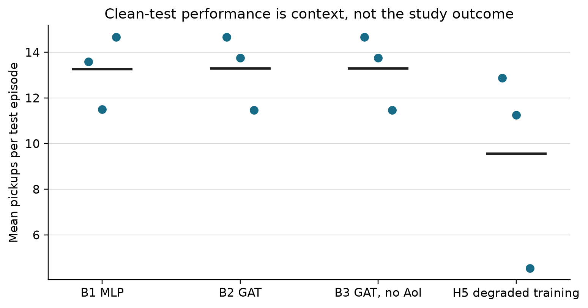
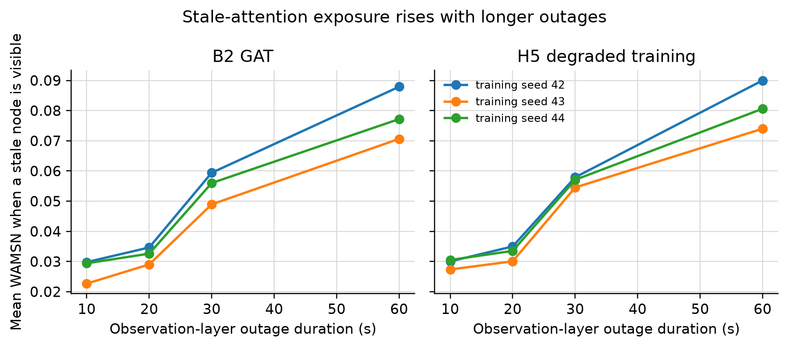
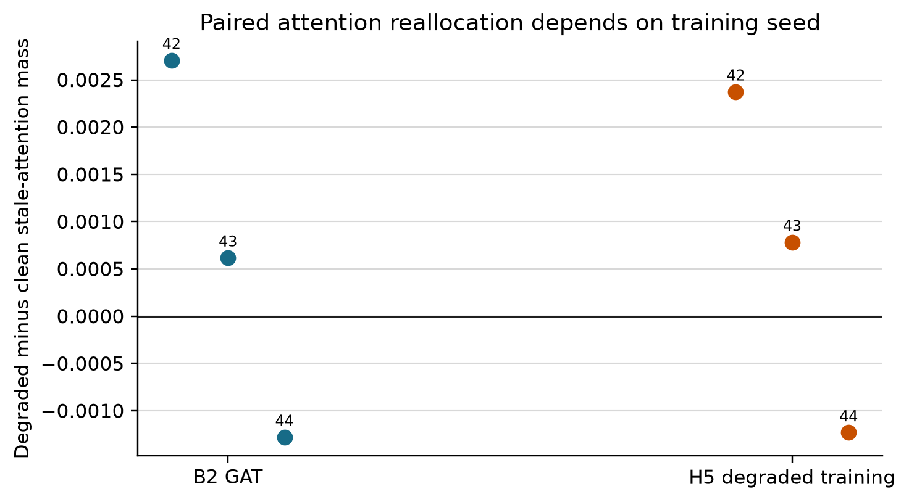
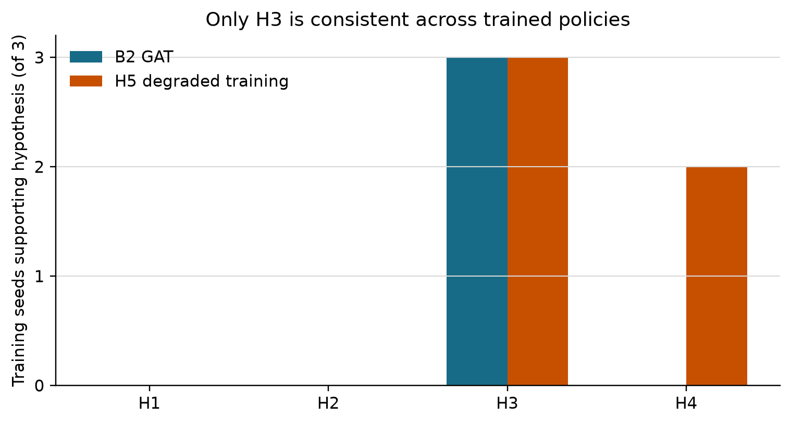

::: title-block
# When Explanations Outlive Their Data: Faithfulness Decoupling in Graph-Attention MARL Fleet Dispatch under Telemetry Degradation

**Hongwei Lin**

MSc Dissertation, De Montfort University Dubai

Supervisor: **Dr. Farhan S. Ujager**
:::

## Abstract

Graph-attention multi-agent reinforcement learning (GAT-MARL) exposes weights
that are easy to present as explanations of fleet-dispatch decisions. In an
operational fleet, however, those weights may refer to stale vehicle telemetry.
This study tests whether attention explanations remain trustworthy under
tunnel-triggered signal loss. SUMO retains the true vehicle state, while an
observation-layer degradation module freezes the last valid position and speed
for 10, 20, 30, or 60 seconds. Clean-trained and degradation-trained GAT
policies are each trained with three independent seeds, selected on validation
demand, and tested with eight evaluation seeds and three episodes per
condition. Explanation quality is measured by decision-level explanation
faithfulness (DEF) with type-matched random occlusions, and stale-data exposure
is measured by weighted attention mass on stale nodes (WAMSN). WAMSN increases
with outage duration for all six trained GAT policies (within-policy Spearman
rho 0.078-0.121; Holm-adjusted p = 0.0004). In contrast, the exact paired
attention shift is positive for two training seeds and negative for one under
both training regimes. No run supports a direct decrease in DEF or a faster
decline in faithfulness than dispatch performance. The WAMSN-DEF relationship
is also seed-dependent. A supporting validity audit shows that request-node
occlusion can delete an action, whereas taxi-node occlusion only hides
information; type-matched controls are therefore required. The results show
that longer outages reliably increase stale-data exposure, but their effect on
attention allocation and explanation faithfulness is not stable across trained
policies. Attention weights should not be treated as trustworthy explanations
without freshness-aware and model-specific validation.

**Index Terms:** explainable reinforcement learning, graph attention,
multi-agent reinforcement learning, fleet dispatch, telemetry degradation,
Age of Information, faithfulness.

## I. Introduction

Fleet dispatch depends on relationships among vehicles, passenger requests,
and road conditions. Graph neural networks represent these relationships
directly, while graph attention networks learn weights over neighbouring nodes
[6], [7]. Those weights are often attractive as built-in explanations because
they can be displayed without training a separate explainer.

Attention is not automatically a faithful account of a model's decision.
Studies in other domains show that attention may be weakly related to feature
importance and that different attention maps can support similar predictions
[9]-[12]. Fleet systems add a second problem: the input may become stale while
the explanation remains visible.

A taxi entering a tunnel may stop transmitting its current position and speed.
The dispatcher then continues to use the last valid reading while its Age of
Information (AoI) grows [13]. This paper calls the resulting trust risk
**faithfulness decoupling**: the explanation and the evidence supporting the
decision may separate, even if dispatch performance appears stable.

The study asks:

1. Is graph attention more faithful than a fair random explanation on clean
   telemetry?
2. Does tunnel-triggered degradation move attention toward stale vehicle
   nodes?
3. Does explanation faithfulness decline faster than dispatch behaviour as
   outage duration increases?
4. Does degradation-aware training make the explanation response more
   reliable?

The main contribution is a cross-training-seed answer. Thousands of decisions
can make a result precise for one checkpoint, but they do not show that the
same effect will appear after retraining. The final synthesis therefore treats
each independently trained policy as a replicate.

## II. Related Work

### A. MARL and Graph Attention for Dispatch

Multi-agent reinforcement learning has been used for large-scale fleet
management and ride-sharing because vehicles make coupled decisions under
shared demand [1], [2]. MAPPO provides a stable policy-gradient framework for
cooperative multi-agent tasks [5]. Graph models add an explicit representation
of vehicle-request relationships [6], and GAT assigns learned weights to those
relationships [7]. Recent dispatch work continues to use graph attention to
improve matching and coordination [14], [15]. These studies primarily evaluate
dispatch quality, not whether attention remains a trustworthy explanation when
telemetry is stale.

### B. Attention Faithfulness

The attention-as-explanation debate distinguishes a readable weight map from a
faithful account of the evidence that affects the output. Jain and Wallace [9]
reported weak agreement between attention and alternative importance measures.
Wiegreffe and Pinter [10] argued that the answer depends on the definition and
test. Serrano and Smith [11] found that attention is only partly informative,
while Liu et al. [12] proposed explicit faithfulness-violation tests.

Perturbation tests commonly remove highly ranked features and compare the
output change with random removals [8]. This study adopts that idea but audits
the random control because graph nodes have different semantic roles.

### C. Telemetry Freshness

AoI measures how long it has been since the newest valid update was generated
[13]. Most AoI work asks how stale information affects communication or
control. Here AoI is used to describe observation freshness and to weight
stale-node attention. The study does not assume that AoI itself causes lower
faithfulness.

## III. Experimental Design

### A. Environment and Data Flow

SUMO [16] simulates a 20-taxi fleet, 50 passenger requests, and 1,200 seconds of
traffic in a tunnel-rich road network from Yubei, Chongqing. Demand is divided
into training, validation, and held-out test splits.

Tunnel entry is the physical trigger, but degradation occurs at another layer.
SUMO continues to update ground-truth movement. The observation layer freezes
the last valid position and speed supplied to the policy for the declared
outage duration. Each degraded decision is paired with a clean twin generated
at the same simulation step.


**Fig. 1.** Tunnel entry triggers the outage; stale telemetry is created only
at the observation boundary.

### B. Observation Graph and Policy

Each acting taxi observes itself, up to five nearby taxis, and up to five
passenger requests. Taxi nodes contain position, speed, availability, distance,
and AoI features. Request nodes contain pickup/drop-off vectors and waiting
time. The action space contains no-op plus one action for each request node.

The GAT-MAPPO actor uses node-type projections, two graph-attention layers, and
four heads. The actor scores the available actions and the critic supports
centralised training with decentralised execution. Attention tensors are
returned directly for evaluation.


**Fig. 2.** The attention channel is part of the policy computation and is then
audited as a possible explanation.

### C. Model Conditions and Training

| Model | Architecture | Training data | Purpose |
|---|---|---|---|
| B1 | MLP-MAPPO | clean | performance context without attention |
| B2 | GAT-MAPPO | clean | primary attention audit |
| B3 | GAT-MAPPO, no AoI input | clean | structural freshness-input control |
| H5 | GAT-MAPPO | 30-second tunnel outages | degradation-aware training |

Each model is trained for 150 epochs with seeds 42, 43, and 44. Checkpoints are
saved every ten epochs and selected by stochastic mean pickups on validation
demand; test demand is not used for selection. B2 and B3 are identical under
clean evaluation because AoI is zero in both conditions. This does not test an
AoI effect under degradation.

### D. Degradation Sweep

B2 and H5 are evaluated under clean telemetry and fixed observation-layer
outages of 10, 20, 30, and 60 seconds. Each sweep contains:

```text
5 conditions x 8 evaluation seeds x 3 test episodes
```

The configuration uses freeze corruption and stochastic policy evaluation.
All six sweeps pass preflight checks for expected cells, provenance,
type-matched controls, chosen-action protection, and increasing empirical
degradation.

### E. Explanation Measures

DEF compares the output change caused by the explanation's top-k nodes with the
change caused by five size- and type-matched random subsets for
`k in {1,2,3}`. Positive DEF means that the explanation identifies more
decision-relevant evidence than its random control. A probability form and an
action-protected logit-margin form are recorded.

WAMSN measures attention assigned to stale vehicle information:

```text
WAMSN = sum(alpha_i * normalised_AoI_i) / sum(alpha_i)
```

The paired stale-attention shift compares stale-node attention mass in the
degraded observation with its exact clean twin. Unlike WAMSN, this paired
measure can be positive or negative.

### F. Construct-Validity Control

A passenger-request node is also an action candidate. Deleting it can remove
the chosen action. A taxi node, by contrast, only supplies contextual
information. Uniform random occlusion can therefore alter the action space more
often than attention top-k occlusion and create a misleading DEF value.

The final protocol matches each random subset to the same taxi/request
composition as the explanation subset. It also records an action-protected
variant and counterfactual clamps. The audit supports the primary experiment by
ensuring that DEF does not confuse action deletion with hidden evidence.

### G. Statistical Analysis

H1 tests whether DEF decreases with outage duration. H2 compares faithfulness
and pickup degradation rates. H3 tests whether WAMSN increases with duration.
H4 tests whether WAMSN and DEF are negatively associated within an episode.
H5 asks whether degradation-aware training changes these relationships.

Episode-block permutation is used for H1 and H3. H2 uses paired cell-level sign
flips. H4 computes Spearman correlation within each episode before a sign-flip
test. Holm correction covers H1-H4 separately for each trained policy. Across
training seeds, the paper reports consistency counts and effect ranges, not a
pooled population p-value.

## IV. Results

### A. Performance Context

| Model | Mean pickups | Training-seed range |
|---|---:|---:|
| B1 MLP | 13.25 | 11.50-14.67 |
| B2 GAT | 13.29 | 11.46-14.67 |
| B3 GAT without AoI | 13.29 | 11.46-14.67 |
| H5 degradation-trained GAT | 9.56 | 4.54-12.88 |

H5 seed 44 is substantially weaker than the other H5 policies. It is retained
because removing it would hide a real training outcome. Performance is context
for the explanation analysis, not the primary success criterion.



**Fig. 3.** Clean-test pickups for each independently trained policy.

### B. Stale Exposure Increases Consistently

Conditional WAMSN rises from approximately 0.023-0.031 at 10 seconds to
0.071-0.090 at 60 seconds. H3 is supported in every B2 and H5 training seed.
Within-policy rho ranges from 0.078 to 0.121, with Holm-adjusted p = 0.0004 in
all six cases.



**Fig. 4.** WAMSN increases with observation-layer outage duration for every
trained GAT policy.

This is a manipulation and exposure result. Because WAMSN includes normalised
AoI, it must not be interpreted as evidence that AoI reduces faithfulness.

### C. Paired Attention Shift Depends on Training Seed

| Model | Seed 42 | Seed 43 | Seed 44 | Positive seeds |
|---|---:|---:|---:|---:|
| B2 GAT | +0.002706 | +0.000618 | -0.001278 | 2/3 |
| H5 degradation training | +0.002374 | +0.000783 | -0.001231 | 2/3 |



**Fig. 5.** Degraded-minus-clean stale-attention mass. Seed 44 reverses the
direction under both training regimes.

The estimates are precise within each policy because observations are paired,
but they disagree across independently trained policies. A universal claim
that degradation shifts attention toward stale nodes is therefore not
supported.

### D. Faithfulness Hypotheses

H1 is unsupported in all six GAT policies: DEF does not decrease with outage
duration. H2 is also unsupported throughout: faithfulness does not decline
faster than pickups. Clean type-matched DEF remains close to zero, so percentage
rate calculations around that denominator are unstable.

H4 is unsupported for every B2 policy. The B2 within-episode WAMSN-DEF
correlations are positive (0.036-0.069), contrary to the predicted negative
direction. H5 seeds 42 and 43 support a negative association (rho -0.072 and
-0.061; adjusted p = 0.0004), but H5 seed 44 does not (rho -0.001; adjusted
p = 0.185). The result is mixed rather than general.

::: figure-block


**Fig. 6.** Number of training seeds supporting each hypothesis after
within-policy Holm correction.
:::

::: hypothesis-table
| Hypothesis | B2 | H5 | Verdict |
|---|---:|---:|---|
| H1: DEF decreases with duration | 0/3 | 0/3 | not supported |
| H2: faithfulness declines faster | 0/3 | 0/3 | not supported |
| H3: WAMSN increases with duration | 3/3 | 3/3 | consistently supported |
| H4: greater WAMSN means lower DEF | 0/3 | 2/3 | mixed |
| H5: degraded training gives consistent mitigation | n/a | 0/3 | not supported |
:::

## V. Discussion

The experiment supports a narrower interpretation of explanations outliving
their data. During an outage, the attention map remains available while some
of its vehicle nodes represent earlier states. Longer outages reliably
increase stale-data exposure. Yet the exact attention response can reverse
after retraining, and no consistent decline in DEF is observed.

This distinction is important. WAMSN is useful for monitoring freshness
exposure, but it is not a causal measure of faithfulness. DEF tests
decision-relevant evidence, while paired attention shift tests reallocation
against a clean twin. Combining them into one claim would overstate the result.

Training-seed variation is an operational risk. A dashboard validated on one
checkpoint may behave differently after the same architecture is retrained.
Faithfulness and freshness tests should therefore be release checks for each
model, not one-time properties assigned to the architecture.

The construct-validity audit is equally practical. In candidate-action graphs,
feature removal can also remove an action. Type matching and chosen-action
protection are necessary before perturbation scores can be interpreted as
explanation quality.

## VI. Limitations

The benchmark covers one district, one freeze corruption, 20 taxis, 50
requests, and sparse tunnel exposure. Three training seeds reveal
heterogeneity but are too few for a strong population-level estimate. H5 seed
44 is weak, so competence and explanation response are partly confounded. DEF
uses one family of perturbation tests, and WAMSN depends on the selected AoI
normalisation. Real telemetry can include delay, packet reordering, partial
failure, and noisy recovery, none of which is represented here.

## VII. Conclusion

Observation-layer outage duration consistently increases stale-attention
exposure, but it does not consistently reduce explanation faithfulness or shift
attention in one direction across trained policies. Degradation-aware training
does not remove this variation. The study therefore does not claim that AoI
causes lower faithfulness. It shows that an attention map can remain plausible
after its data become stale and that its response is checkpoint-dependent.

The practical conclusion is direct: graph-attention weights should be treated
as model internals unless each released policy passes action-aware
faithfulness tests and freshness-aware monitoring. Stable dispatch output is
not evidence that the explanation remains trustworthy.

## References

[1] K. Lin, R. Zhao, Z. Xu, and J. Zhou, "Efficient large-scale fleet
management via multi-agent deep reinforcement learning," in *Proc. ACM SIGKDD*,
2018, pp. 1774-1783.

[2] Z. Qin, H. Zhu, and J. Ye, "Reinforcement learning for ridesharing: An
extended survey," *Transportation Research Part C*, vol. 144, 2022.

[3] R. Lowe et al., "Multi-agent actor-critic for mixed
cooperative-competitive environments," in *NeurIPS*, 2017.

[4] T. Rashid et al., "Monotonic value function factorisation for deep
multi-agent reinforcement learning," *JMLR*, vol. 21, no. 178, 2020.

[5] C. Yu et al., "The surprising effectiveness of PPO in cooperative
multi-agent games," in *NeurIPS*, 2022.

[6] F. Scarselli et al., "The graph neural network model," *IEEE Trans. Neural
Networks*, vol. 20, no. 1, pp. 61-80, 2009.

[7] P. Velickovic et al., "Graph attention networks," in *ICLR*, 2018.

[8] J. DeYoung et al., "ERASER: A benchmark to evaluate rationalized NLP
models," in *ACL*, 2020, pp. 4443-4458.

[9] S. Jain and B. C. Wallace, "Attention is not explanation," in *NAACL-HLT*,
2019, pp. 3543-3556.

[10] S. Wiegreffe and Y. Pinter, "Attention is not not explanation," in
*EMNLP-IJCNLP*, 2019, pp. 11-20.

[11] S. Serrano and N. A. Smith, "Is attention interpretable?" in *ACL*, 2019,
pp. 2931-2951.

[12] Y. Liu et al., "Rethinking attention-model explainability through
faithfulness violation test," in *ICML*, 2022.

[13] S. Kaul, R. Yates, and M. Gruteser, "Real-time status: How often should
one update?" in *IEEE INFOCOM*, 2012, pp. 2731-2735.

[14] Y. Hu, S. Feng, and S. Li, "BMG-Q: Localized bipartite match graph
attention Q-learning for ride-pooling order dispatch," arXiv:2501.13448, 2025.

[15] J. Wang et al., "CoopRide: Cooperate all grids in city-scale ride-hailing
dispatching with multi-agent reinforcement learning," in *ACM SIGKDD*, 2025.

[16] P. A. Lopez et al., "Microscopic traffic simulation using SUMO," in
*IEEE ITSC*, 2018, pp. 2575-2582.
