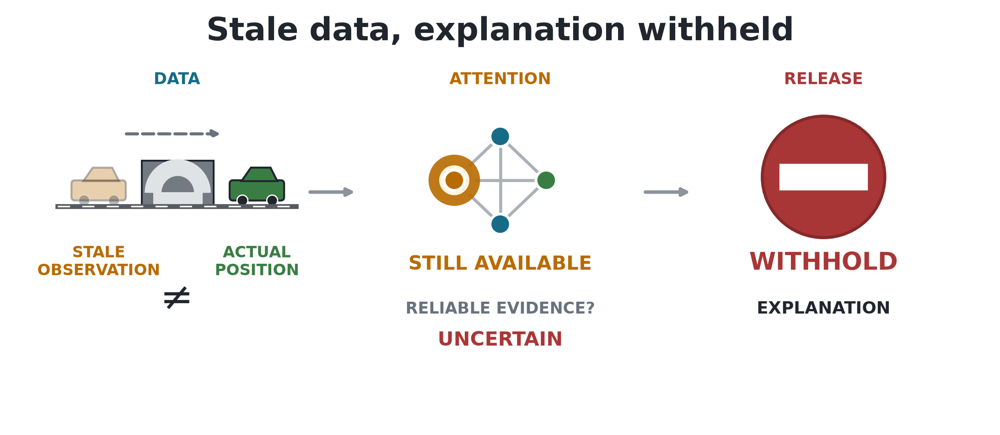

# 1. Introduction

## 1.1 Context

Fleet dispatch is relational. A taxi's useful action depends on nearby
vehicles, open passenger requests, road conditions, and competition for the
same demand. Graph neural networks (GNNs) represent these relationships directly,
and graph attention networks (GATs) add learned weights over neighboring
nodes [6], [7]. Because the weights are easy to display, they are often read as
an explanation of which vehicles or requests influenced a decision.

That reading is convenient, but it is not automatically valid. Prior work has
shown that an attention weight can be weakly related to the evidence that
actually changes a model's output [12], [14], [13], [15]. The issue becomes more serious in
an operational system because the input itself may no longer describe the
current world.

## 1.2 Problem statement

Vehicle telemetry can be interrupted by tunnels and other signal-loss areas.
During an interruption, a dispatch platform may keep the last received
position and speed. The reading remains available, but its Age of Information
(AoI) grows [21]. An attention map can therefore look complete even though some
nodes represent old information. The interface reveals where
the model placed attention, but it does not reveal whether that information is
fresh or whether removing it would change the decision.

This creates an assurance problem. An operator may read a complete attention
map as a trustworthy reason even when its evidence is stale, and stable dispatch
performance cannot show whether the explanation is valid. This dissertation
focuses on explanation reliability rather than increasing the number
of pickups. It tests whether raw graph-attention weights provide reliable
evidence about a decision under clean and degraded telemetry.

This dissertation uses *faithfulness decoupling* to describe a situation in
which an explanation still appears credible after its supporting data have
become stale, even though the displayed attention weights may not reliably
identify the evidence that influenced the decision. One possible pattern is declining
faithfulness while dispatch performance remains stable. The core question is
whether attention provides reliable evidence under the tested conditions.

## 1.3 Research questions

The central research question is:

**Can raw graph-attention weights be trusted as explanations of fleet-dispatch
decisions when vehicle telemetry becomes stale?**

Four operational questions provide the evidence needed to answer it:

1. **RQ1:** Under clean telemetry, do raw graph-attention weights identify
   decision-relevant nodes more reliably than type-matched random controls?
2. **RQ2:** Does tunnel-triggered telemetry degradation change the attention
   assigned to stale vehicle nodes relative to the paired clean observation?
3. **RQ3:** As outage duration increases, are changes in stale-node attention
   and decision-level faithfulness consistent across independently trained
   checkpoints?
4. **RQ4:** In the tested configurations, does degradation-aware training
   produce more consistent attention and faithfulness responses under telemetry
   degradation than clean training?

The construct-validity audit supports the interpretation of all four research
questions. It is not a separate primary problem. Its purpose is to check that
the faithfulness evaluator measures the effect of removing information rather
than the accidental removal of an available action.

## 1.4 Objectives

The measurable objectives are to:

1. develop a reproducible Simulation of Urban Mobility (SUMO)
   fleet-dispatch benchmark that creates paired clean and degraded observations
   from the same simulated state and uses held-out test demand;
2. evaluate whether raw graph-attention weights identify
   decision-relevant nodes under clean telemetry using action-protected,
   type-matched controls and a leave-one-out (LOO) positive control;
3. quantify the paired change in attention assigned to stale vehicle
   nodes under tunnel-triggered outages and test its sensitivity to randomly
   triggered telemetry loss;
4. assess whether stale-node attention and decision-level faithfulness
   responses are consistent across outage durations, independently trained
   checkpoints, action groups, and attention-extraction choices;
5. compare the matched clean-trained and degradation-aware configurations to
   assess whether the tested degradation-aware configuration gives more
   consistent attention and faithfulness responses;
6. implement and apply a freshness-aware explanation audit framework
   that converts the collected evidence into an `ELIGIBLE`, `WITHHOLD`, or
   `INCOMPLETE` explanation-release decision.

## 1.5 Main findings

Overall, **this study does not validate raw graph-attention weights as reliable
explanations of fleet-dispatch decisions**. Figure 1.1 summarizes the central
finding: an attention explanation can remain available after the policy begins
receiving stale vehicle information, but its availability does not show that it
reliably identifies the evidence behind the decision.

**Figure 1.1.** Main finding. A tunnel-triggered outage leaves the policy with a
stale observation. Attention remains available, but the audit withholds it
because freshness and faithfulness are not both established.

Under clean telemetry, raw attention performs close to its type-matched random
control and varies across the six trained policies. In contrast, the
leave-one-out control produces a clearer faithfulness response. This shows that
the evaluator can detect decision-relevant information, but raw attention does
not consistently provide it.

Longer outages consistently increase exposure to stale vehicle information.
However, the resulting changes in attention and faithfulness differ across
trained policies. Some policies assign more attention to stale nodes, while
others assign less. The study therefore does not find a single, consistent
attention response to telemetry degradation.

The findings also depend on how attention is extracted and on whether the
selected action is dispatch or no-op. Most scorable decisions are no-op, and
the smaller dispatch-only results do not reproduce the main associations
consistently. Degradation-aware training does not remove this variation.

The practical conclusion is that data freshness and explanation faithfulness
must be checked separately for each trained policy. In the present experiment,
the policy may still produce an action, but its raw attention weights should be
withheld as an explanation.

## 1.6 Contributions

The dissertation makes four main contributions:

1. a reproducible paired clean/degraded benchmark that creates two observations
   from the same SUMO state, separates physical ground truth from policy input,
   and distinguishes the tunnel trigger from the observation-layer outage;
2. an action-aware, type-matched evaluation protocol that reduces the deletion
   bias caused by request nodes representing both information and available
   actions, checked through LOO, overlap, and action-type diagnostics;
3. evidence across independently trained checkpoints showing that stale-data
   exposure increases consistently with outage duration, while direct paired
   attention and DEF shifts vary across checkpoints and attention-extraction
   choices, with the pattern also tested under random telemetry loss;
4. an implemented freshness-aware explanation audit framework that combines
   freshness, faithfulness, action composition, extraction sensitivity, and
   checkpoint-consistency evidence to return an `ELIGIBLE`, `WITHHOLD`, or
   `INCOMPLETE` explanation-release decision.

## 1.7 Dissertation structure

**Chapter 1: Introduction.** Defines the research problem, research questions,
objectives, main findings, and contributions.

**Chapter 2: Literature Review.** Reviews MARL fleet dispatch, graph attention,
explanation faithfulness, graph explainability, and telemetry freshness.

**Chapter 3: Methodology.** Describes the SUMO environment, policy models,
observation-layer degradation, faithfulness measures, evaluation design, and
audit rules.

**Chapter 4: Results.** Reports policy capability, construct-validity checks,
faithfulness results, stale-data exposure, sensitivity analyses, and audit
decisions.

**Chapter 5: Discussion.** Interprets the findings, explains their limitations,
and presents the freshness-aware explanation audit framework.

**Chapter 6: Conclusion.** Answers the research questions and summarizes the
practical implications for trustworthy fleet-dispatch explanations.
