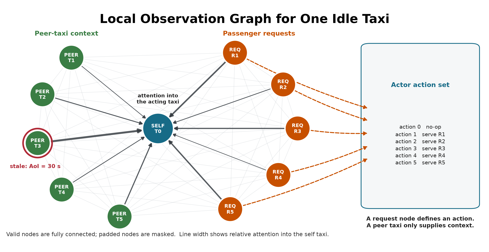
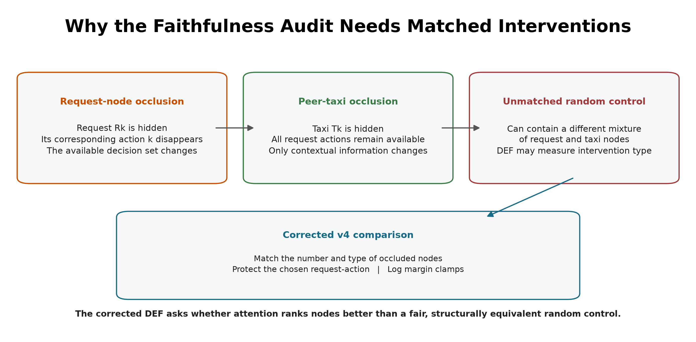

# 3. Methodology

## 3.1 Study design

The study uses a controlled simulation because the research question requires
the same decision to be observed in two ways: once with current telemetry and
once with degraded telemetry. A real operational log cannot provide this exact
clean twin. SUMO provides the simulated physical state, while a separate
observation layer controls what the policy receives.

The protocol is defined in version-controlled configuration files. It contains
three stages: training, validation-based checkpoint selection, and held-out
evaluation. Faithfulness sweeps are run only after the selected checkpoints are
frozen.

## 3.2 SUMO environment and data

The road network is an OpenStreetMap extract of the Central Park area in
Yubei, Chongqing. Roads marked as tunnels supply physically meaningful
signal-loss triggers. SUMO simulates 20 taxis and 50 passenger requests during
each 1,200-second episode. Taxi dispatch is controlled through TraCI, while
SUMO continues to update the true position and speed of every vehicle.

Demand variants are separated into training, validation, and test splits. The
policy is fitted on training demand. Candidate checkpoints are compared on
validation demand. The final reported runs use held-out test demand. This
separation prevents test results from influencing model selection.

SUMO is a simulator rather than a neutral source of observed data [22]. Its
outputs depend on the chosen road network, generated demand, routes, vehicle
behavior parameters, tunnel locations, and random seeds. The experiment is
therefore not described as free from bias. Instead, it uses these assumptions
consistently in a paired design. At each sampled decision, the clean and
degraded observations share the same underlying SUMO state and trained-policy
checkpoint; only the observation-layer telemetry differs. This controls the
comparison well enough to isolate the effect of the implemented degradation
within this scenario, but it does not make the simulated fleet representative
of every real city.

## 3.3 Observation graph and action space

Each idle taxi receives a self-centered graph containing:

| Node type | Main features | Role |
|---|---|---|
| Self taxi | position, time, speed, AoI, position-valid flag | acting vehicle |
| Peer taxi | relative position, availability, distance, AoI | nearby fleet context |
| Passenger request | pickup/drop-off vectors, waiting time | candidate request and action |

The graph contains up to five nearby taxis and five nearby requests. Features
are normalized and request/taxi masks prevent padded nodes from receiving
attention.

The discrete action space contains no-op plus one action for each visible
passenger request. This one-to-one relationship is important: deleting a
passenger-request node also removes the associated action, whereas deleting a
peer-taxi node only hides information about that taxi. Section 3.7 explains
how the faithfulness audit controls this asymmetry.



**Figure 3.1.** Valid self, peer-taxi and request nodes form a fully connected
local graph. The red ring marks a stale peer observation, and the illustrative
edge widths show attention into the acting taxi. Only request nodes map directly
to dispatch actions, which motivates the construct-validity controls.

## 3.4 Policy models and training

The main policy uses per-node-type feature projections followed by two graph
attention layers with four heads. The actor scores no-op and the visible
requests. The critic estimates value for MAPPO training with centralized
training and decentralized execution. The GAT implementation returns its
attention tensors directly so they can be audited without changing the trained
network.

The implementation uses scaled dot-product graph attention on the fully
connected set of valid local nodes. This differs from the additive attention
score in the original GAT paper, so "GAT" in the experiment labels denotes the
graph-attention policy family, not an exact reproduction of that layer. For
node `i`, node `j`, layer `l`, and head `h`:

```text
q_i = W_Q,h LayerNorm(h_i^l),  k_j = W_K,h LayerNorm(h_j^l)
v_j = W_V,h LayerNorm(h_j^l)
s_ij^(l,h) = (q_i dot k_j) / sqrt(d_head)
alpha_ij^(l,h) = softmax_j(s_ij^(l,h))
z_i = concat_h sum_j alpha_ij^(l,h) v_j
u_i = h_i^l + W_O z_i
h_i^(l+1) = u_i + FFN(LayerNorm(u_i))
```

Here, FFN denotes the feed-forward network within each attention layer. The
mask removes padded nodes before the softmax. A residual connection keeps
the previous node embedding. The actor reads the updated self embedding for
no-op and each updated request embedding for its matching dispatch action.
The default explanation is the self row (`i = 0`) averaged over both layers
and all four heads, then renormalized:

```text
alpha_j = normalize((1 / (L H)) sum_l sum_h alpha_0j^(l,h))
```

This aggregation is declared before evaluation. A sensitivity analysis also
reports each layer, head-wise values, head maximums, and attention rollout; it
does not select an aggregation after seeing which result is favorable.
The explanation average is an analysis choice: inside the policy, head outputs
are concatenated and projected rather than averaged.

The fixed self row represents the acting taxi's dashboard view and is the
explanation channel originally declared for audit. It directly contributes to
the no-op embedding. A request-action logit, however, is read from that
request's updated embedding, so its corresponding request row is more directly
aligned with the selected logit. A sensitivity analysis therefore reports a
separate request-action sensitivity comparison between the fixed self row and
the selected request row. This comparison is not used to redefine the primary
metric after seeing the result.


**Figure 3.2.** The policy and audit share the same two-layer attention encoder.
The default audit reduces the self-node attention row to node importance
without modifying the actor, critic, or selected action; the selected-request
row is evaluated separately as a sensitivity check.

Three policy conditions are included:

| Model | Policy | Training observations | Purpose |
|---|---|---|---|
| MLP | MLP-MAPPO | clean | performance context without graph attention |
| GAT | GAT-MAPPO | clean | primary attention model under audit |
| GAT-Outage | GAT-MAPPO | tunnel-triggered 30-second outages | degradation-aware training condition |

MLP is trained for 50 epochs, GAT for 40 epochs, and GAT-Outage for 50
epochs. Each condition uses independent training seeds 42, 43, and 44.

Candidate checkpoints include periodic snapshots saved every ten epochs, the
final snapshot, and a rolling-best snapshot updated when the ten-epoch mean
pickup count improves. The implementation records zero-based epoch indices, so
index 39 denotes the checkpoint saved after 40 training epochs. Selection uses
eight stochastic validation episodes with seed 2026 and mean pickups as the
primary criterion; mean reward and the earlier checkpoint index break ties. The
test split is not read during selection. The selected checkpoint indices are:

| Model | seed 42 | seed 43 | seed 44 |
|---|---:|---:|---:|
| MLP | 20 | 40 | 34 |
| GAT | 39 | 39 | 30 |
| GAT-Outage | 49 | 40 | 40 |

The shared optimization settings are shown below.

| Setting | Value |
|---|---:|
| Training epochs | 40 (GAT), 50 (MLP and GAT-Outage) |
| Learning rate | 0.0001 (GAT variants), 0.0003 (MLP) |
| Discount factor (gamma) | 0.99 |
| Generalized advantage estimation factor (lambda) | 0.95 |
| PPO clip ratio | 0.20 |
| PPO passes per update | 4 |
| Minibatch size | 256 |
| Value-loss coefficient | 0.25 |
| Value clip ratio | 0.20 |
| Entropy coefficient | 0.05, adaptive to a 0.20 entropy floor |
| Maximum adaptive entropy coefficient | 0.20 |
| Target Kullback-Leibler divergence | 0.015 |
| Gradient-norm limit | 0.50 |
| Dispatch credit reward | 1.00 |
| Critic encoder gradient scale | 0.10 |
| GAT hidden width / layers / heads | 64 / 2 / 4 |
| Stability window | Final 10 training epochs |
| Minimum final-window mean pickups | 5.0 |
| Maximum consecutive zero-pickup epochs | 4 |
| Minimum selected validation pickups | 5.0 |
| Minimum final validation retention | 0.80 |

Final validation retention is the final checkpoint's mean validation pickups
divided by the selected checkpoint's mean validation pickups. These four
stability gates are applied to every training run before its checkpoint is
accepted for evaluation.

At simulation step `t`, the shared team reward is:

```text
r_t = 10 N_pickup,t + 0.5 N_dispatch,t - 0.001 mean_wait_t
```

The reward trains dispatch behavior. It contains no term that rewards a
faithful, stable, or human-readable attention map.


**Figure 3.3.** Common training and validation-based checkpoint selection for
all three model conditions. Each frozen checkpoint receives 24 clean held-out
episodes. The faithfulness audit then compares the frozen GAT and GAT-Outage
checkpoints across clean and four outage conditions without reselection.

## 3.5 Telemetry degradation

The trigger and the degradation location are separate parts of the design.

**Step 1 - Trigger:** when a taxi enters a tunnel edge, the event starts one
outage.

**Step 2 - Observation-layer outage:** for the declared duration, the policy
sees the taxi's last valid position and speed. SUMO continues to simulate the
true state.

**Step 3 - Recovery:** after the fixed window expires, a current reading is
accepted. A taxi must leave and enter a tunnel again before another
tunnel-entry event can trigger.

The fixed outage durations are 10, 20, 30, and 60 seconds. They are easy to
monitor and compare, and they create increasing empirical degradation rates.
They are not treated as direct causal doses of explanation faithfulness.

AoI is calculated as the current simulation time minus the time of the last
valid update and is included in each GAT observation. WAMSN uses normalized AoI
as a staleness weight. For this reason, an
increase in WAMSN with outage duration partly verifies that the manipulation
created longer stale exposure; it is not by itself proof that AoI changed DEF.


**Figure 3.4.** Tunnel entry triggers an observation-layer outage. SUMO keeps
moving the vehicle while the policy sees its last valid position; the clean
twin reads current state but never acts.

## 3.6 Explanation measures

### 3.6.1 Decision-level explanation faithfulness

DEF asks whether the nodes ranked highly by an explanation affect the chosen
action more than a size- and type-matched random set. Two score functions are
recorded from the same counterfactual forward passes. **Probability DEF** uses
the selected action probability, `p(G,a)`, and is bounded by the probability
scale. **Logit-margin DEF** uses the selected action logit minus the strongest
available alternative, `m(G,a)`. The margin can retain resolution when the
softmax probability is saturated, but its value depends on a checkpoint's
logit scale.

For top-k nodes `R_k`, comprehensiveness measures the output change when those nodes are
removed; sufficiency measures the output retained when only those nodes remain.
The two gains are compared with five matched random subsets for each
`k in {1,2,3}` and then averaged.

Let `s(G,a)` denote either `p(G,a)` or `m(G,a)`. For explanation subset `R_k`
and a matched random subset `B_k`:

```text
Comp(R_k) = s(G,a) - s(G without R_k,a)
Suff(R_k) = s(G,a) - s(G keeping only R_k,a)
g_comp(k) = Comp(R_k) - mean_b Comp(B_k,b)
g_suff(k) = mean_b Suff(B_k,b) - Suff(R_k)
DEF = mean_k 0.5 [g_comp(k) + g_suff(k)]
```

Comprehensiveness is better when removing the explanation weakens the action
more than removing random nodes. Sufficiency is better when keeping the
explanation loses less evidence than keeping random nodes. The logit margin is
clipped to `[-10, 10]` only when an action becomes unavailable or unopposed;
every clamp is logged.

Type-matched random subsets are the **control baseline**; they are not
themselves a faithfulness score. Corrected DEF is the measured difference
between the attention-ranked subset and this matched random control. Its sign
is interpreted as follows:

1. **Positive DEF:** the attention-ranked nodes affect the selected action more
   than comparable random nodes. This supports decision-level faithfulness.
2. **DEF near zero:** the attention ranking has no measured advantage over the
   matched random control.
3. **Negative DEF:** the attention-ranked nodes affect the selected action less
   than the matched random nodes. This does not support the attention ranking
   as a faithful explanation.

These interpretations apply to both variants. The confirmatory H1-H4 family
and the paired clean-twin comparison use probability DEF, following the
declared hypothesis analysis. Logit-margin DEF is used for the
construct-validity and ranking-control diagnostics because it can show output
movement that a saturated probability hides. It is action-protected where
request deletion could remove the chosen action. The two variants have
different units and cannot be converted into one another. Both use the
type-matched baseline described in Section 3.7. DEF provides comparative
perturbation evidence; even a positive value does not prove that attention is
a complete causal explanation.

### 3.6.2 Stale-node attention

WAMSN measures attention attached to stale vehicle information:

```text
WAMSN = sum(attention_i * normalized_AoI_i) / sum(attention_i)
```

Only self and peer-taxi nodes contribute because request nodes do not carry
vehicle telemetry. The analysis reports WAMSN when at least one stale vehicle
node is visible, together with stale-node attention share, stale-node mass,
and whether a stale node enters the top three.

The paired stale-attention shift compares the degraded observation with its
exact clean twin at the same simulation step. Positive values mean the
degraded observation assigns more attention mass to nodes marked stale;
negative values mean it assigns less.

## 3.7 Construct-validity audit

The audit supports the primary research problem by checking whether DEF is a
valid comparison in this action-candidate graph.

A uniform random occlusion can select passenger requests more often than the
attention top-k. Removing such a request changes both the observation and the
available action set. A nearby-taxi occlusion changes only information. The
result can therefore reflect different node-type composition rather than
explanation quality.

The corrected protocol uses three controls:

- **type matching:** random subsets contain the same mixture of taxi and
  request nodes as the explanation subset;
- **chosen-action protection:** the request associated with the selected
  action is not deleted in the action-protected variant;
- **clamp logging:** counterfactual action-margin clamps are counted so that
  action deletion can be detected.



**Figure 3.5.** Request-node occlusion can remove its action, while peer-taxi
occlusion removes context only. Corrected DEF matches subset size and node types,
protects the chosen request, and logs margin clamps.

Uniform-baseline results are retained only as an audit trail. They
are not used for the final hypothesis verdicts.

Three additional diagnostics test whether a near-zero DEF can be interpreted.
First, a leave-one-out (LOO) control masks each valid node separately and ranks
nodes by the resulting selected-action margin loss. The selected request is
protected. This control is expected to strengthen comprehensiveness because it
is built from the same single-node perturbation, but it is not an independent
proof that the combined DEF is optimal. Second, Gradient x Input ranks each
node by the L2 norm of the selected-action logit gradient multiplied by its raw
features. It is a post-hoc comparator that does not use attention weights.
Third, the audit reports valid taxi/request counts and the exact expected
top-k overlap with a type-matched random subset. Taxi-only Spearman correlation
between attention and LOO effects supplies a ranking measure that does not
delete request actions and does not depend on random subset overlap.

## 3.8 Evaluation matrix

MLP, GAT, and GAT-Outage are evaluated under clean telemetry with eight evaluation
seeds (42-49) and three episodes per seed. One checkpoint is frozen for each
model and training seed, so this gives 24 held-out episodes per checkpoint. The
clean capability evaluation therefore contains 216 episode evaluations:

```text
3 models x 3 frozen checkpoints per model x 8 evaluation seeds x 3 episodes
```

The complete evaluation structure is summarized below. An episode evaluation is
one complete rollout of one frozen checkpoint under one telemetry condition.

| Evaluation | Model families | Total frozen checkpoints | Telemetry cases | Episodes/cell | Total |
|---|---:|---:|---:|---:|---:|
| Clean capability context | 3 | 9 | 1 | 24 | 216 |
| Exposure-conditioned faithfulness sweep | 2 | 6 | 5 | 48 | 1,440 |
| Added ranking controls | 2 | 6 | 2 | 24 | 288 |
| Random-trigger sensitivity analysis | 2 | 6 | 3 | 24 | 432 |

GAT and GAT-Outage receive the full faithfulness sweep:

```text
3 training seeds x 5 conditions x 8 evaluation seeds x 6 episodes
```

The five conditions and their roles are:

| Telemetry condition | Observation-layer treatment | GAT-Outage relation | Evaluation purpose |
|---|---|---|---|
| Clean | Current vehicle readings | No imposed outage | Capability context and faithfulness baseline |
| 10 s | Freeze last valid reading for 10 seconds | Unseen shorter duration | Mild-degradation transfer test |
| 20 s | Freeze last valid reading for 20 seconds | Unseen shorter duration | Intermediate transfer test |
| 30 s | Freeze last valid reading for 30 seconds | Training-matched duration | In-condition degradation test |
| 60 s | Freeze last valid reading for 60 seconds | Unseen longer duration | Severe stress and transfer test |

The legal-random capability baseline samples uniformly from no-op and the
currently valid request actions. The greedy baseline is deliberately naive:
each idle taxi chooses its nearest visible request independently. If several
taxis choose the same request, the environment accepts the first action in the
step and rejects the later conflicts; there is no fleet-wide assignment or
conflict optimization. The policy is deterministic for a fixed demand variant,
so its uncertainty is based on three independent demand variants rather than
the repeated evaluation-seed records. It is therefore interpreted only as a
lower bound, not as a competitive dispatch algorithm.

The primary learned-policy evaluation samples from the policy distribution.
This matches training and preserves both no-op and request-dispatch decisions
for explanation auditing. A separate descriptive diagnostic evaluates each of
the six selected GAT checkpoints by deterministic argmax over three held-out
test episodes. This diagnostic is not used for checkpoint selection or the
primary capability comparison. It checks whether sampled performance also
corresponds to a usable deterministic policy.

The relation column refers only to GAT-Outage; the clean-trained GAT has not
seen any imposed outage duration during training. The evaluation changes the
observation-layer condition but never retrains or reselects a checkpoint.
Outside stale exposure, faithfulness is sampled every 16 decisions. Every
decision that contains at least one stale vehicle node is scored. Each such
observation is also compared with its exact clean twin at the same simulation
step. The degraded and clean evaluations reuse the same matched-random draw,
so the paired difference does not contain avoidable baseline-sampling noise.

Each degraded condition must contain at least 20 stale-exposed records from at
least three episodes. Preflight also checks expected cells, clean source
provenance, type-matched controls, chosen-action exclusion, complete event
capture, and separation in empirical AoI between conditions. All six sweeps
pass these gates.

## 3.9 Hypotheses and statistics

The confirmatory hypotheses are:

- **H1:** DEF decreases as outage duration increases.
- **H2:** faithfulness declines faster than dispatch performance.
- **H3:** WAMSN increases as outage duration increases.
- **H4:** decisions with greater WAMSN have lower DEF within an episode.
- **H5:** compared with clean training, degradation-aware training reduces the
  decline in DEF associated with longer outages and higher WAMSN.

H1 and H3 use episode-block permutation trend tests and cluster bootstrap
confidence intervals. H2 uses paired cell-level sign flips relative to each
evaluation seed's clean condition. H4 calculates Spearman correlation within
each episode before a sign-flip test. Holm correction is applied to H1-H4
within each trained policy.

The exposure-conditioned paired follow-up directly subtracts clean-twin DEF
from degraded DEF for the same decision. Negative values mean lower measured
faithfulness under the degraded observation. This paired estimate is reported
with an episode-block confidence interval and is interpreted by effect size,
direction across trained policies, and uncertainty rather than by a
decision-level p-value alone.

H2 is treated as a predeclared exploratory comparison. Its original rate
divides by clean DEF, which is close to zero and can make a small absolute
change look arbitrarily large. The analysis therefore reports the support
verdict and absolute trajectories, but does not use the ratio as the main
evidence for faithfulness decoupling.

Thousands of decisions improve measurement precision but do not replace
independent model replication. The final synthesis therefore treats each
training seed as one trained-policy replicate. With only three seeds per model,
the dissertation reports the range and number of supporting seeds and does not
claim a cross-seed population p-value.

An exploratory action-stratified audit separates eligible decisions into
`no-op` and `dispatch`. Decisions with no available request are excluded because
no-op is then forced rather than chosen. Within each stratum, records are still
averaged by episode before permutation tests or bootstrap intervals are formed.
This diagnostic tests whether the combined statistics describe both actions or
are driven by the more common action. It was added after the primary analysis
and is interpreted descriptively rather than as a new confirmatory hypothesis.

A second sensitivity analysis checks whether the paired result is specific to
the fixed tunnel location. The six checkpoints remain frozen and are evaluated
under clean telemetry, a 30-second tunnel-triggered freeze, and a 30-second
randomly triggered freeze. The random trigger is an independent Bernoulli draw
for each taxi at each observation step. A preliminary run without faithfulness
scoring selected a trigger probability of 0.0023: for the reference GAT
checkpoint, this produced a 0.569% degraded-observation rate, close to the
0.580% tunnel rate. The same probability is then held fixed for all
checkpoints. Because policy actions change taxi availability and trajectories,
the realized exposure rates can differ; they are reported rather than assumed
equal. The comparison is therefore interpreted mainly from paired shifts among
decisions that actually contain a stale vehicle node.

The ranking controls use the same held-out demand and stochastic action
protocol. They evaluate GAT and GAT-Outage under clean telemetry and a 60-second
outage:

```text
2 models x 3 training seeds x 2 conditions x 8 evaluation seeds x 3 episodes
```

LOO, Gradient x Input, overlap, and aggregation diagnostics are sampled every
eight decisions. Query-row sensitivity is evaluated at every selected-request
action because it asks whether the explanation row matches the node that
produces that action logit. Decision records are averaged within episodes
before bootstrap confidence intervals are calculated. Attention-aggregation
sensitivity is reported per training seed and only for decisions where at
least one stale vehicle node is visible.

## 3.10 Reproducibility

The experiment runner records the configuration, commands, seeds, checkpoint
hashes, source revision, and preflight reports in versioned run directories.
Compact outputs include the summary, performance context, deterministic
diagnostic, action-stratified audit, and training-seed synthesis tables. The
training-seed synthesis makes consistency across trained policies explicit.
Reproduction commands, file locations, and expected outputs
are documented in `docs/REPRODUCE_EXPERIMENTS.md`.

## 3.11 Ethics and data governance

The experiment uses a simulated taxi fleet, generated demand, and an
OpenStreetMap-derived road network. It contains no human participants,
personal records, live vehicle identifiers, or commercial dispatch data. Its
main ethical risk is miscommunication: presenting attention as a trustworthy
reason could give an operator false confidence. The reporting therefore keeps
freshness, task behavior, and faithfulness separate and avoids unsupported
causal claims.
