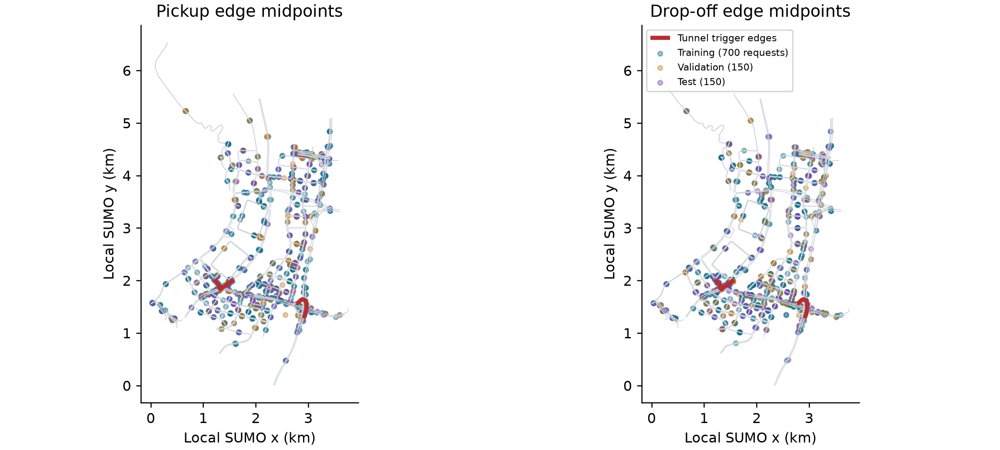
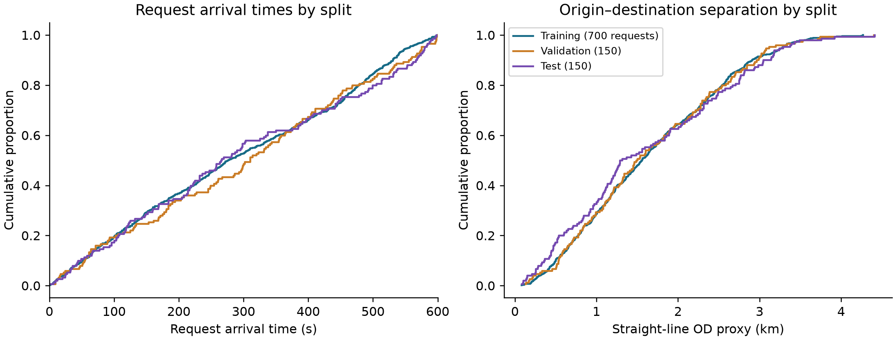

# 3. Methodology

## 3.1 Study design and proposed approach

The study uses a controlled simulation because the research question requires
the same decision to be observed in two ways: once with current telemetry and
once with degraded telemetry. A conventional observational fleet log would not
normally provide this exact clean twin. SUMO provides the simulated physical
state, while a separate observation layer controls what the policy receives.

The protocol is defined in version-controlled configuration files. It contains
three stages: training, validation-based checkpoint selection, and held-out
evaluation. Faithfulness sweeps are run only after the selected checkpoints are
frozen.

The proposed approach has two connected paths. SUMO ground truth passes
through an observation-layer degradation mechanism into the local graph and
GAT-MAPPO actor. A separate, read-only path extracts attention, constructs
paired clean twins, evaluates action-aware faithfulness and aggregates the
evidence into an explanation-release decision. Figure 3.4 shows the actor
and attention channel; Figure 5.2 shows the offline release workflow.
The methodological contribution lies in the paired evaluation and release
protocol, with GAT-MAPPO serving as the policy under audit.

Each stage addresses a specific failure mode. The clean twin controls the
underlying world state; per-type embeddings distinguish vehicles from
requests; the graph encoder combines relational context; the actor identifies
the action to explain; and the centralized critic supports learning without
being needed for decentralized action selection. AoI records freshness without
assuming that a large attention weight means a fresh reading. Type matching
and selected-action protection remove a known perturbation confound. The
final audit combines evidence that no single score supplies. Table 3.10
summarizes the implementation interfaces and their purpose.

## 3.2 Dataset selection and exploratory data analysis

The road network is an OpenStreetMap extract of Central Park in Yubei,
Chongqing. Map data are credited to OpenStreetMap contributors under the Open
Database License [69]. The committed XML records extraction and network
conversion on 22 June 2026 using SUMO tools 1.27.0. This network-building
version is distinct from the recorded simulation runtime in Section 3.11.1.
Roads marked as tunnels supply physically meaningful
signal-loss triggers. SUMO simulates 20 taxis and 50 passenger requests during
each 1,200-second episode. Taxi dispatch is controlled through TraCI, while
SUMO continues to update the true position and speed of every vehicle.

Twenty generated demand variants use one fixed taxi seed (42) and passenger
request seeds 1000-1019. Variants 0-13 form the training split, variants 14-16
form the validation split, and variants 17-19 form the held-out test split. The
policy is fitted on the 14 training variants. Candidate checkpoints are
compared on the three validation variants. The final reported runs use only the
three test variants. This separation prevents test results from influencing
model selection. During evaluation, consecutive episodes cycle through the
three test variants, and actions are sampled from the policy's probability
distribution. Evaluation seeds control this action sampling; they do not create
additional independent demand datasets. The same demand splits were used in an earlier
pilot study. They remain separate from training and checkpoint selection, but
this rerun does not constitute validation on a newly collected dataset.

SUMO generates microscopic traffic simulations [22] from the chosen road
network, demand, routes, vehicle behavior, tunnel locations, and random seeds.
These modeling choices shape the results and are held constant in the paired
comparison. At each sampled decision, the clean and
degraded observations share the same underlying SUMO state and trained-policy
checkpoint; only the observation-layer telemetry differs. This controls the
comparison well enough to isolate the effect of the implemented degradation
within this scenario, but it does not make the simulated fleet representative
of every real city.

### 3.2.1 Data generation and selection rationale

SUMO was selected because the study needs an interactive traffic environment
with access to the physical state of each vehicle [22]. Through TraCI, the
implementation reads vehicle states and applies taxi-dispatch actions at each
decision step. A separate observation layer can then retain outdated readings
while vehicles continue moving in the simulation. This separation allows the
same decision state to be evaluated with current and degraded telemetry, which
is central to the paired explanation audit. Fixed road, demand and seed inputs
also support repeatable evaluations across policies and outage settings.

The committed demand generator samples distinct origin and destination edge
identifiers for each request and an integer arrival time uniformly from 0 to
600 seconds. Requests therefore arrive during the first half of the episode;
the remaining time permits ongoing journeys to finish. Edge sampling is not
weighted by population, road length or observed passenger demand. The 20
variants contain 1,000 generated requests in total: 700 training, 150 validation
and 150 test requests. These are scenario inputs, not 1,000 independently
observed real-world journeys. The fixed taxi placement and shared road network
make the split a demand-generalization test within one scenario.

The Central Park network is suitable for a controlled outage study because
its tunnel metadata supplies localized, repeatable trigger edges while the
surrounding roads permit clean and exposed decisions in the same network.
The configured trigger set contains three edges; the metadata also excludes
orphan tunnel edges that would not support meaningful traversals. The scenario was chosen for these features; it is not a representative sample
of Chongqing.
Twenty taxis, 50 requests and a 1,200-second horizon define a small, manageable
benchmark for repeated paired counterfactual evaluation. These settings are
experimental design choices, not estimates of real fleet size or demand.
The demand-generation assumptions, random-circling idle taxis and configured
vehicle dimensions must therefore be considered when transferring the results.

### 3.2.2 Spatial and temporal exploration

The EDA describes the fixed demand splits using the committed route XML files
and road geometry. It was conducted after evaluation and was not used for
model selection or hyperparameter tuning. Figure 3.1 plots pickup and drop-off
edge midpoints against the road network and the configured tunnel triggers.
Locations are proxies obtained from the midpoint along the first lane's
polyline, not observed passenger coordinates or an exact SUMO boarding point.



**Figure 3.1.** Spatial EDA of all 20 demand variants. Grey lines are non-internal
road edges, red lines are the three configured tunnel-trigger edges, and
colored points distinguish training, validation and test demand. Map data:
OpenStreetMap contributors, ODbL; https://www.openstreetmap.org/copyright. Coordinates
use the local SUMO frame. Repeated edge choices can overlap on the map.

Mean request-arrival times are 289.8, 300.8 and 294.1 seconds for training,
validation and test, respectively. Their ranges are 0-600, 5-599 and 0-598
seconds. Figure 3.2 compares empirical cumulative distributions so that the
unequal split sizes do not distort the comparison. Arrivals occupy broadly
similar portions of the generation window, but this does not establish
statistical equivalence between the small validation and test samples.

The median straight-line origin-destination separation is 1.558 km in training,
1.495 km in validation and 1.302 km in test. The corresponding 10th-90th
percentile intervals are 0.502-2.909, 0.537-2.967 and 0.364-3.055 km.
Test demand therefore has a lower median separation despite a comparable
upper tail. This may affect journey completion and reinforces using identical
held-out demand for policy comparisons. The distance is a Euclidean proxy
between edge midpoints; it is not a routed distance, congestion estimate or
observed travel time.



**Figure 3.2.** Demand-split EDA. Left: request-arrival times. Right: straight-line
origin-destination separation. Requests are generated during the first 600 seconds
of each 1,200-second episode; the remaining time allows ongoing journeys to finish.
Each curve is normalized within its split; sample sizes are 700, 150 and 150 requests.

The retained route files each contain 20 taxi trips and 50 requests, and every
request origin and destination resolves to an edge in the committed network.
The generator and manifest make the split reproducible, but sampling different
requests on one map does not test unseen road layouts or real demand shifts.
No rebalancing or split changes were made in response to this descriptive EDA.

### 3.2.3 Policy-conditioned observations and exposure

The graph and telemetry records depend on the policy trajectory, unlike the
fixed input demand above. Table 4.4 reports their valid-node distribution:
the scored observations contain about five peer taxis and 2.5 request nodes
on average. Padding must therefore be masked, and a fixed top-three
explanation may cover a substantial fraction of the eligible graph.
Figures 4.7 and 4.9 report outage-conditioned WAMSN and action composition,
respectively. These describe the observations actually scored, not the
unconditional distribution of all simulation steps. Exposure-triggered
sampling scores stale observations more densely than clean observations, so
record proportions must not be interpreted as fleet-wide outage prevalence.
The paired analysis and episode-level resampling account for the declared
comparison, but they do not make the scored records independent data samples.

## 3.3 Observation graph and action space

Each idle taxi receives a self-centered graph. Table 3.1 summarizes its node
types, features, and roles.

| Node type | Main features | Role |
|---|---|---|
| Self taxi | position, normalized time, speed and AoI; separate position-valid indicator | acting vehicle |
| Peer taxi | relative position, availability, distance, AoI | nearby fleet context |
| Passenger request | pickup/drop-off vectors, waiting time | candidate request and action |

The graph contains up to five nearby taxis and five nearby requests. Features
are normalized, and request and taxi masks prevent padded nodes from receiving
attention. The discrete action space contains no-op plus one action for each
visible passenger request. Figure 3.3 shows the maximum graph size and the
request-to-action mapping. This mapping is important for the faithfulness
evaluation: masking a passenger request node also removes its associated
action, whereas masking a peer-taxi node removes only information about that
taxi. Section 3.7 explains how the evaluation accounts for the different
effects of masking request and peer-taxi nodes.


**Figure 3.3.** Maximum configured graph: one self taxi, five peer taxis, and
five requests. Valid nodes are fully connected, and unused slots are masked.
The red ring marks stale telemetry; dark edges show illustrative attention into
the self taxi. Each request maps to one dispatch action.

## 3.4 Policy models and training

The main policy uses per-node-type feature projections followed by two graph
attention layers with four heads. The actor scores no-op and the visible
requests. The critic estimates value for MAPPO training [5] with centralized
training and decentralized execution (CTDE). The GAT implementation returns its
attention tensors directly so they can be audited without changing the trained
network.

During training, the centralized critic pools the valid node embeddings from
all agents in the same transition and returns one shared team-value estimate.
The actor does not receive this pooled representation: each taxi selects its
action from its own local graph. At execution and during the explanation audit,
the actor therefore remains decentralized.

The implementation uses scaled dot-product graph attention on the fully
connected set of valid local nodes. This differs from the additive attention
score in the original GAT paper, so "GAT" in the experiment labels denotes the
graph-attention policy family, not an exact reproduction of that layer. For
node `i`, node `j`, layer `l`, and head `h`:

```text
q_i = W_Q,h LayerNorm(h_i^l),  k_j = W_K,h LayerNorm(h_j^l)
v_j = W_V,h LayerNorm(h_j^l)
s_ij^(l,h) = (q_i dot k_j) / sqrt(d_head)
alpha_ij^(l,h) = softmax_j(s_ij^(l,h))
z_i = concat_h sum_j alpha_ij^(l,h) v_j
u_i = h_i^l + W_O z_i
h_i^(l+1) = u_i + FFN(LayerNorm(u_i))
```

Here, FFN denotes the feed-forward network within each attention layer. The
mask removes padded nodes before the softmax. A residual connection keeps
the previous node embedding. The actor reads the updated self embedding for
no-op and each updated request embedding for its matching dispatch action.
The default explanation is the self row (`i = 0`) averaged over both layers
and all four heads, then renormalized:

```text
alpha_j = normalize((1 / (L H)) sum_l sum_h alpha_0j^(l,h))
```

This aggregation is declared before evaluation. A sensitivity analysis also
reports each layer, head-wise values, head maximums, and attention rollout; it
does not select an aggregation after seeing which result is favorable.
The explanation average is an analysis choice: inside the policy, head outputs
are concatenated and projected rather than averaged.

The fixed self row represents the acting taxi's dashboard view and is the
explanation channel originally declared for audit. It directly contributes to
the no-op embedding. A request-action logit, however, is read from that
request's updated embedding, so its corresponding request row is more directly
aligned with the selected logit. A sensitivity analysis therefore reports a
separate request-action sensitivity comparison between the fixed self row and
the selected request row. This comparison is not used to redefine the primary
metric after seeing the result.

Figure 3.4 summarizes the policy path and the read-only audit channel.


**Figure 3.4.** The policy and audit share the same two-layer attention encoder.
The default audit reduces the self-node attention row to node importance
without modifying the actor, critic, or selected action; the selected-request
row is evaluated separately as a sensitivity check.

Table 3.2 lists the three policy conditions included in the experiment. The
non-graph baseline uses a multilayer perceptron (MLP).

| Model | Policy | Training observations | Purpose |
|---|---|---|---|
| MLP | MLP-MAPPO | clean | performance context without graph attention |
| GAT | GAT-MAPPO | clean | primary attention model under audit |
| GAT-Outage | GAT-MAPPO | tunnel-triggered 30-second outages | tested degradation-aware training configuration |

Each model is trained in five independently initialized runs using seeds
42-46. All three models receive 50 training epochs. GAT and GAT-Outage use the
same learning rate, linear decay schedule, PPO settings and checkpoint-selection
criterion; MLP retains its architecture-specific learning rate. Corresponding
GAT and GAT-Outage seeds are paired in the H5 comparison.

Equal epoch budgets do not guarantee equal numbers of agent decisions or PPO
updates because the learned policies follow different trajectories. Training
logs retain those counts. Validation telemetry matches each model's training
condition, as specified below. H5 therefore compares the fitted clean and
outage training-and-selection configurations, rather than isolating training
telemetry as the only difference.

Candidate checkpoints include periodic trained snapshots, the final snapshot,
and a rolling-best snapshot that may come from any trained epoch. The epoch-0
snapshot is saved after the first training epoch. It is evaluated only as an
early-training diagnostic and is excluded from final checkpoint selection. Because the implementation records zero-based
indices, index 49 denotes the checkpoint saved after 50 training epochs.
Selection uses eight sampled-action validation episodes with seed 2026 and the
mean number of completed passenger journeys as the primary criterion; mean
reward and the earlier checkpoint index break ties. MLP and GAT are selected
under clean validation observations. GAT-Outage is selected under its 30-second
tunnel-triggered training condition. The test split is not read during
selection. Table 3.3 reports the selected checkpoint index for each training
run.

| Model | seed 42 | seed 43 | seed 44 | seed 45 | seed 46 |
|---|---:|---:|---:|---:|---:|
| MLP | 20 | 20 | 40 | 40 | 49 |
| GAT | 40 | 28 | 10 | 20 | 10 |
| GAT-Outage | 10 | 10 | 30 | 20 | 31 |

Table 3.4 reports the training and optimization settings.

| Setting | Value |
|---|---:|
| Training epochs | 50 for all models |
| Learning rate | 0.0001 (GAT variants), 0.0003 (MLP) |
| Learning-rate schedule | linear decay over each run (GAT variants); constant (MLP) |
| Discount factor (gamma) | 0.99 |
| Generalized advantage estimation factor (lambda) | 0.95 |
| PPO clip ratio | 0.20 |
| PPO passes per update | 4 |
| Minibatch size | 256 |
| Value-loss coefficient | 0.25 |
| Value clip ratio | 0.20 |
| Entropy coefficient | 0.05, adaptive to a 0.20 entropy floor |
| Maximum adaptive entropy coefficient | 0.20 |
| Target Kullback-Leibler divergence | 0.015 |
| Gradient-norm limit | 0.50 |
| Dispatch credit reward | 1.00 |
| Critic encoder gradient scale | 0.10 |
| GAT hidden width / layers / heads | 64 / 2 / 4 |
| GAT attention dropout | 0 |
| MLP hidden width / layers | 176 / 3 |

Table 3.5 separates checkpoint acceptance from the optimizer settings. Final
validation retention is the final checkpoint's mean validation completed
journeys divided by the selected checkpoint's mean validation completed
journeys. The stability window
defines where the training measures are calculated; the remaining four gates
must pass before a training run is accepted for evaluation.

| Checkpoint-acceptance setting | Required value |
|---|---:|
| Stability window | Final 10 training epochs |
| Minimum final-window mean completed journeys | 5.0 |
| Maximum consecutive zero-completion epochs | 4 |
| Minimum selected validation completed journeys | 5.0 |
| Minimum final validation retention | 0.80 |

At simulation step `t`, the reported shared team reward is:

```text
r_t = 10 N_complete,t + 0.5 N_dispatch,t - 0.001 mean_wait_t
```

For PPO training, taxi `i` receives an additional difference credit only when
its dispatch is accepted:

```text
r_train,i,t = r_t + 1.0 I(i makes a successful dispatch at t)
```

Here, `N_complete,t` counts target passengers who reach their destinations;
it is not a boarding count. `I(.)` is one when the condition is true and zero
otherwise. A taxi can be absent from the action set while it serves a request.
The implementation therefore keeps its last decision open and accumulates the
shared reward from every intervening simulation step. For a gap of `Delta`
steps, the interval return discounts those rewards by `gamma^j`, bootstraps with
`gamma^Delta`, and applies the GAE trace factor
`(gamma lambda)^Delta`. Terminal intervals do not bootstrap into the next
episode. This semi-Markov treatment prevents rewards earned while a taxi is
busy from disappearing. Neither reward contains a term for a faithful, stable,
or human-readable attention map.

Figure 3.5 shows how training, validation selection, and held-out evaluation
remain separated.


**Figure 3.5.** Shared training and validation-based selection pipeline with
the common 50-epoch budget and model-specific settings described above. Each frozen checkpoint receives 48 clean held-out
episodes. The faithfulness audit then compares the frozen GAT and GAT-Outage
checkpoints across clean and four outage conditions without reselection. This
produces 1,200 faithfulness-sweep episodes per GAT model and 2,400 in total.

## 3.5 Telemetry degradation

The trigger and the degradation location are separate parts of the design.

**Step 1 - Trigger:** when a taxi enters a tunnel edge, the event starts one
outage.

**Step 2 - Observation-layer outage:** for the declared duration, the policy
sees the taxi's last valid position and speed. SUMO continues to simulate the
true state.

**Step 3 - Recovery:** after the fixed window expires, a current reading is
accepted. A taxi must leave and enter a tunnel again before another
tunnel-entry event can trigger.

The fixed outage durations are 10, 20, 30, and 60 seconds. They are easy to
monitor and compare, and they create increasing empirical degradation rates.
A longer outage is not assumed to cause a larger loss of faithfulness.

AoI is current simulation time minus the last valid update's timestamp [39]
and is included in each GAT observation. WAMSN uses normalized AoI
as a staleness weight. For this reason, an
increase in WAMSN with outage duration partly verifies that the manipulation
created longer stale exposure; it is not by itself proof that AoI changed DEF.
Figure 3.6 illustrates this separation between physical state and policy
observation.


**Figure 3.6.** Tunnel entry triggers an observation-layer outage. SUMO keeps
moving the vehicle while the policy sees its last valid position; the clean
twin reads current state but never acts. The paired observations keep the same
node identities, node order, masks, and selected action.

## 3.6 Explanation measures

### 3.6.1 Decision-level explanation faithfulness

DEF asks whether the nodes ranked highly by an explanation affect the chosen
action more than a size- and type-matched random set. Two score functions are
recorded from the same counterfactual forward passes. **Probability DEF** uses
the selected action probability, `p(G,a)`, and is bounded by the probability
scale. **Logit-margin DEF** uses the selected action logit minus the strongest
available alternative, `m(G,a)`. The margin can retain resolution when the
softmax probability is saturated, but its value depends on a checkpoint's
logit scale.

Following ERASER [16], comprehensiveness measures output loss after removing
top-k nodes `R_k`; sufficiency measures loss when only `R_k` remains. This study
combines matched-random gains into DEF.
The self node is always retained and is not a deletion candidate. The candidate
set contains only valid peer-taxi and request nodes. The two gains are compared
with five matched random subsets for each `k in {1,2,3}` and then averaged.

Let `s(G,a)` denote either `p(G,a)` or `m(G,a)`. The action `a` is sampled from
the policy observation being audited. For a degraded/clean pair, the action
sampled on the degraded side is held fixed when both observations and every
counterfactual subset are scored. For
explanation subset `R_k` and each matched random subset indexed by `b`:

```text
Comp(R_k; a) = s(G,a) - s(G without R_k,a)
Suff(R_k; a) = s(G,a) - s(G keeping only R_k,a)
g_comp(k;a) = Comp(R_k;a) - mean_b Comp(B_k^(b);a)
g_suff(k;a) = mean_b Suff(B_k^(b);a) - Suff(R_k;a)
DEF(a) = mean_k 0.5 [g_comp(k;a) + g_suff(k;a)]
```

Comprehensiveness is better when removing the explanation weakens the action
more than removing random nodes. Sufficiency is better when keeping the
explanation loses less evidence than keeping random nodes. The logit margin is
clipped to `[-10, 10]` only when an action becomes unavailable or unopposed;
every clamp is logged.

Type-matched random subsets are the **control baseline**; they are not
themselves a faithfulness score. Corrected DEF is the measured difference
between the attention-ranked subset and this matched random control. Its sign
is interpreted as follows:

1. **Positive DEF:** the attention-ranked nodes affect the selected action more
   than comparable random nodes. This supports decision-level faithfulness.
2. **DEF near zero:** the attention ranking has no measured advantage over the
   matched random control.
3. **Negative DEF:** the attention-ranked nodes affect the selected action less
   than the matched random nodes. This does not support the attention ranking
   as a faithful explanation.

These interpretations apply to both score functions. For no-op decisions, the
primary metric uses standard type-matched DEF because no request action is
selected. For dispatch decisions, it uses the chosen-action-protected variant
so that the selected request cannot be removed. This hybrid action rule applies
to both probability DEF and logit-margin DEF.

The predeclared H1-H4 analysis family and the paired clean-twin comparison use
hybrid action-protected probability DEF, following the declared analysis plan.
Logit-margin DEF is used for the construct-validity and ranking-control
diagnostics because it can show output movement that a saturated probability
hides. The two score functions have different units and cannot be converted
into one another. Both use the type-matched baseline described in Section 3.7.
DEF provides comparative perturbation evidence; even a positive value does not
prove that attention is a complete causal explanation.

The study uses related measures for different questions. They should not be
read as interchangeable estimates. Table 3.6 states the role of each measure.

| Measure | Decisions and score | Role in the study |
|---|---|---|
| Probability DEF (hybrid action rule) | standard type-matched score for no-op; selected request protected for dispatch | primary H1-H4 and paired clean/degraded analysis |
| Logit-margin DEF (hybrid action rule) | standard type-matched score for no-op; selected request protected for dispatch | construct-validity and ranking diagnostics when probability is saturated |
| Dispatch self-row margin-DEF | sampled dispatch actions only; declared self-row explanation | release check for decision relevance under clean and 60-second outage conditions |
| WAMSN | stale-exposed decisions; AoI-weighted attention | freshness-exposure indicator and H3 manipulation check |
| Paired attention and DEF shifts | degraded observation minus its clean twin | direct within-decision response to the observation-layer intervention |

### 3.6.2 Stale-node attention

WAMSN measures attention attached to stale vehicle information:

```text
WAMSN = sum(attention_i * normalized_AoI_i) / sum(attention_i)
```

Only self and peer-taxi nodes contribute because request nodes do not carry
vehicle telemetry. The analysis reports WAMSN when at least one stale vehicle
node is visible, together with stale-node attention share, stale-node mass,
and whether a stale node enters the top three.

The paired stale-attention shift compares the degraded observation with its
exact clean twin at the same simulation step. Positive values mean the
degraded observation assigns more attention mass to nodes marked stale;
negative values mean it assigns less.

## 3.7 Construct-validity audit

The audit supports the primary research problem by checking whether DEF is a
valid comparison in this action-candidate graph.

Random masking without type matching can select passenger requests more often than the
attention top-k. Removing such a request changes both the observation and the
available action set. Masking a nearby taxi changes only the available information. The
result can therefore reflect different node-type composition rather than
explanation quality.

The corrected protocol uses three controls:

- **type matching:** random subsets contain the same mixture of taxi and
  request nodes as the explanation subset;
- **chosen-action protection:** the request associated with the selected
  action is not deleted in the action-protected variant;
- **clamp logging:** counterfactual action-margin clamps are counted so that
  action deletion can be detected.

Figure 3.7 illustrates why these controls are required.


**Figure 3.7.** Request-node occlusion can remove its action, while peer-taxi
occlusion removes context only. Corrected DEF matches subset size and node types,
protects the chosen request, and logs margin clamps.

Uniform-baseline results are retained only as an audit trail. They
are not used for the final hypothesis verdicts.

Three additional diagnostics test whether a near-zero DEF can be interpreted.
First, a leave-one-out (LOO) control masks each valid node separately and ranks
nodes by the resulting selected-action margin loss. The selected request is
protected. This control is expected to strengthen comprehensiveness because it
is built from the same single-node perturbation, but it is not an independent
proof that the combined DEF is optimal. Second, Gradient x Input (GxI) ranks
each node by the L2 norm of the selected-action logit gradient multiplied by its raw
features. It is a post-hoc comparator that does not use attention weights.
Third, the audit reports valid taxi/request counts and the exact expected
top-k overlap with a type-matched random subset. Taxi-only Spearman correlation
between attention and LOO effects provides a ranking measure that does not
delete request actions and does not depend on random subset overlap.

## 3.8 Evaluation design

### 3.8.1 Primary evaluation

MLP, GAT, and GAT-Outage are evaluated under clean telemetry with eight
evaluation seeds (42-49) and six episodes per seed. One checkpoint is frozen
for each model and training seed, giving 48 held-out episodes per checkpoint.
The clean capability evaluation contains 720 episode evaluations:

```text
3 models x 5 frozen checkpoints per model x 8 evaluation seeds x 6 episodes
```

Table 3.7 summarizes the complete evaluation structure. An episode evaluation
is one complete rollout of one frozen checkpoint under one telemetry condition.

| Evaluation | Model families | Total frozen checkpoints | Telemetry cases | Episodes/cell | Total |
|---|---:|---:|---:|---:|---:|
| Clean capability context | 3 | 15 | 1 | 48 | 720 |
| Exposure-conditioned faithfulness sweep | 2 | 10 | 5 | 48 | 2,400 |
| Full ranking controls | 2 | 10 | 2 | 9 | 180 |
| Request-row sensitivity | 2 | 10 | 2 | 9 | 180 |
| Random-trigger sensitivity analysis | 2 | 10 | 3 | 24 | 720 |

GAT and GAT-Outage receive the full faithfulness sweep:

```text
2 models x 5 training seeds x 5 conditions x 8 evaluation seeds x 6 episodes = 2,400
```

This gives 1,200 episode evaluations per GAT model and 2,400 across both models.

Table 3.8 lists the five telemetry conditions and their roles.

| Telemetry condition | Observation-layer treatment | GAT-Outage relation | Evaluation purpose |
|---|---|---|---|
| Clean | Current vehicle readings | No imposed outage | Capability context and faithfulness baseline |
| 10 s | Freeze last valid reading for 10 seconds | Unseen shorter duration | Mild-degradation transfer test |
| 20 s | Freeze last valid reading for 20 seconds | Unseen shorter duration | Intermediate transfer test |
| 30 s | Freeze last valid reading for 30 seconds | Training-matched duration | In-condition degradation test |
| 60 s | Freeze last valid reading for 60 seconds | Unseen longer duration | Severe stress and transfer test |

The legal-random capability baseline samples uniformly from no-op and the
currently valid request actions. The greedy baseline is deliberately naive:
each idle taxi chooses its nearest visible request independently. If several
taxis choose the same request, the environment accepts the first action in the
step and rejects the later conflicts; there is no fleet-wide assignment or
conflict optimization. The policy is deterministic for a fixed demand variant,
so its uncertainty is based on three independent demand variants rather than
the repeated evaluation-seed records. It is therefore used as simple performance context, rather than as an optimized fleet-dispatch benchmark.

The relation column refers only to GAT-Outage; the clean-trained GAT has not
seen any imposed outage duration during training. The evaluation changes the
observation-layer condition but never retrains or reselects a checkpoint.
Outside stale exposure, faithfulness is sampled every 16 decisions. Every
decision that contains at least one stale vehicle node is scored. Each such
observation is also compared with its exact clean twin at the same simulation
step. The pair keeps the same trained checkpoint, agent, graph-node identities,
node order, validity masks, and sampled action. Only telemetry-dependent
feature values and freshness indicators differ. The degraded and clean
evaluations also reuse the same matched-random subsets, so the paired difference
does not contain avoidable baseline-sampling noise.

Each degraded condition must contain at least 20 stale-exposed records from at
least three episodes. Preflight also checks expected cells, clean source
provenance, type-matched controls, chosen-action exclusion, complete event
capture, and separation in empirical AoI between conditions. A checkpoint
sweep is included in the analysis only if it passes these gates.

### 3.8.2 Supporting analyses

Actions in the primary learned-policy evaluation are sampled from the policy
distribution, matching training and preserving both no-op and dispatch
decisions for audit. A separate descriptive diagnostic applies deterministic
argmax to each of the ten GAT checkpoints over three held-out episodes. It does
not affect checkpoint selection or the primary capability comparison.

The action-type diagnostic separates scorable decisions into `no-op` and
`dispatch`; cases with no available request are excluded because no-op is then
forced. Records are averaged by episode within each action group. This shows whether
combined results apply to both action types or mainly reflect the more common
action.

The random-trigger sensitivity analysis evaluates the ten frozen checkpoints
under clean telemetry, a 30-second tunnel-triggered freeze, and a 30-second
randomly triggered freeze. The per-taxi, per-step trigger probability is fixed
at 0.0023 for every checkpoint. This value was chosen before the revised-model
test, but the corrected policies follow different trajectories and produce less
random-trigger exposure than tunnel-trigger exposure. The two conditions are
therefore not treated as exposure matched. The analysis reports observed
exposure and uses the random condition only to check whether the direction of
the paired response depends entirely on the tunnel trigger. Its role is a supporting
sensitivity analysis, not a confirmatory test.

The ranking controls use the same held-out demand and action-sampling protocol.
They evaluate GAT and GAT-Outage under clean telemetry and a 60-second outage:

```text
2 models x 5 training seeds x 2 conditions x 3 evaluation seeds x 3 episodes
```

The control evaluation uses seeds 42, 43, and 44 and covers all three held-out
demand files in each run. LOO, Gradient x Input, overlap, and aggregation
diagnostics are sampled every eight decisions. Query-row sensitivity uses the
same cadence and retains only sampled selected-request actions. Records are averaged within
episodes before bootstrap intervals are calculated. The pooled control CIs
describe episode-level evaluation variation conditional on the five fixed
checkpoints; they do not estimate uncertainty over a population of training
runs. Per-training-seed control means are retained in the supporting data. Attention-aggregation
sensitivity is reported by training seed for decisions with at least one
visible stale vehicle node. These controls support interpretation of the main
48-episode-per-checkpoint sweep; they do not replace it.

## 3.9 Hypotheses and statistical analysis

Table 3.9 summarizes the five hypotheses, their analyses, and their
roles. H1, H3, and H4 were predeclared as primary tests. H2 is a supporting
exploratory diagnostic rather than a test of the main research claim, and H5
is a matched-seed descriptive comparison.

| Hypothesis | Question | Analysis | Role |
|---|---|---|---|
| H1 | DEF across outage durations | episode-block probability-DEF trend | primary |
| H2 | Faithfulness versus capability decline | paired clean-relative change | supporting exploratory diagnostic |
| H3 | WAMSN across outage durations | episode-block WAMSN trend | primary check |
| H4 | Within-episode WAMSN-DEF link | Spearman correlation and sign-flip test | primary |
| H5 | Weaker relationships for GAT-Outage | matched-seed correlation comparison | descriptive |

RQ1 uses clean DEF, type-matched random controls, LOO, and ranking controls. RQ2
uses the paired clean/degraded stale-attention comparison. RQ3 uses H1, H3, and
H4 together with the paired and action-type diagnostics. RQ4 uses H5 to
describe association strength, together with the per-checkpoint direction and
decision-relevance results to assess consistency. Weaker absolute correlation
is not itself evidence of lower variability or greater robustness.

### 3.9.1 Statistical procedure

H1 and H3 use episode-block permutation trend tests and cluster bootstrap
confidence intervals. H2 uses paired cell-level sign flips relative to each
evaluation seed's clean condition. H4 first calculates a Spearman correlation
within each episode and then applies a sign-flip test. Holm adjustment is
applied to H1-H4 within each trained policy; H2 remains exploratory.

All tests use 10,000 permutation draws, 2,000 bootstrap draws, statistical seed
0, and 95% percentile bootstrap intervals. Episodes, rather than individual
decisions, are the resampling blocks. Each training seed represents one trained
policy. Five seeds can show variation but provide limited support for a population-level
claim, so cross-seed results are reported as ranges and counts of supporting
seeds without a population p-value.

H5 is supported for a matched seed only when both the outage-duration/DEF and
WAMSN/DEF correlations are closer to zero for GAT-Outage than for GAT. The
result is the number of supporting pairs out of five; no cross-seed
significance test is used. This criterion measures weaker association, not
stability across training seeds or causal improvement from outage training.

### 3.9.2 Interpretation limits

H2's original rate divides by clean DEF. Because clean DEF is close to zero,
that ratio can exaggerate a small absolute change. The analysis therefore uses
the support verdict and absolute trajectories as its main evidence.

H3 is a manipulation check, not evidence that AoI causes DEF to change. WAMSN
contains normalized AoI by definition, so H3 only confirms that longer outages
create more AoI-weighted stale exposure.

H5 uses matched training budgets and learning-rate schedules. However,
validation telemetry still matches each model's training condition, so the
comparison does not isolate training observations from checkpoint selection. The exposure-conditioned paired follow-up is also kept
separate from H1-H5: it subtracts clean-twin DEF from degraded DEF for the same
decision and reports episode-block intervals, effect size, direction across
trained policies, and uncertainty.

## 3.10 Audit decision implementation

The experiment pipeline produces measurements; a separate release-audit stage
turns those measurements into a decision about whether attention may be shown
as an explanation. The stage reads saved evidence and leaves the policy,
selected action, SUMO state, and observations unchanged.

Its inputs are the frozen-checkpoint preflight reports, condition summaries,
action-type results, training-seed synthesis, deterministic diagnostics,
faithfulness controls, and tunnel-versus-random trigger comparison. These
artifacts jointly cover telemetry freshness, decision relevance, action
composition, attention extraction, checkpoint replication, and the action rule
intended for deployment.

The implementation applies nine checks:

1. evidence integrity;
2. separate freshness reporting;
3. type-matched and action-protected controls;
4. dispatch-action decision relevance;
5. no-op and dispatch composition;
6. attention-extraction stability;
7. consistency across independently trained checkpoints;
8. capability of the action rule intended for deployment;
9. robustness to tunnel and random loss triggers.

Decision relevance passes only when the 95% confidence-interval lower bound of
self-row dispatch margin-DEF is greater than zero under both clean and 60-second
outage evaluation. A positive value means that the attention ranking is more
informative than its type-matched random control. Extraction stability fails if
an audited layer, head, maximum, or rollout rule reverses the direction produced
by the declared self-row mean. Trigger robustness uses confidence intervals: a
direction is supported only when its 95% interval excludes zero, and supported
tunnel and random-trigger directions must agree. An interval that crosses zero
is `INDETERMINATE`, not evidence of a reversal. The remaining rules test
evidence availability, action coverage, checkpoint agreement, and the action
rule declared for deployment.

The present audit concerns actions sampled from the policy distribution. The
argmax evaluation is therefore retained as a descriptive limitation rather
than a mandatory release gate. If an argmax policy were intended for
deployment, its held-out capability check would become mandatory. The current
action-composition gate requires both action groups and at least 20 dispatch
decisions at the model and individual-checkpoint levels, matching the minimum
stale-exposure record floor used by the evaluation preflight. It confirms that
dispatch evidence is present but does not by itself establish that a sparse
dispatch group is representative.

The decision concerns the whole declared self-row explanation channel. Its
dispatch criterion is a necessary gate; failure does not establish that every
no-op explanation is unfaithful. Section 4.12 separately reports an exploratory
absolute no-op analysis from archived records.

The output has three states. `ELIGIBLE` means that every required check passed
within the stated scope. `WITHHOLD` means that at least one check failed and
attention must remain an internal diagnostic. `INCOMPLETE` means that required
evidence is missing, so no release decision can be made. Eligibility is not
proof of a complete causal explanation; it only permits presentation with an
explicit freshness indicator and audit scope as an audited candidate
explanation.

The release rules were developed from an earlier pilot and fixed before the
present rerun. Their application is separate from the H1-H5 tests. Because the
rerun uses the same scenario and demand splits as the pilot, it does not
establish transfer to an independently collected dataset. Future evaluations
should retain the rules and thresholds before examining test results.

## 3.11 Implementation and reproducibility

### 3.11.1 Software environment and provenance

The experiment runner records the configuration, commands, seeds, checkpoint
hashes, source revision, and preflight reports in versioned run directories.
Compact outputs include the summary, performance context, deterministic
diagnostic, action-type audit, and training-seed synthesis tables. The
training-seed synthesis makes consistency across trained policies explicit.
Reproduction commands, file locations, and expected outputs are documented in
`docs/REPRODUCE_EXPERIMENTS.md`. The complete frozen-checkpoint workflow is
available as a single `framework` stage. It produces a machine-readable JSON
decision, a CSV check table, and a reader-facing Markdown report. The detailed
input and output contract is documented in
`docs/FRESHNESS_AWARE_EXPLANATION_AUDIT.md`.

All reported models were trained and evaluated on one Apple M3 Pro workstation
with 12 logical CPU cores, 18 GiB of installed memory and macOS 14.2.1. The
runtime uses Python 3.11.14, NumPy 1.26.4, PyTorch 2.2.2, Gymnasium 1.3.0,
PettingZoo 1.26.1 and SUMO, TraCI and sumolib 1.20.0. Training and evaluation
use CPU execution, with one Torch intra-operation thread and the default 12
inter-operation threads. SUMO runs through TraCI. Training, selection and
clean performance evaluation run sequentially. The main sweep, random-loss checks and attribution controls use up to six
independent evaluation processes, each with a separate output directory and
the same per-process settings. Execution records retain worker commands and
timings; the overlapping batch is reported separately from sequential stages.

The SUMO command-line binary was built from the unmodified upstream 1.20.0
source tag using AppleClang 15.0.0, Xerces-C 3.3.0 and PROJ 9.7.0. The source
revision, binary hash, exact Python dependency lock and build commands are
retained with the experiment records. Network generation remains a separate
step using the version recorded in Section 3.2.

Training all 15 models took 491.8 seconds at the orchestration-stage level,
including process startup and checkpoint output. Checkpoint selection took
633.6 seconds, clean performance evaluation 585.7 seconds, and the deterministic
diagnostic 34.9 seconds. The overlapping main-sweep, random-loss and attribution-control batch took 1,684.7 seconds at the wrapper level. Later robustness and control stages reused the completed cells, so their short durations are aggregation overhead rather than simulation cost. Main hypothesis analysis took 232.5 seconds and baseline evaluation 65.4 seconds. The execution records retain the remaining analysis and packaging durations. These are measurements on
this workstation, not comparisons with the earlier machine, whose hardware
and complete timings were not recorded.

The initial SUMO 1.27.0 attempt stopped on a reservation-data decoding error.
Its partial and completed runs were excluded, and all models restarted under
the fixed 1.20.0 runtime in a fresh output directory. No result from that
attempt or from the earlier workstation enters the reported estimates.

### 3.11.2 Component interfaces and feature configuration

Table 3.10 connects the components to their implementation and explains why
each is included. Package modules below are within `dispatch_marl`; the standalone analysis
entry point is under `scripts`.
The simulator advances physical state independently of the observation cache,
which is necessary to construct the clean twin without changing the world.

| Component | Implementation interface | Purpose and design rationale |
|---|---|---|
| Simulator and local graph | env.py; scenario.py | Controls taxi dispatch and builds typed observations from a reproducible road and demand scenario |
| Telemetry cache | degradation.py | Freezes received readings while SUMO continues moving; separates stale evidence from ground truth |
| Typed encoder and actor | models/policy.py; models/gat.py | Projects heterogeneous features, combines local context and scores valid request actions |
| Centralized critic and PPO | models/policy.py; training.py | Estimates team value during training; preserves local actor execution and actual decision intervals |
| Faithfulness evaluator | faithfulness.py | Compares ranked nodes with matched random subsets while protecting the selected action |
| Statistical analysis | scripts/analyze_hypotheses.py | Aggregates by episode, estimates uncertainty and preserves per-checkpoint variation |
| Release audit | explanation_audit.py | Applies explicit evidence checks and produces a traceable release decision |

Each node type has five numeric features. Self features are normalized x and
y position, episode time, speed and AoI. Each of the five peer slots holds
relative x/y, empty status, distance and AoI; each of the five request slots
holds pickup x/y and drop-off x/y relative to the acting taxi, plus waiting time.
Self position uses the network bounding box; relative positions and distances
use its diagonal. Time uses the 1,200-second episode horizon. Speed, AoI and
waiting time use scales of 30 m/s, 60 seconds and 600 seconds, respectively,
with their upper normalized values clipped to one. The observation also
includes peer and request validity masks and a separate position-valid flag.

The actor has up to 11 nodes, each projected to width 64, two attention layers
and four heads per layer. The attention tensor for one observation therefore
has two layers of four 11-by-11 matrices before padded entries are excluded.
The six action slots are no-op and five request candidates. Inference and
audit use evaluation mode; a sampled selected action is held fixed when its
clean twin and counterfactual observations are scored. Neither a fresh twin
nor a masked input triggers a new action sample for that comparison.

### 3.11.3 End-to-end algorithm

The following pseudocode summarizes the implemented dependency order. It
separates training and validation from the held-out evaluation and the
post-study synthesis of release rules.

```text
1. Load the fixed road network and the train/validation/test manifest.
2. For each model and training seed:
   train on training demand using interval-aware PPO updates;
   select a trained checkpoint using validation completed journeys;
   freeze the checkpoint and save its hash and configuration.
3. For each frozen checkpoint and held-out telemetry condition:
   roll out the sampled-action actor in SUMO;
   capture every stale-exposed decision and scheduled clean samples;
   construct its clean twin with the same nodes, masks and action;
   extract the declared attention ranking;
   score ranked and type-matched random subsets with action protection;
   reuse random subsets across each clean/degraded pair;
   save scores, freshness, action type and episode identity.
4. Check evidence completeness; aggregate and resample by episode.
5. Run ranking, extraction, action-type and trigger diagnostics.
6. Apply the stated audit rules; emit decisions and failed-check reasons.
```

The minimal baseline and full audit commands are documented in the
reproduction guide. The added EDA is reproduced separately with
`python scripts/plot_dataset_eda.py`; its JSON summary records source hashes
and the distance definition. It does not alter checkpoints or confirmatory
hypothesis outputs.

## 3.12 Ethics and data governance

The experiment uses a simulated taxi fleet, generated demand, and an
OpenStreetMap-derived road network. It contains no human participants,
personal records, live vehicle identifiers, or commercial dispatch data. Its
main ethical risk is miscommunication: presenting attention as a trustworthy
reason could give an operator false confidence. The reporting therefore keeps
freshness, task behavior, and faithfulness separate and avoids unsupported
causal claims.
