# 4. Results

All nine clean capability evaluations and all six faithfulness sweeps passed
their preflight checks. Results are reported by training seed because one
checkpoint, rather than each decision, is the independent trained-policy
replicate. Unless stated otherwise, intervals are 95% confidence intervals
(CIs) formed from episode blocks.

## 4.1 Policy capability and training stability

Validation selected different epochs for different training seeds, as shown in
Table 3.3. Epoch 0 was retained only as an initialization diagnostic and could
not be selected. Every training run passed the declared stability gates.

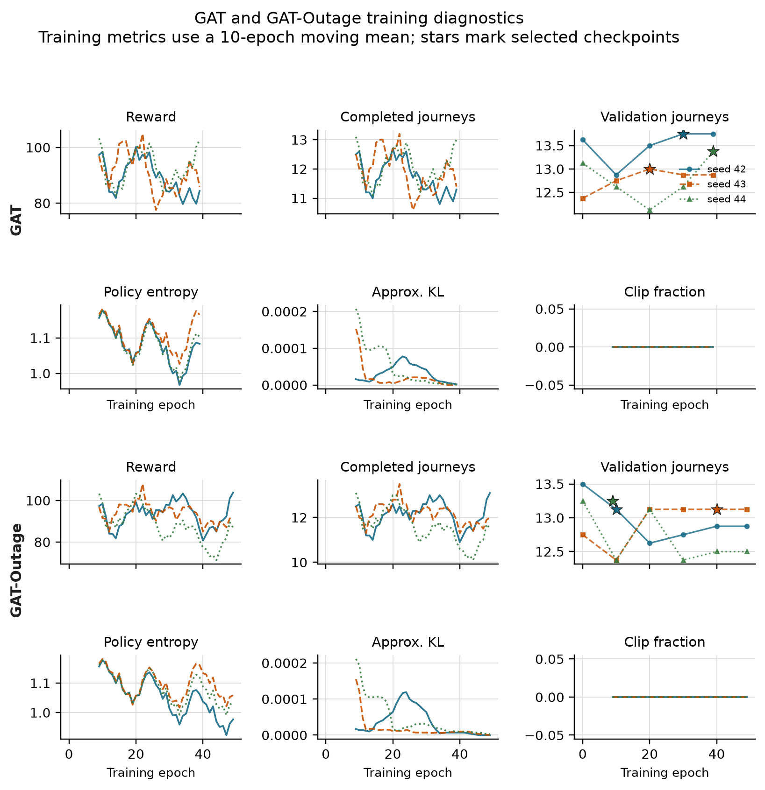

**Figure 4.1.** Training diagnostics for GAT (upper panels) and GAT-Outage
(lower panels). Curves use a ten-epoch moving mean; stars mark the checkpoints
selected on validation data. All six runs passed the stability gates, although
the curves still show variation between epochs.

Table 4.1 reports clean held-out capability. The learned policies complete
about 12.5 to 13.0 passenger journeys per episode. Their results overlap the
legal-random CI and the range of the simple greedy policy. Therefore, the
comparison establishes that the audited policies can dispatch and complete
journeys; it does not show that GAT is better than the baselines or MLP.

| Policy | Mean completed journeys per episode | Uncertainty or training-seed range |
|---|---:|---:|
| Legal random | 12.708 | 95% episode CI [11.875, 13.542] |
| Greedy nearest request | 12.000 | 95% demand-variant CI [10.000, 15.000] |
| MLP | 12.472 | training-seed range 12.458-12.500 |
| GAT | 12.674 | training-seed range 12.563-12.833 |
| GAT-Outage | 12.799 | training-seed range 12.667-13.000 |

The legal-random estimate uses 48 episode records. The greedy policy is
deterministic for a fixed demand file, so its effective replication unit is the
three held-out demand variants. Each learned-policy point uses 48 held-out
episodes: eight action-sampling seeds and six episodes per seed.

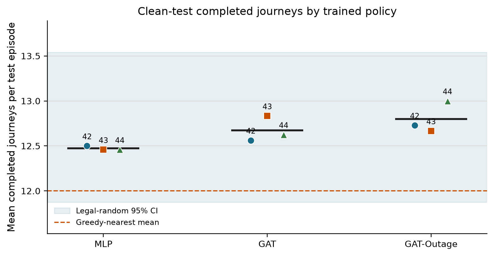

**Figure 4.2.** Clean-test completed journeys for each selected policy. The
shaded band is the legal-random 95% CI and the dashed line is the greedy mean.
Performance shows whether the policies can complete journeys; explanation
faithfulness is evaluated separately.

The separate argmax diagnostic also completes journeys. Across three held-out
episodes, GAT checkpoint means are 8.0, 7.3, and 9.7; GAT-Outage means are 7.0,
7.7, and 10.0. None of the 18 checkpoint-episodes has zero completed journeys.

## 4.2 Protocol correction and precision audit

The corrected experiment addresses four implementation risks found during the
code review: rewards earned while a taxi was busy are now accumulated over the
whole decision interval; completed passenger journeys are counted globally;
request-linked actions are protected in dispatch DEF; and unrounded numeric
values are stored for analysis. Checkpoint selection was then repeated using
validation data, followed by a new held-out evaluation. No corrected result is
combined with an earlier run.

Table 4.2 reports the numeric-precision check. Repeating the hypothesis
analysis after rounding stored values to four decimals changed some estimates
slightly but changed no direction or verdict. Full precision remains the
official analysis.

| Precision check | Checkpoints tested | Direction changes | Verdict changes | Use in thesis |
|---|---:|---:|---:|---|
| Full precision versus four-decimal sensitivity | 6 | 0 | 0 | full precision |

The agreement is useful given the small DEF values: the reported signs and
hypothesis decisions are unchanged by the tested rounding precision.

## 4.3 Decision-relevance controls

The supporting control experiment evaluates raw attention, Gradient x Input
(GxI), and leave-one-out (LOO) rankings under clean and 60-second outages.
Each model-condition estimate combines 27 episode blocks: three training
seeds, three evaluation seeds, and three episodes.

| Model | Condition | Raw-attention margin-DEF [95% CI] | GxI margin-DEF [95% CI] | LOO margin-DEF [95% CI] |
|---|---|---:|---:|---:|
| GAT | clean | -0.001355 [-0.002316, -0.000589] | -0.000388 [-0.001083, 0.000303] | +0.005595 [0.004053, 0.007436] |
| GAT | 60 s | -0.001027 [-0.001867, -0.000401] | +0.000002 [-0.000647, 0.000672] | +0.005735 [0.004151, 0.007636] |
| GAT-Outage | clean | -0.000596 [-0.000812, -0.000404] | -0.000584 [-0.001059, -0.000131] | +0.004001 [0.003037, 0.005108] |
| GAT-Outage | 60 s | -0.000454 [-0.000656, -0.000274] | -0.000553 [-0.001001, -0.000117] | +0.003949 [0.002968, 0.005064] |

Raw attention does not beat its type-matched random control: all four CIs are
below zero. LOO is positive in every case. This shows that the evaluator can
reward a perturbation-based ranking, but LOO is a positive control rather than
a ground-truth explanation. GxI gives mixed or negative results.

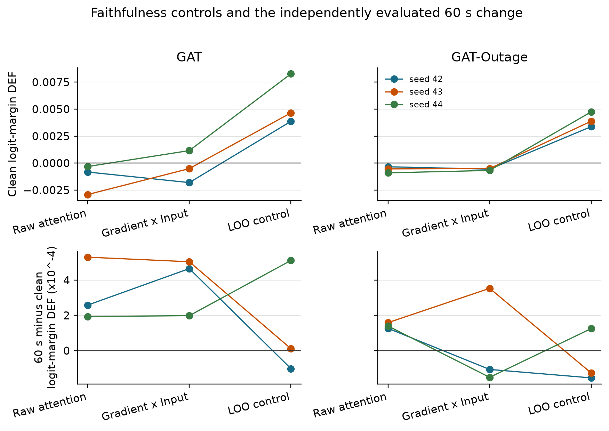

**Figure 4.3.** Top: clean logit-margin DEF. Bottom: independently evaluated
60-second result minus clean. LOO gives the clearest positive response; raw
attention does not show a matched-random advantage.

The attention result also depends on how weights are extracted. Every
checkpoint has at least one audited layer, head, maximum, or rollout choice
that reverses the direction of its default stale-attention shift.

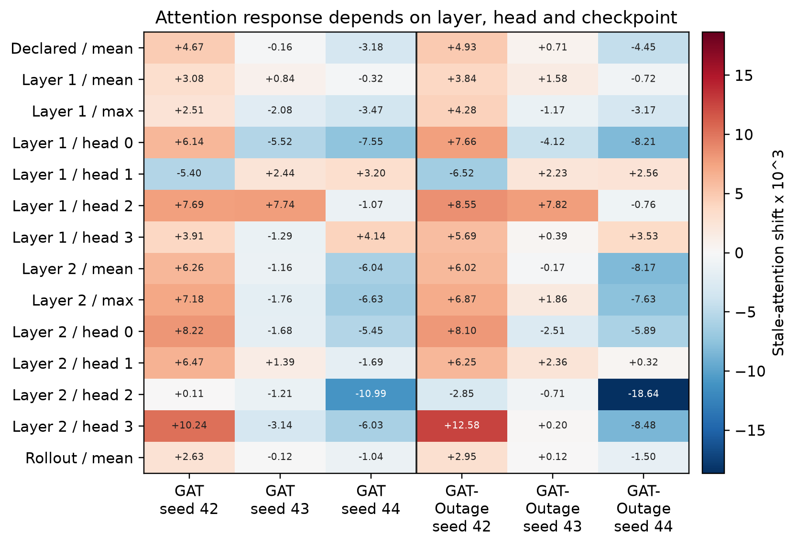

**Figure 4.4.** Stale-attention shift under alternative extraction rules,
multiplied by 1,000. Positive and negative values within the same checkpoint
show that the conclusion can depend on the chosen layer or head.

For dispatch decisions, the declared self-row margin-DEF is negative for both
models under clean and 60-second conditions. Using the selected request row
moves the estimate closer to zero, but its CIs include zero and it does not
provide consistent positive evidence.

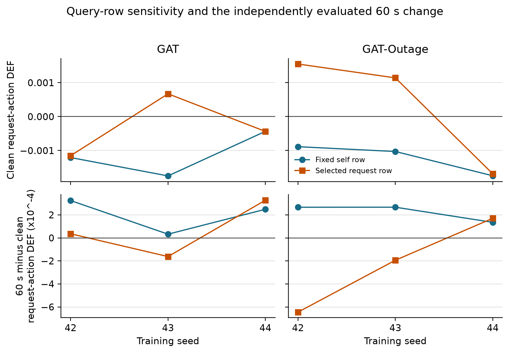

**Figure 4.5.** Dispatch-action margin-DEF from the fixed self row and selected
request row. The lower panels show the independently evaluated 60-second minus
clean change. Changing the query row does not make decision relevance
reliable.

## 4.4 Small-graph resolution

The scored graph contains five visible peer taxis in nearly every record and a
smaller, variable number of request nodes. Table 4.4 describes the eligible
non-self nodes.

| Model | Node type | Mean | Median | 5th percentile | 95th percentile |
|---|---|---:|---:|---:|---:|
| GAT | peer taxis | 5.00 | 5 | 5 | 5 |
| GAT | requests | 2.53 | 2 | 1 | 5 |
| GAT | all non-self nodes | 7.53 | 7 | 6 | 10 |
| GAT-Outage | peer taxis | 5.00 | 5 | 5 | 5 |
| GAT-Outage | requests | 2.55 | 2 | 1 | 5 |
| GAT-Outage | all non-self nodes | 7.55 | 7 | 6 | 10 |

In a small candidate set, a top-k explanation and a matched random set can
overlap by chance. For GAT, attention-LOO agreement is below the expected
random overlap at k=1, 2, and 3. For GAT-Outage, it is slightly above random at
k=1 but below random at k=2 and 3. The overlap reduces DEF's ability to
separate rankings, especially as k increases.

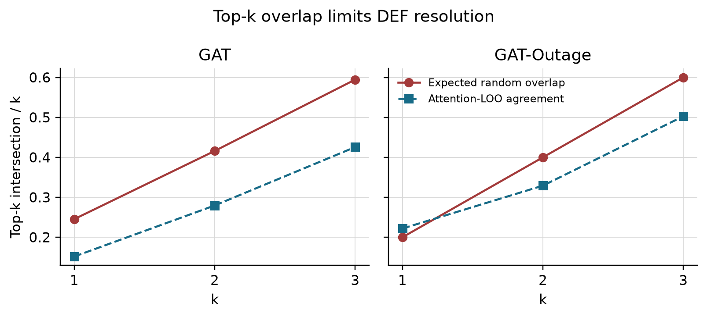

**Figure 4.6.** Observed attention-LOO agreement compared with expected random
overlap. Large expected overlap limits the resolution of a top-k comparison;
it does not by itself prove or disprove faithfulness.

## 4.5 Telemetry manipulation and stale exposure

The outage manipulation worked as intended. Conditional WAMSN rises from about
0.027-0.029 at 10 seconds to about 0.071-0.076 at 60 seconds. Across the six
checkpoints, H3 correlations between duration and WAMSN are 0.458-0.477 and
remain significant after Holm correction. H3 is therefore supported for all
six checkpoints.

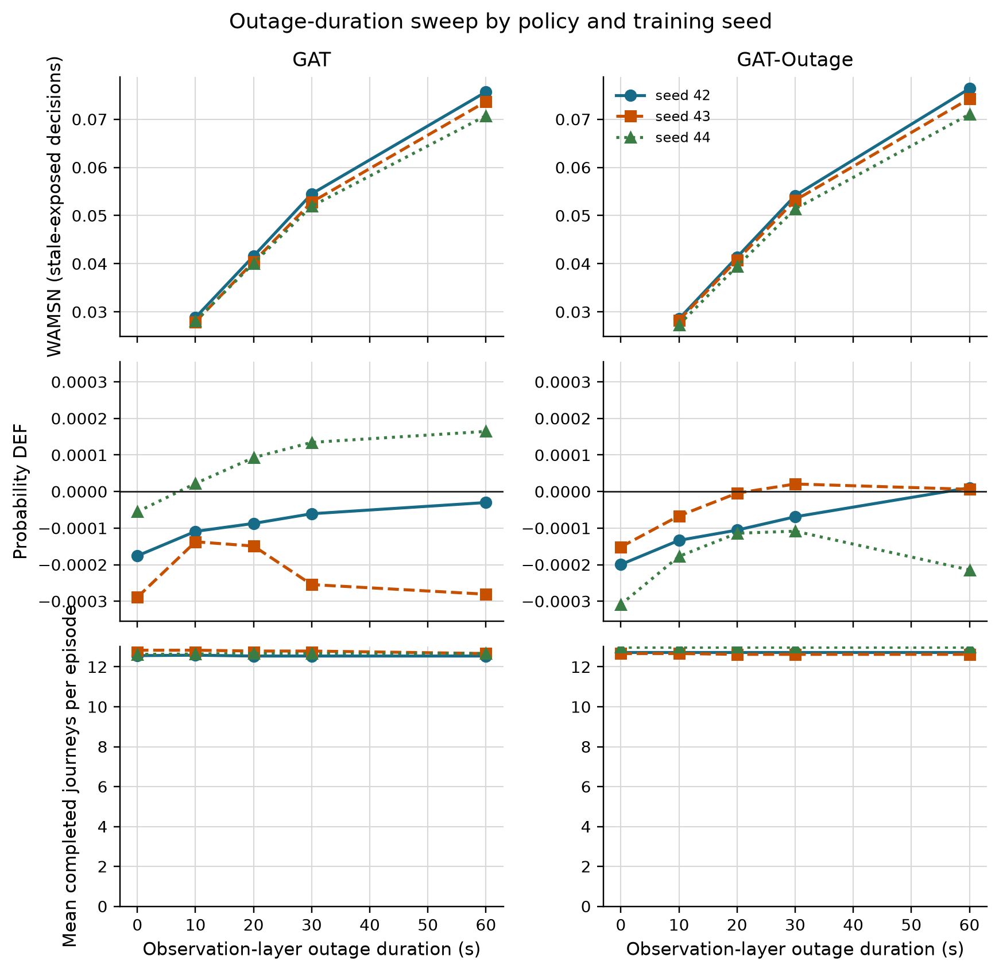

**Figure 4.7.** Longer observation outages increase WAMSN for every
checkpoint. Completed journeys remain broadly stable. Probability DEF does
not show the proposed decline. WAMSN verifies stale exposure; it does not show
that AoI causes a change in faithfulness.

## 4.6 Paired clean and degraded observations

The paired audit compares each degraded observation with its exact clean twin
at the same SUMO step. Positive attention shift means that the degraded
observation assigns more attention to nodes marked stale. Positive DEF shift
means that measured DEF is higher, not lower, under degradation.

| Model | Seed | Stale-attention shift x 1,000 [95% CI] | Probability-DEF shift x 10,000 [95% CI] |
|---|---:|---:|---:|
| GAT | 42 | +3.834 [+3.725, +3.943] | +0.852 [+0.763, +0.940] |
| GAT | 43 | +0.015 [-0.005, +0.037] | +1.222 [+1.048, +1.418] |
| GAT | 44 | -2.639 [-2.708, -2.574] | +1.889 [+1.772, +2.008] |
| GAT-Outage | 42 | +3.347 [+3.254, +3.443] | +0.855 [+0.739, +0.979] |
| GAT-Outage | 43 | +0.928 [+0.913, +0.943] | +1.596 [+1.489, +1.699] |
| GAT-Outage | 44 | -3.578 [-3.646, -3.508] | +0.514 [+0.455, +0.574] |

The estimates summarize stale-exposed decisions across the evaluated degraded
conditions using the saved episode-block analysis. Attention uses all eligible
stale-exposed records; DEF additionally requires a scorable action, so their
record and episode-block counts can differ. They do not estimate variation across new, independently trained policies. The unscaled paired probability-DEF increases
range from approximately 0.000051 to 0.000189. These are changes in the
composite, random-adjusted DEF score, not percentage-point improvements in
success probability. Their consistent positive direction contradicts the
predicted decline but does not establish practically useful explanations.
No deployment utility threshold for this effect size has been validated.

Three checkpoints show a clear increase in attention to stale nodes, two show
a clear decrease, and GAT seed 43 is inconclusive because its 95% CI crosses
zero. The direction follows the training seed more closely than the training
condition: both seed-44 checkpoints are negative. All six paired DEF changes
are small and positive, which is opposite to the proposed degradation-related
decline.

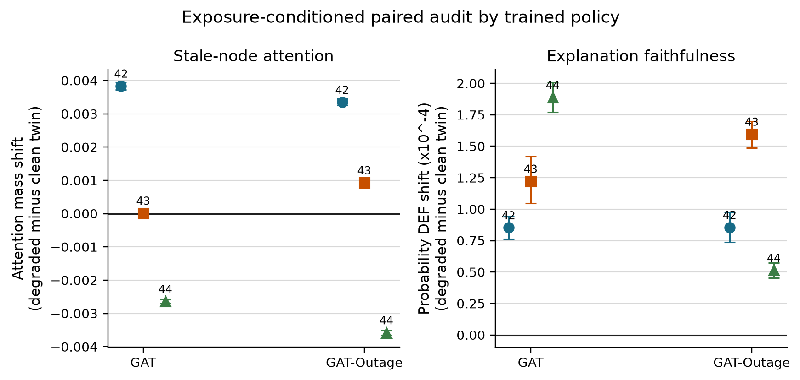

**Figure 4.8.** Exposure-conditioned degraded-minus-clean shifts by frozen
checkpoint. Error bars are episode-block bootstrap CIs. Attention direction
varies across checkpoints, while probability DEF increases slightly in all
six.

## 4.7 Analysis by action type

The corrected reward handling changes the action composition compared with the
earlier experiment. For GAT, dispatch accounts for 9,649 of 12,028 scorable
decisions (80.2%); no-op accounts for 2,379 (19.8%). For GAT-Outage,
dispatch accounts for 8,392 of 12,022 decisions (69.8%) and no-op for
3,630 (30.2%). Table 4.6 shows that this
balance still differs by checkpoint.

| Checkpoint | No-op (%) | Dispatch (%) | All-action DEF shift x 10,000 | No-op DEF shift x 10,000 | Dispatch DEF shift x 10,000 |
|---|---:|---:|---:|---:|---:|
| GAT, seed 42 | 16.3 | 83.7 | +0.852 | -0.228 | +1.095 |
| GAT, seed 43 | 25.8 | 74.2 | +1.222 | -0.420 | +2.146 |
| GAT, seed 44 | 17.3 | 82.7 | +1.889 | -1.093 | +2.660 |
| GAT-Outage, seed 42 | 33.8 | 66.2 | +0.855 | -0.450 | +1.584 |
| GAT-Outage, seed 43 | 26.0 | 74.0 | +1.596 | -1.024 | +2.760 |
| GAT-Outage, seed 44 | 30.8 | 69.2 | +0.514 | -0.456 | +0.999 |

The two action groups move in opposite directions in every checkpoint: no-op
DEF decreases, while dispatch DEF increases. The positive all-action estimate obscures this difference between the two
action types, making the separate results necessary for interpretation.

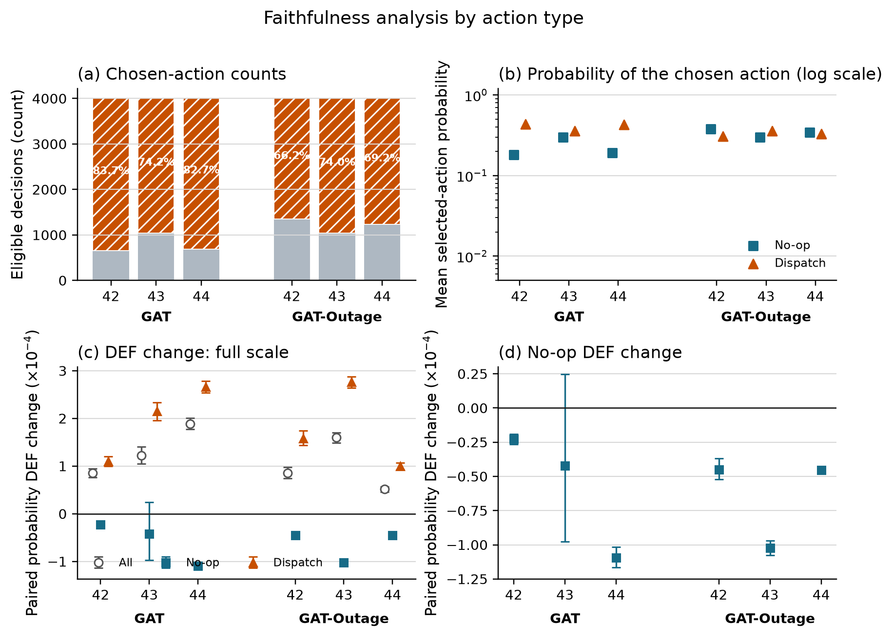

**Figure 4.9.** (a) Scorable action counts and dispatch share; (b) selected
action probability; (c) all, no-op, and dispatch paired DEF changes; and (d)
an enlarged view of the no-op changes. Error bars are episode-block bootstrap
CIs.

## 4.8 Random-trigger sensitivity analysis

The random-loss control replaces tunnel entry with an independent per-taxi,
per-step trigger while retaining a 30-second observation-layer freeze. The
configured trigger rate is fixed, but observed random exposure is only about
18% of tunnel exposure. This is a trigger-location sensitivity check, not an
exposure-matched causal comparison.

| Result compared between tunnel and random triggers | Checkpoints agreeing in direction | Interpretation |
|---|---:|---|
| Stale-attention shift | 5/6 | broad seed pattern remains, with one near-zero mismatch |
| Probability-DEF shift | 6/6 | both triggers give a small positive shift |
| Exposure rate | 0/6 matched | random condition has much lower realized exposure |

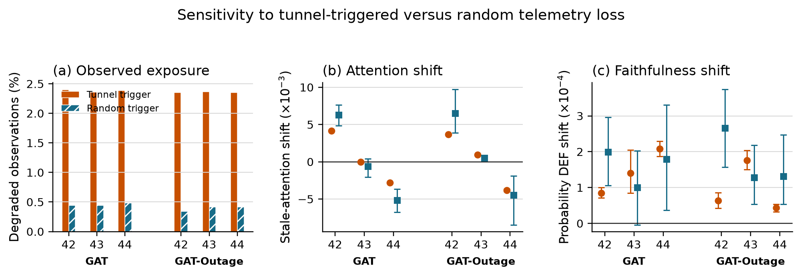

**Figure 4.10.** Tunnel and random triggers under a 30-second freeze. The
random condition creates less exposure. Attention direction agrees for five
checkpoints and DEF direction for all six, but several random-condition CIs
are wide because few stale-exposed decisions occur.

## 4.9 Hypothesis results

Figure 4.11 shows increasing DEF rank across within-episode WAMSN groups.
All six checkpoint correlations are positive, providing no support for the
negative association predicted by H4.

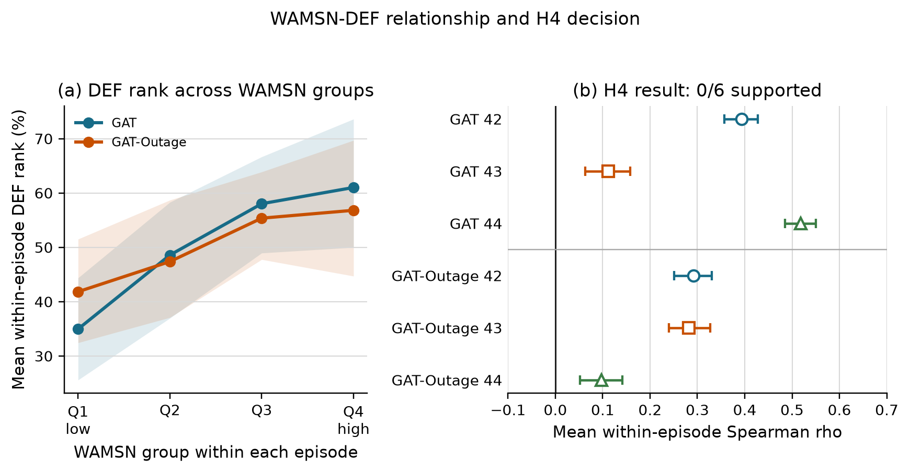

**Figure 4.11.** Panel (a) groups WAMSN within each episode and shows mean DEF
rank. Panel (b) reports the per-checkpoint mean Spearman correlation and CI.
H4 predicted a negative relationship; all six estimates are positive, so H4
is not supported.

| Hypothesis | GAT seeds supporting | GAT-Outage seeds supporting | Verdict |
|---|---:|---:|---|
| H1: DEF decreases as outage duration increases | 0/3 | 0/3 | not supported |
| H2: faithfulness declines faster than performance | 0/3 | 0/3 | not supported |
| H3: WAMSN increases as outage duration increases | 3/3 | 3/3 | supported manipulation check |
| H4: higher WAMSN is associated with lower DEF | 0/3 | 0/3 | not supported |
| H5: GAT-Outage gives weaker H1 and H4 relationships | n/a | 2/3 matched comparisons | not consistent across seeds |

H1 correlations are non-negative (0.015-0.226), and H4 mean within-episode
correlations are also non-negative (0.097-0.518). H2 cannot be supported when
the expected faithfulness decline is absent. GAT-Outage has weaker absolute H1
and H4 relationships than its matched GAT checkpoint for seeds 42 and 44, but
not seed 43; H5 is therefore not consistent.

## 4.10 Answers to the research questions

**RQ1:** The tested averaged self-row attention does not establish reliable
dispatch decision relevance under clean telemetry. Its dispatch margin-DEF
is below the matched-random control, while LOO gives a positive control
response. Selected-request-row sensitivity does not establish a consistent
advantage over random controls; this does not reject all attention-based
explanation methods. No-op evidence is reported separately in Section 4.12.

**RQ2:** Degradation changes stale-node attention, but not in one consistent
direction. Three checkpoints show a clear shift toward stale nodes, two show a
clear shift away, and one is inconclusive.

**RQ3:** Longer outages consistently increase stale exposure, but the proposed
decline in DEF is not observed. The result also differs by action type and by
attention-extraction choice.

**RQ4:** The tested outage-trained configuration does not remove checkpoint
variation or make raw attention pass the decision-relevance check.

## 4.11 Explanation-release audit

The final framework decision is `WITHHOLD` for GAT, GAT-Outage, and all six
checkpoints. This means that the evidence is complete enough to audit, but raw
attention should not be presented as the reason for a dispatch or no-op
decision. This is a conservative decision for the whole declared explanation
channel, based in part on failed dispatch decision relevance. It does not mean
that no-op faithfulness fails individually in every checkpoint. The exploratory
no-op analysis in Section 4.12 does not alter the original release criteria.

| Audit check | GAT | GAT-Outage | Main reason |
|---|---|---|---|
| Evidence integrity | PASS | PASS | all sweep preflights passed |
| Freshness visibility | PASS | PASS | AoI-derived exposure is reported separately |
| Action-aware controls | PASS | PASS | type matching, action protection, and LOO are present |
| Decision relevance | FAIL | FAIL | dispatch self-row margin-DEF CIs are below zero |
| Action composition | PASS | PASS | no-op and dispatch are reported separately |
| Extraction stability | FAIL | FAIL | alternative heads or layers reverse direction |
| Checkpoint consistency | FAIL | FAIL | stale-attention direction differs across seeds |
| Deployment-action capability | NOT APPLICABLE | NOT APPLICABLE | audit scope uses sampled actions |
| Trigger robustness | INDETERMINATE | PASS | GAT seed 43 random-trigger interval crosses zero |
| Model decision | WITHHOLD | WITHHOLD | required release checks do not pass |

Under this decision, attention remains available for internal model diagnosis,
with freshness displayed separately. It is not released as an audited
explanation of the selected action.

## 4.12 Supplementary no-op decision relevance

A supplementary analysis of the archived main-sweep records examines whether
no-op attention exceeds its type-matched random control in absolute DEF. This
addresses a different question from the paired change under degradation. The
analysis is exploratory and leaves the original H1-H5 tests and release
criteria unchanged. Only scored no-op decisions
with at least one available request are eligible. The existing cadence and
stale-exposure sampling schedule is retained, so these estimates describe the
scored records rather than all no-op actions or a matched clean/degraded sample.

Each cell first averages scores within evaluation-seed/episode blocks for one
fixed checkpoint. Table 4.10 reports equal-weight block means and pointwise
95% percentile intervals from 10,000 bootstrap draws (seed 20260912). These
intervals are exploratory, are not multiplicity-adjusted, and do not estimate
between-training-seed uncertainty. E/D denotes eligible episode blocks/scored
decisions; episodes without eligible no-op records do not contribute.

| Model / seed | Clean mean [95% CI] | 60 s mean [95% CI] | E/D clean; 60 s |
|---|---|---|---|
| GAT / 42 | +0.448 [+0.274, +0.628] | +0.150 [+0.082, +0.221] | 26/41; 47/194 |
| GAT / 43 | -3.475 [-6.850, -0.758] | -4.939 [-6.841, -3.226] | 37/64; 48/322 |
| GAT / 44 | +0.031 [-0.060, +0.145] | -0.852 [-0.964, -0.742] | 25/40; 46/209 |
| GAT-Outage / 42 | +0.660 [+0.539, +0.783] | +0.173 [+0.111, +0.241] | 41/92; 48/417 |
| GAT-Outage / 43 | +0.266 [+0.078, +0.459] | -0.102 [-0.216, +0.021] | 37/65; 48/324 |
| GAT-Outage / 44 | +0.460 [+0.175, +0.782] | +0.238 [+0.052, +0.447] | 40/82; 48/383 |

All margin-DEF values in Table 4.10 are multiplied by 1,000 for readability.
GAT seed 42 and GAT-Outage seeds 42 and 44 have positive margin-DEF intervals
in both conditions. GAT seed 43 is below zero in both; GAT seed 44 is
inconclusive when clean and below zero at 60 seconds; GAT-Outage seed 43 is
positive when clean and inconclusive at 60 seconds. Probability DEF is less
consistent: only GAT seed 42 and GAT-Outage seed 42 have positive intervals
in both conditions. Thus a decline under degradation need not imply an
absolute failure against the random comparator, and the dispatch result must
not be generalized to every no-op explanation. Small effects, score choice,
sampling differences and checkpoint variation limit interpretation.

The original whole-channel decision remains WITHHOLD because its dispatch
and stability requirements are not met. This supplementary analysis does not
certify any checkpoint for explanation release. Appendix C summarizes the original hypothesis tests and identifies the
supporting files containing full-precision estimates, sample counts and
archive hashes.
