# 4. Results

All 15 training runs passed the stability gates, all 120 clean evaluation cells completed, and all ten faithfulness sweeps passed their preflight checks. Results are reported by training seed because one
checkpoint, rather than each decision, is the independent trained-policy
replicate. Unless stated otherwise, intervals are 95% confidence intervals
(CIs) formed from episode blocks.

## 4.1 Policy capability and training stability

Validation selected different epochs for different training seeds, as shown in
Table 3.3. Epoch 0, saved after the first training epoch, was retained only as an early-training diagnostic and could
not be selected. Every training run passed the declared stability gates.

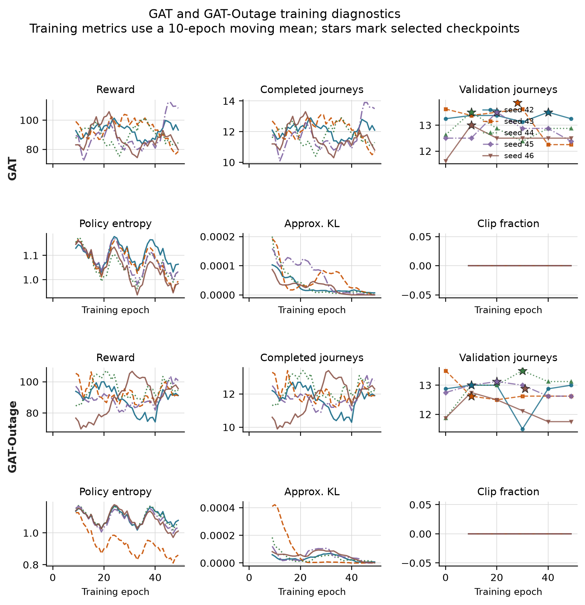

**Figure 4.1.** Training diagnostics for GAT (upper panels) and GAT-Outage
(lower panels). Curves use a ten-epoch moving mean; stars mark the checkpoints
selected on validation data. All ten GAT runs passed the stability gates, although
the curves still show variation between epochs.

Table 4.1 reports clean held-out capability. The learned policies complete
between 11.729 and 13.146 passenger journeys per episode across individual training seeds. Their results overlap the
legal-random CI and the range of the simple greedy policy. Therefore, the
comparison establishes that the audited policies can dispatch and complete
journeys; it does not show that GAT is better than the baselines or MLP.

| Policy | Mean completed journeys per episode | Uncertainty or training-seed range |
|---|---:|---:|
| Legal random | 12.708 | 95% episode CI [11.875, 13.542] |
| Greedy nearest request | 12.000 | 95% demand-variant CI [10.000, 15.000] |
| MLP | 12.521 | training-seed range 11.729-13.146 |
| GAT | 12.850 | training-seed range 12.792-12.917 |
| GAT-Outage | 12.721 | training-seed range 12.271-12.958 |

The legal-random estimate uses 48 episode records. The greedy policy is
deterministic for a fixed demand file, so its effective replication unit is the
three held-out demand variants. Each learned-policy point uses 48 held-out
episodes: eight action-sampling seeds and six episodes per seed.

The lower greedy mean may partly reflect independent taxis selecting the same request without coordination. However, the baseline records do not quantify rejected conflicts, so their contribution to the difference is unknown. The point estimates alone do not establish that random dispatch is generally better than greedy dispatch.

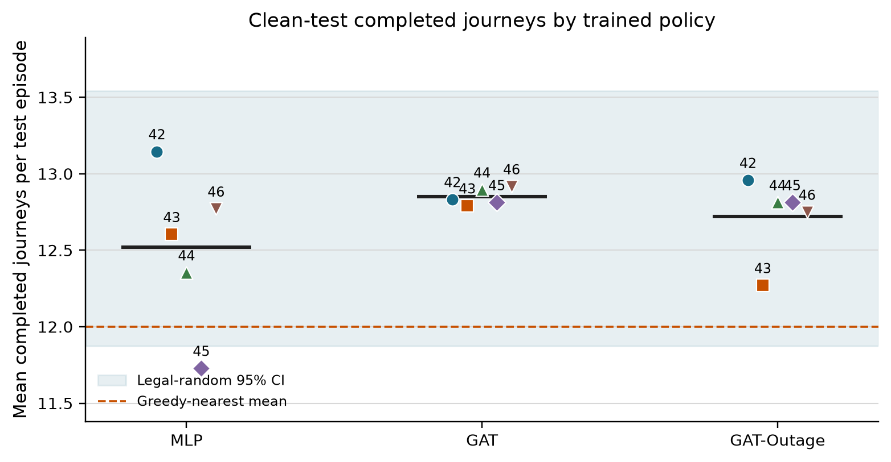

**Figure 4.2.** Clean-test completed journeys for each selected policy. The
shaded band is the legal-random 95% CI and the dashed line is the greedy mean.
Performance shows whether the policies can complete journeys; explanation
faithfulness is evaluated separately.

The separate argmax diagnostic also completes journeys. Across three held-out
episodes, GAT checkpoint means are 7.3, 7.7, 8.7, 11.3 and 5.3 for seeds 42-46; GAT-Outage means are 9.0, 7.7, 10.0, 9.0 and 8.7. None of the 30 checkpoint-episodes has zero completed journeys.

The argmax means are lower than the corresponding sampled-action means. This suggests that the action-selection rule matters, but the diagnostic uses only three episodes per checkpoint, compared with 48 for sampling. A deployment using argmax would need its own matched evaluation; the present capability claim concerns the sampled policies.

## 4.2 Protocol correction and precision audit

The corrected experiment addresses four implementation risks found during the
code review: rewards earned while a taxi was busy are now accumulated over the
whole decision interval; completed passenger journeys are counted globally;
request-linked actions are protected in dispatch DEF; and unrounded numeric
values are stored for analysis. All models were trained afresh under the corrected protocol, followed by validation selection and test evaluation on the current workstation. No result is combined with an earlier run.

Earlier pilot estimates are superseded because they were obtained under a protocol with known implementation defects. The rerun also changes the trained checkpoints, seed coverage, training budgets and runtime environment. Differences from the pilot cannot therefore be attributed to an individual correction, or used to estimate the effect of any one implementation change.

Table 4.2 reports the numeric-precision check. Repeating the hypothesis
analysis after rounding stored values to four decimals preserved the signs of H1 rho, H4 rho and paired DEF for all ten checkpoints, but changed one H1 verdict. Full precision remains the
official analysis.

| Precision check | Checkpoints tested | Point-estimate sign changes | H1-H4 significance decisions changed | Use in thesis |
|---|---:|---:|---:|---|
| Full precision versus four-decimal sensitivity | 10 | 0 | 1 (H1, GAT-Outage seed 46) | full precision |

Sign changes refer to H1 rho, H4 rho and the paired DEF point estimate. The next column counts H1-H4 tests crossing the Holm-adjusted 0.05 threshold. Changes in whether the paired DEF confidence interval includes zero are reported separately below.

For GAT-Outage seed 46, the H1 Holm-adjusted p-value changes from 0.0495 to 0.0867 after rounding. Its paired DEF interval also changes from crossing zero to slightly above zero. This borderline checkpoint is precision-sensitive and should not carry a general claim. The full-precision result remains official, while the rounding check qualifies its interpretation.

## 4.3 Decision-relevance controls

The supporting control experiment evaluates raw attention, Gradient x Input
(GxI), and leave-one-out (LOO) rankings under clean and 60-second outages.
Each model-condition estimate combines 45 episode blocks: five training
seeds, three evaluation seeds, and three episodes.

| Model | Condition | Raw-attention margin-DEF [95% CI] | GxI margin-DEF [95% CI] | LOO margin-DEF [95% CI] |
|---|---|---:|---:|---:|
| GAT | clean | -0.000907 [-0.001075, -0.000729] | -0.000366 [-0.000986, +0.000161] | +0.003228 [+0.002591, +0.003927] |
| GAT | 60 s | -0.000767 [-0.000916, -0.000612] | -0.000014 [-0.000461, +0.000378] | +0.003066 [+0.002492, +0.003698] |
| GAT-Outage | clean | -0.002493 [-0.003356, -0.001674] | +0.000131 [-0.000671, +0.000958] | +0.004328 [+0.003486, +0.005286] |
| GAT-Outage | 60 s | -0.002307 [-0.003045, -0.001613] | +0.000389 [-0.000367, +0.001149] | +0.003941 [+0.003194, +0.004787] |

Raw attention does not beat its type-matched random control: all four CIs are
below zero. LOO is positive in every case. This shows that the evaluator can
reward a perturbation-based ranking, but LOO is a positive control rather than
a ground-truth explanation. All four GxI intervals include zero.

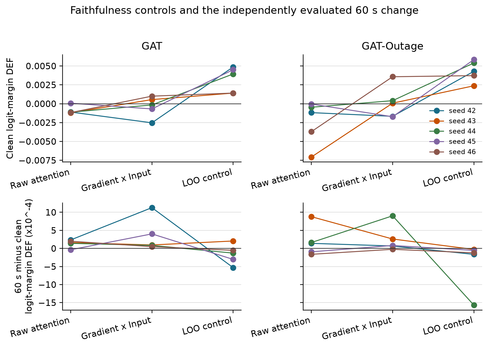

**Figure 4.3.** Clean logit-margin DEF (top) and independently evaluated 60-second minus clean change (bottom), by training seed. Pooled raw attention shows no matched-random advantage.

The attention result also depends on how weights are extracted. Every
checkpoint has at least one audited layer, head, maximum, or rollout choice
that reverses the direction of its default stale-attention shift.

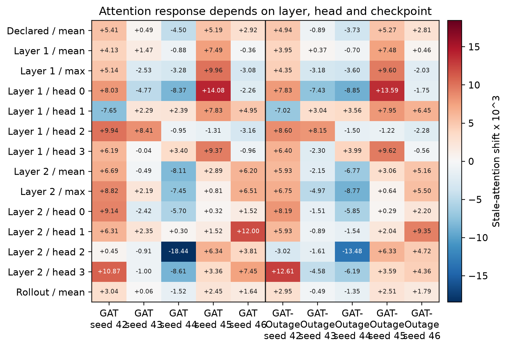

**Figure 4.4.** Stale-attention shift under alternative extraction rules,
multiplied by 1,000. Positive and negative values within the same checkpoint
show that the conclusion can depend on the chosen layer or head.

For dispatch decisions, the declared self-row margin-DEF is negative for both
models under clean and 60-second conditions. Using the selected request row gives a different result. GAT remains below zero in both conditions, while GAT-Outage is positive: +0.000711 [0.000252, 0.001219] when clean and +0.000762 [0.000297, 0.001254] at 60 seconds. This is positive evidence for the alternative row in this configuration, but it does not validate the predeclared self-row channel or establish consistency across both model conditions.

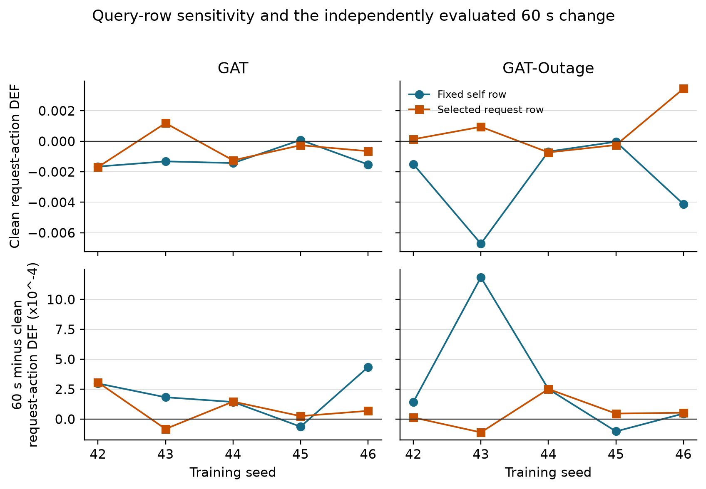

**Figure 4.5.** Dispatch-action margin-DEF from the fixed self row and selected
request row. The lower panels show the independently evaluated 60-second minus
clean change. The selected request row improves GAT-Outage estimates above zero, while GAT remains below zero. The result is specific to the extraction rule and model configuration.

## 4.4 Small-graph resolution

The scored graph contains five visible peer taxis in nearly every record and a
smaller, variable number of request nodes. Table 4.4 describes the eligible
non-self nodes in main-sweep records with at least one available request and a recorded primary DEF. The distribution is descriptive and weighted by scored decisions.

| Model | Node type | Mean | Median | 5th percentile | 95th percentile |
|---|---|---:|---:|---:|---:|
| GAT | peer taxis | 5.00 | 5 | 5 | 5 |
| GAT | requests | 2.54 | 2 | 1 | 5 |
| GAT | all non-self nodes | 7.54 | 7 | 6 | 10 |
| GAT-Outage | peer taxis | 5.00 | 5 | 5 | 5 |
| GAT-Outage | requests | 2.54 | 2 | 1 | 5 |
| GAT-Outage | all non-self nodes | 7.54 | 7 | 6 | 10 |

In a small candidate set, a top-k explanation and a matched random set can
overlap by chance. For both models, attention-LOO agreement is below the expected
random overlap at k=1, 2, and 3. The overlap reduces DEF's ability to
separate rankings, especially as k increases.

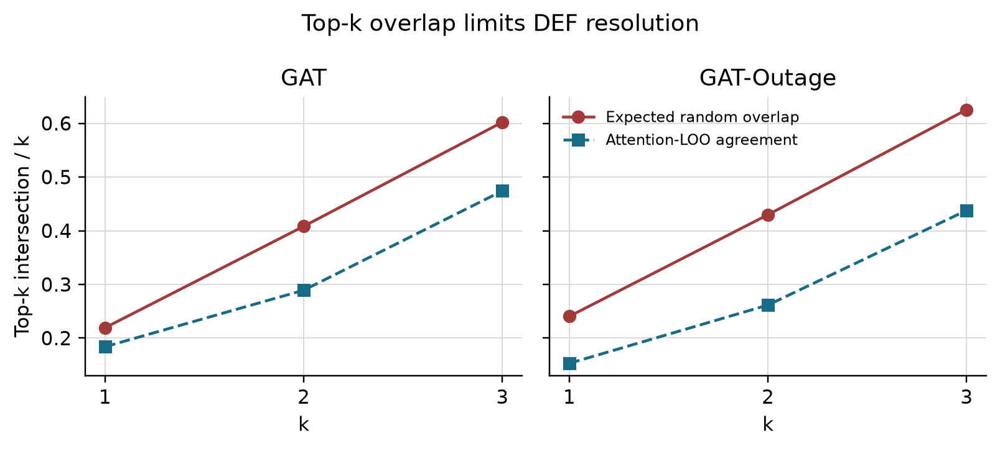

**Figure 4.6.** Observed attention-LOO agreement compared with expected random
overlap. Large expected overlap limits the resolution of a top-k comparison;
it does not by itself prove or disprove faithfulness.

## 4.5 Telemetry manipulation and stale exposure

The outage manipulation worked as intended. Conditional WAMSN rises from 0.027-0.029 at 10 seconds to 0.071-0.077 at 60 seconds. Across the ten checkpoints, H3 correlations between duration and WAMSN are 0.466-0.486 and remain significant after Holm correction. H3 is therefore supported for all ten checkpoints.

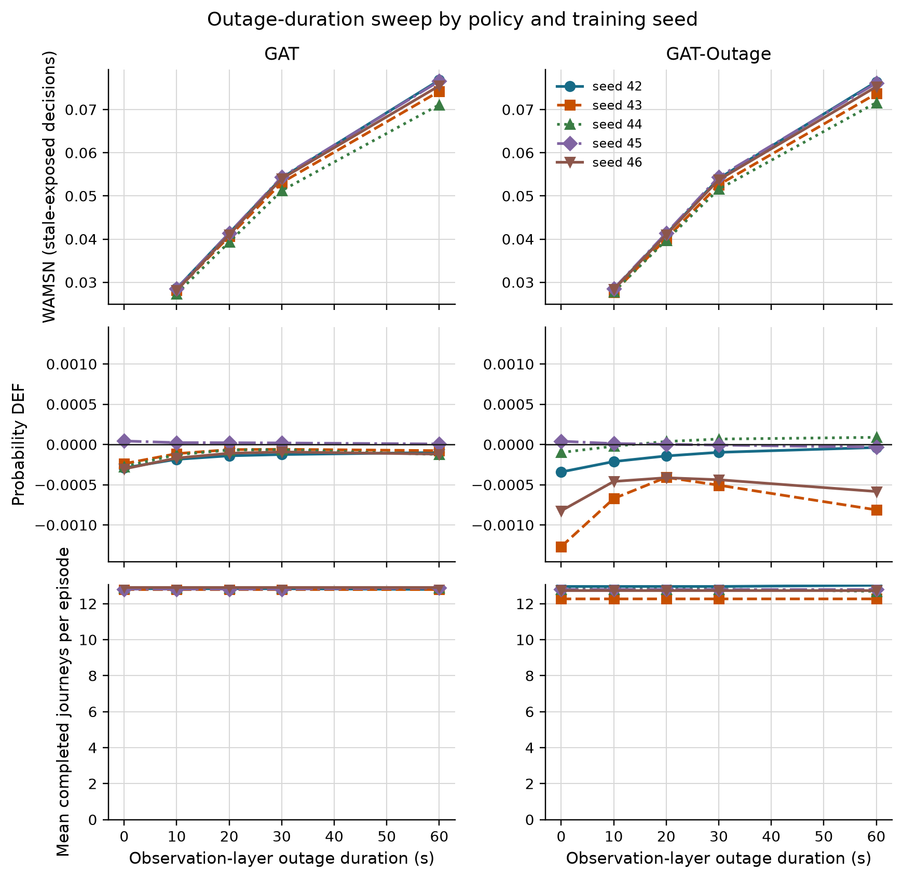

**Figure 4.7.** Longer observation outages increase WAMSN for every
checkpoint. Completed journeys remain broadly stable. Probability DEF has no consistent direction across checkpoints. WAMSN verifies stale exposure; it does not show
that AoI causes a change in faithfulness.

## 4.6 Paired clean and degraded observations

The paired audit compares each degraded observation with its exact clean twin
at the same SUMO step. Positive attention shift means that the degraded
observation assigns more attention to nodes marked stale. Positive DEF shift
means that measured DEF is higher, not lower, under degradation.

| Model | Seed | Stale-attention shift x 1,000 [95% CI] | Probability-DEF shift x 10,000 [95% CI] |
|---|---:|---:|---:|
| GAT | 42 | +3.805 [+3.689, +3.930] | +0.653 [+0.460, +0.872] |
| GAT | 43 | +0.650 [+0.636, +0.665] | +1.225 [+1.097, +1.342] |
| GAT | 44 | -3.444 [-3.530, -3.354] | +0.819 [+0.747, +0.891] |
| GAT | 45 | +4.022 [+3.929, +4.116] | -0.075 [-0.104, -0.048] |
| GAT | 46 | +2.474 [+2.418, +2.527] | +0.828 [+0.720, +0.940] |
| GAT-Outage | 42 | +3.331 [+3.233, +3.431] | +0.965 [+0.840, +1.095] |
| GAT-Outage | 43 | -0.736 [-0.769, -0.702] | +1.344 [+1.176, +1.514] |
| GAT-Outage | 44 | -2.440 [-2.512, -2.367] | +1.619 [+1.459, +1.774] |
| GAT-Outage | 45 | +3.918 [+3.823, +4.009] | -0.445 [-0.494, -0.398] |
| GAT-Outage | 46 | +2.083 [+2.033, +2.132] | +0.039 [-0.019, +0.103] |

The estimates summarize stale-exposed decisions across the evaluated degraded
conditions using the saved episode-block analysis. Attention uses all eligible
stale-exposed records; DEF additionally requires a scorable action, so their
record and episode-block counts can differ. They do not estimate variation across new, independently trained policies. The unscaled paired probability-DEF changes range from approximately -0.000044 to +0.000162. These are changes in the composite, random-adjusted DEF score, not percentage-point changes in success probability. Seven checkpoints have positive intervals, both seed-45 checkpoints have negative intervals, and GAT-Outage seed 46 is inconclusive. No deployment utility threshold for these small effects has been validated.

Seven checkpoints show a clear increase in attention to stale nodes and three show a clear decrease: GAT seed 44 and GAT-Outage seeds 43 and 44. The two models share the direction for four of five matched seeds. This pattern shows substantial checkpoint dependence, rather than a uniform effect of outage training.

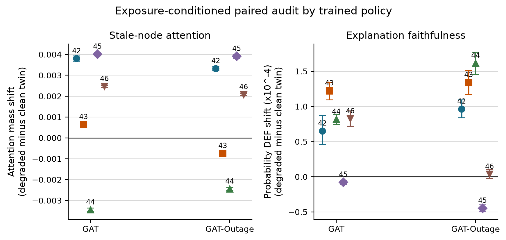

**Figure 4.8.** Exposure-conditioned degraded-minus-clean shifts by frozen
checkpoint. Error bars are episode-block bootstrap CIs. Both attention and probability DEF vary across checkpoints. Seven DEF intervals are positive, two negative, and one crosses zero.

## 4.7 Analysis by action type

Dispatch accounts for 14,953 of 20,096 scorable GAT decisions (74.4%) and 15,714 of 20,056 GAT-Outage decisions (78.3%). No-op accounts for the remaining 5,143 and 4,342 records. Table 4.6 separates the paired changes by checkpoint and action type.

| Checkpoint | No-op (%) | Dispatch (%) | All-action DEF shift x 10,000 | No-op DEF shift x 10,000 | Dispatch DEF shift x 10,000 |
|---|---:|---:|---:|---:|---:|
| GAT, seed 42 | 29.8 | 70.2 | +0.653 | -0.193 | +1.041 |
| GAT, seed 43 | 21.5 | 78.5 | +1.225 | -2.483 | +2.345 |
| GAT, seed 44 | 24.3 | 75.7 | +0.819 | -0.630 | +1.399 |
| GAT, seed 45 | 25.5 | 74.5 | -0.075 | -0.010 | -0.071 |
| GAT, seed 46 | 26.9 | 73.1 | +0.828 | -0.167 | +1.443 |
| GAT-Outage, seed 42 | 25.7 | 74.3 | +0.965 | -0.416 | +1.540 |
| GAT-Outage, seed 43 | 7.3 | 92.7 | +1.344 | -0.644 | +1.566 |
| GAT-Outage, seed 44 | 31.6 | 68.4 | +1.619 | -1.619 | +3.537 |
| GAT-Outage, seed 45 | 23.0 | 77.0 | -0.445 | +0.157 | -0.646 |
| GAT-Outage, seed 46 | 20.6 | 79.4 | +0.039 | -0.065 | +0.065 |

No-op DEF decreases in all five GAT checkpoints and four of five GAT-Outage checkpoints. Dispatch DEF increases in eight checkpoints and decreases in both seed-45 checkpoints. Nine checkpoints therefore have opposite no-op and dispatch directions. GAT seed 45 decreases in both groups; GAT-Outage seed 45 increases for no-op but decreases for dispatch. The combined estimate does not describe every action type equally well.

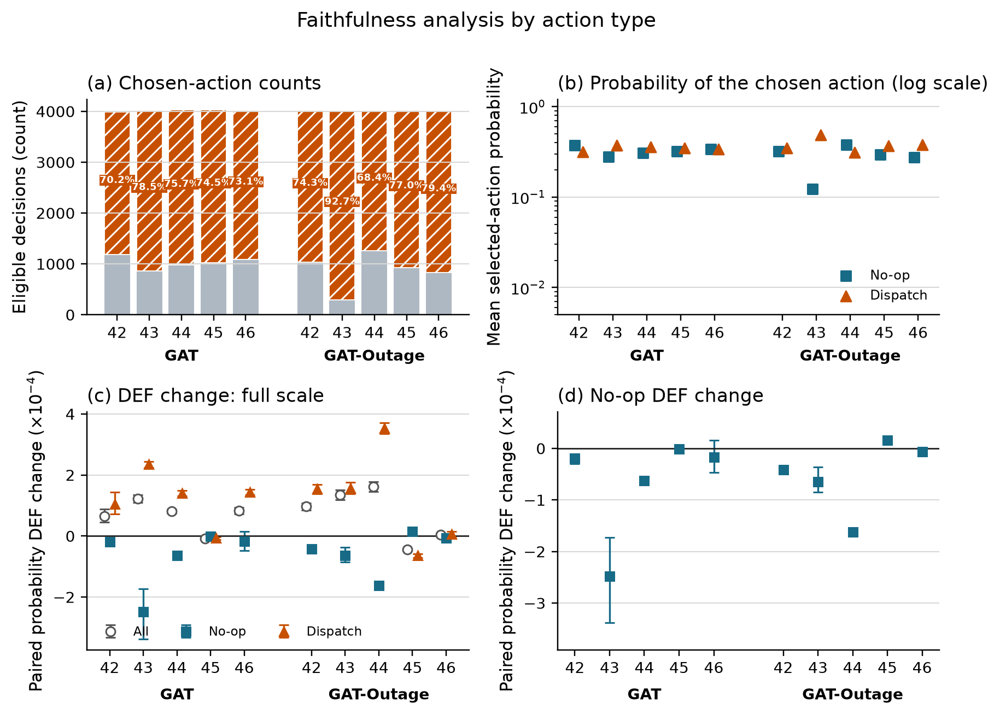

**Figure 4.9.** (a) Scorable action counts and dispatch share; (b) selected
action probability; (c) all, no-op, and dispatch paired DEF changes; and (d)
an enlarged view of the no-op changes. Error bars are episode-block bootstrap
CIs.

## 4.8 Random-trigger sensitivity analysis

The random-loss control replaces tunnel entry with an independent per-taxi,
per-step trigger while retaining a 30-second observation-layer freeze. The
configured trigger rate is fixed, but observed random exposure is only about
15% of tunnel exposure (median across checkpoints). This is a trigger-location sensitivity check, not an
exposure-matched causal comparison.

| Result compared between tunnel and random triggers | Checkpoints agreeing in direction | Interpretation |
|---|---:|---|
| Stale-attention shift | 10/10 | point-estimate directions agree for every checkpoint |
| Probability-DEF shift | 10/10 | checkpoint-specific directions agree, including decreases |
| Exposure rate | 0/10 matched | random condition has much lower realized exposure |

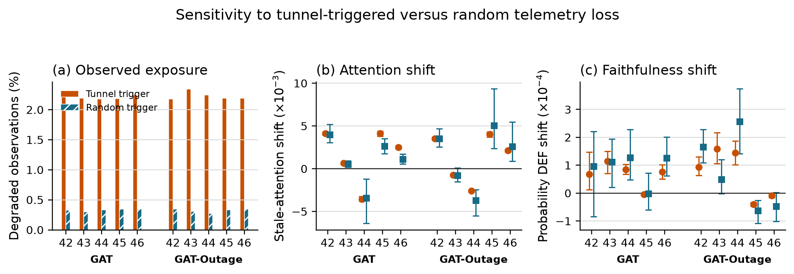

**Figure 4.10.** Tunnel and random triggers under a 30-second freeze. The
random condition creates less exposure. Point-estimate directions agree for all ten checkpoints for both metrics, but several random-condition CIs
are wide because few stale-exposed decisions occur.

## 4.9 Hypothesis results

Figure 4.11 reports the within-episode association between WAMSN and DEF. Seven checkpoint estimates are positive and three are negative. The negative relationship predicted by H4 is supported after Holm correction for the two seed-45 checkpoints only.

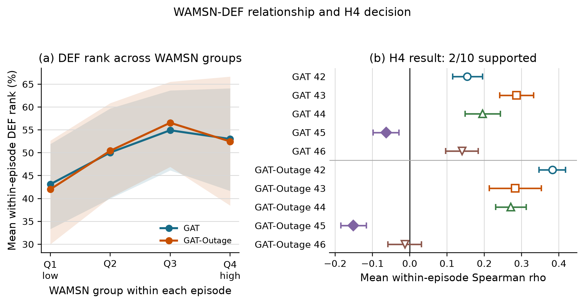

**Figure 4.11.** Panel (a) groups WAMSN within each episode and shows mean DEF rank. Panel (b) reports the per-checkpoint mean Spearman correlation and CI. H4 is supported for GAT and GAT-Outage seed 45, with no consistent support across all training seeds.

| Hypothesis | GAT seeds supporting | GAT-Outage seeds supporting | Verdict |
|---|---:|---:|---|
| H1: DEF decreases as outage duration increases | 1/5 | 2/5 | checkpoint-dependent support |
| H2: faithfulness declines faster than performance | 1/5 | 1/5 | limited exploratory support |
| H3: WAMSN increases as outage duration increases | 5/5 | 5/5 | supported manipulation check |
| H4: higher WAMSN is associated with lower DEF | 1/5 | 1/5 | checkpoint-dependent support |
| H5: GAT-Outage gives weaker H1 and H4 relationships | n/a | 2/5 matched comparisons | not consistent across seeds |

H1 correlations range from -0.114 to +0.198. H1 is supported for GAT seed 45 and GAT-Outage seeds 45 and 46; the latter is close to the 0.05 boundary (Holm-adjusted p=0.0495). H4 mean within-episode correlations range from -0.152 to +0.383. Both seed-45 checkpoints support H1, H2 and H4, so the proposed response occurs for some trained policies. It is not a general result across checkpoints.

H2 remains exploratory because its clean-relative rate can become large when clean DEF is close to zero; GAT-Outage seed 45 illustrates this sensitivity. GAT-Outage has weaker absolute H1 and H4 associations than its matched GAT checkpoint for seeds 43 and 46 only. H5 is descriptive and does not establish that outage training improves explanation reliability.

## 4.10 Answers to the research questions

**RQ1:** The tested averaged self-row attention does not establish reliable
dispatch decision relevance under clean telemetry. Its dispatch margin-DEF
is below the matched-random control, while LOO gives a positive control
response. The selected request row is positive for GAT-Outage but negative for GAT; these results leave room for alternative attention-based explanation methods while showing that the extraction rule matters. No-op evidence is reported separately in Section 4.12.

**RQ2:** Degradation changes stale-node attention, but not in one consistent
direction. Seven checkpoints show a clear shift toward stale nodes and three show a clear shift away.

**RQ3:** Longer outages consistently increase stale exposure, but a decline in DEF occurs for some checkpoints but is not consistent across seeds. The result also differs by action type and by
attention-extraction choice.

**RQ4:** The tested outage-trained configuration does not remove checkpoint
variation or make raw attention pass the decision-relevance check.

## 4.11 Explanation-release audit

The final framework decision is `WITHHOLD` for GAT, GAT-Outage, and all ten
checkpoints. This means that the evidence is complete enough to audit, but raw
attention should not be presented as the reason for a dispatch or no-op
decision. This is a conservative decision for the whole declared explanation
channel, based in part on failed dispatch decision relevance. It does not mean
that no-op faithfulness fails individually in every checkpoint. The exploratory
no-op analysis in Section 4.12 does not alter the original release criteria.

| Audit check | GAT | GAT-Outage | Main reason |
|---|---|---|---|
| Evidence integrity | PASS | PASS | all sweep preflights passed |
| Freshness visibility | PASS | PASS | AoI-derived exposure is reported separately |
| Action-aware controls | PASS | PASS | type matching, action protection, and LOO are present |
| Decision relevance | FAIL | FAIL | pooled dispatch self-row margin-DEF CIs are below zero |
| Action composition | PASS | PASS | no-op and dispatch are reported separately |
| Extraction stability | FAIL | FAIL | alternative heads or layers reverse direction |
| Checkpoint consistency | FAIL | FAIL | stale-attention direction differs across seeds |
| Deployment-action capability | NOT APPLICABLE | NOT APPLICABLE | audit scope uses sampled actions |
| Trigger robustness | INDETERMINATE | INDETERMINATE | intervals cross zero for GAT seeds 42/45 and GAT-Outage seeds 43/46 |
| Model decision | WITHHOLD | WITHHOLD | required release checks do not pass |

GAT seed 45 passes its individual dispatch-relevance check, but fails extraction stability and has indeterminate trigger robustness. The model-level failure must not be interpreted as failure of every individual checkpoint on every check.

Under this decision, attention remains available for internal model diagnosis,
with freshness displayed separately. It is not released as an audited
explanation of the selected action.

## 4.12 Supplementary no-op decision relevance

A supplementary analysis of the archived main-sweep records examines whether
no-op attention exceeds its type-matched random control in absolute DEF. This
addresses a different question from the paired change under degradation. The
analysis is exploratory and leaves the original H1-H5 tests and release
criteria unchanged. Only scored no-op decisions
with at least one available request are eligible. The existing cadence and
stale-exposure sampling schedule is retained, so these estimates describe the
scored records rather than all no-op actions or a matched clean/degraded sample.

Each cell first averages scores within evaluation-seed/episode blocks for one
fixed checkpoint. Table 4.10 reports equal-weight block means and pointwise
95% percentile intervals from 10,000 bootstrap draws (seed 20260912). These
intervals are exploratory, are not multiplicity-adjusted, and do not estimate
between-training-seed uncertainty. E/D denotes eligible episode blocks/scored
decisions; episodes without eligible no-op records do not contribute.

| Model / seed | Clean mean [95% CI] | 60 s mean [95% CI] | E/D clean; 60 s |
|---|---|---|---|
| GAT / 42 | +0.498 [+0.314, +0.683] | +0.336 [+0.239, +0.425] | 38/66; 48/388 |
| GAT / 43 | +0.212 [-0.008, +0.453] | -0.604 [-1.327, -0.088] | 30/43; 48/288 |
| GAT / 44 | +0.567 [+0.260, +0.906] | +0.003 [-0.157, +0.171] | 35/52; 48/326 |
| GAT / 45 | -0.086 [-0.189, +0.014] | +0.022 [-0.006, +0.050] | 36/54; 48/342 |
| GAT / 46 | +0.888 [+0.342, +1.606] | +0.470 [+0.214, +0.760] | 35/55; 48/356 |
| GAT-Outage / 42 | +0.869 [+0.680, +1.063] | +0.165 [+0.086, +0.243] | 36/54; 48/343 |
| GAT-Outage / 43 | -4.049 [-8.877, -0.006] | -8.090 [-11.038, -5.530] | 10/14; 37/95 |
| GAT-Outage / 44 | +0.112 [+0.029, +0.208] | -0.592 [-0.704, -0.477] | 39/73; 48/412 |
| GAT-Outage / 45 | -0.023 [-0.136, +0.081] | +0.146 [+0.105, +0.185] | 35/49; 48/306 |
| GAT-Outage / 46 | +0.566 [-0.021, +1.226] | +1.053 [+0.732, +1.383] | 29/41; 48/276 |

All margin-DEF values in Table 4.10 are multiplied by 1,000 for readability.
GAT seeds 42 and 46 and GAT-Outage seed 42 have positive intervals in both conditions for both margin and probability DEF. Other checkpoints have at least one negative or inconclusive interval. A decline under degradation need not imply an absolute failure against the random comparator, and the pooled dispatch result must not be generalized to every no-op explanation. Small effects, score choice, sampling differences and checkpoint variation limit interpretation.

The original whole-channel decision remains WITHHOLD because its dispatch
and stability requirements are not met. This supplementary analysis does not
certify any checkpoint for explanation release. Appendix C summarizes the rerun hypothesis tests and identifies the
supporting files containing full-precision estimates, sample counts and
archive hashes.
