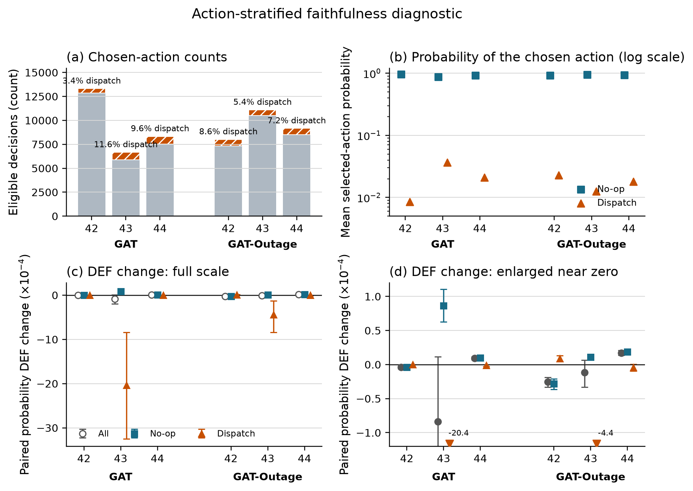
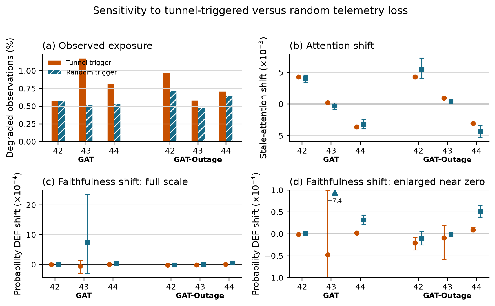

# 4. Results

The automated preflight audit passed 100 checks covering provenance and protocol
requirements. Results are reported by training seed because decisions and
episodes from one checkpoint do not constitute independent model replications.

## 4.1 Policy capability and training stability

Validation selected GAT checkpoint indices 39, 39, and 30 and GAT-Outage
indices 49, 40, and 40 for seeds 42, 43, and 44. These are zero-based indices;
for example, index 39 is the checkpoint saved after 40 training epochs. The
selected index is reported separately for each trained policy.

**Figure 4.1.** GAT training metrics use a ten-epoch moving mean. Stars mark
validation-selected checkpoints. Reward and pickups still vary between
epochs, but entropy remains above the collapse threshold and PPO clipping is
limited.

All nine training runs pass the declared stability gates. The following values
describe the final ten training epochs, not the held-out evaluation in Table
4.1. For GAT, the final ten-epoch mean pickups are 13.3, 9.0, and 9.9, and final
validation retention is 100%, 100%, and 92.6%. The corresponding
GAT-Outage values are 12.4, 14.1, and 13.8 pickups, with validation retention
of 100%, 93.9%, and 96.5%. Training metrics still fluctuate across epochs, but
no selected checkpoint is a zero-pickup policy under stochastic validation.
Deterministic argmax results are reported separately below.

Table 4.1 places the selected policies above two lower bounds evaluated on the
same held-out demand. Performance is reported only to establish that the
audited policies perform above random and greedy lower bounds.

| Policy | Mean pickups | Uncertainty or replicate range |
|---|---:|---:|
| Legal random | 1.50 | 95% episode-cluster CI [1.08, 1.96] |
| Greedy nearest request | 2.00 | 95% demand-variant CI [1.00, 3.00] |
| MLP | 13.63 | training-seed range 12.83-14.17 |
| GAT | 11.64 | training-seed range 9.42-13.71 |
| GAT-Outage | 12.97 | training-seed range 11.79-14.58 |

The legal-random baseline has 24 independent episode clusters. Greedy nearest
is deterministic, so its effective sample is the three demand variants rather
than 24 repeated seed-episode records. GAT's seed means are 13.71, 9.42, and
11.79. Every selected policy exceeds both lower bounds under stochastic action
sampling. These results confirm capability for the sampled policy distributions
only; the role of graph attention and the usability of the argmax policy remain
untested.

The audit requires each checkpoint's sampled policy distribution to exceed the
declared lower bounds, not GAT to outperform MLP. That condition is met. MLP has
the highest cross-seed mean in this implementation, although the replicate
ranges overlap. The experiment finds no task-performance advantage for graph
attention. This limits how broadly the audit can be generalized but remains
separate from whether the exposed weights faithfully explain GAT decisions.

**Figure 4.2.** Each point is one selected policy evaluated over 24 held-out
episodes. Horizontal lines show the cross-seed mean.

The deterministic diagnostic changes the capability interpretation. All six
selected GAT checkpoints choose no-op throughout three held-out episodes,
giving 0 pickups in 18 of 18 checkpoint-episodes. Their common mean reward is
-46.58 and final pending-request wait is 905.9 seconds. The stochastic results
show only that the policy distributions assign enough probability to dispatch
actions to produce pickups when sampled; they do not establish a stable argmax
dispatcher.

## 4.2 Construct-validity audit

Removing a request node can remove an available action, while removing a peer
taxi only hides information. A uniform random occlusion therefore compares
different types of change.

| Control baseline used to calculate DEF | Mean margin-DEF | 95% CI | Interpretation |
|---|---:|---:|---|
| Uniform random | -0.5540 | [-0.5808, -0.5288] | dominated by node-type and action-deletion imbalance |
| Type-matched random | -0.0093 | [-0.0159, -0.0013] | small negative result after matching node types |

The type-matched interval excludes zero, but its magnitude is about two orders
smaller than the uniform-control artifact. This 1,199-decision audit supports
the measurement design rather than answering the primary research question.
The reported protocol uses type matching, protects the chosen request
in the margin variant, and logs action-margin clamps.

## 4.3 Evaluator sensitivity and ranking controls

Raw attention, Gradient x Input, and an LOO perturbation ranking are evaluated
under clean and 60-second conditions. Each model, training seed, and condition
contains eight evaluation seeds and three episodes. Table 4.3 shows clean
results. The 60-second aggregate means remain close to clean.

The two conditions are stored as separate evaluations and have different
decision counts. Across the six checkpoints, the largest absolute 60-second
minus clean change is `0.000071` for raw attention, `0.000254` for Gradient x
Input, and `0.000306` for LOO. Figure 4.3 shows the clean values and the
condition difference separately instead of presenting two visually
indistinguishable rows.

| Model | Seed | Raw-attention margin-DEF | GxI margin-DEF | LOO margin-DEF | Taxi-only rho |
|---|---:|---:|---:|---:|---:|
| GAT | 42 | +0.0003 | -0.0055 | +0.0008 | +0.088 |
| GAT | 43 | -0.0009 | -0.0033 | +0.0099 | +0.404 |
| GAT | 44 | +0.0015 | +0.0012 | +0.0030 | +0.426 |
| GAT-Outage | 42 | +0.0011 | -0.0019 | +0.0020 | +0.472 |
| GAT-Outage | 43 | +0.0006 | -0.0010 | +0.0089 | +0.602 |
| GAT-Outage | 44 | +0.0031 | +0.0052 | +0.0044 | +0.699 |

The LOO-ranked control is positive and larger than raw attention for all six
selected checkpoints. This shows that DEF responds to a ranking built from
single-node margin loss. LOO is still a perturbation control, not a ground-truth
explanation. Gradient x Input changes sign across checkpoints and provides no
uniform improvement.

Raw-attention DEF ranges from -0.0009 to +0.0031. Taxi-only rank correlation
with LOO is positive in all six checkpoints, but ranges from 0.088 to 0.699.
Attention shows some agreement with decision-relevant LOO ordering, but the
strength of that agreement remains checkpoint-dependent.

**Figure 4.3.** Top: clean logit-margin DEF. Bottom: 60-second minus clean DEF,
multiplied by 10,000, from separate evaluations. Lines join methods for each
checkpoint; non-zero changes confirm distinct records.

The attention reduction rule remains important. Across the declared mean,
individual heads, layer maxima, and rollout, every checkpoint contains both a
positive and a negative stale-attention shift. The widest ranges are -0.0109
to +0.0063 for GAT seed 44 and -0.0097 to +0.0064 for GAT-Outage seed 44.

**Figure 4.4.** Stale-attention shift multiplied by 1,000. Selecting a layer,
head, or rollout rule after seeing the result could reverse the conclusion.

Changing from the declared self row to the selected request row has little
effect for seeds 42 and 44, but increases request-action DEF by about 0.0064
for GAT seed 43 and 0.0073 for GAT-Outage seed 43. The aggregate gap is +0.0022
for GAT and +0.0025 for GAT-Outage because it averages these different policy
responses. The largest absolute 60-second minus clean query-row change is
`0.000264`, so the two conditions again remain close without being duplicates.

**Figure 4.5.** Top: clean request-action DEF from the declared self row and
the selected request row. Bottom: each query row's independently evaluated
60-second result minus clean, multiplied by 10,000. The selected request row
improves the seed-43 clean results but does not provide a consistent
improvement across checkpoints or conditions.

## 4.4 Small-graph resolution

The scored graphs usually contain the maximum number of visible nodes.

| Model | Node count | Mean | Median | 5th percentile | 95th percentile |
|---|---|---:|---:|---:|---:|
| GAT | peer taxis | 5.00 | 5 | 5 | 5 |
| GAT | requests | 4.51 | 5 | 1 | 5 |
| GAT | non-self total | 9.51 | 10 | 6 | 10 |
| GAT-Outage | peer taxis | 5.00 | 5 | 5 | 5 |
| GAT-Outage | requests | 4.52 | 5 | 1 | 5 |
| GAT-Outage | non-self total | 9.52 | 10 | 6 | 10 |

Even so, type matching creates substantial top-k overlap. The expected random
intersection is about 0.22 for `k=1`, 0.41 for `k=2`, and 0.60 for `k=3`.
Attention-LOO agreement at `k=1` exceeds random overlap for both models. At
`k=3`, it is 0.60 for GAT and 0.49 for GAT-Outage, compared with expected
overlap of about 0.60. Restricting analysis to at least six non-self nodes
does not change the sample because every scored decision already meets that
threshold. This pattern suggests that the ranking agreement has more contrast
at `k=1`; it does not establish that LOO is ground truth or that the top-ranked
attention node is a causal explanation.

**Figure 4.6.** Large expected overlap between the explanation and its matched
random set reduces the contrast available to DEF, especially at `k=3`.

## 4.5 Telemetry manipulation and stale exposure

Tunnel-triggered observation outages create increasing stale exposure. The
event-aware audit scores every decision that contains at least one stale taxi,
instead of relying on periodic sampling. Across GAT checkpoints, the number of
stale-exposed records ranges from 347-382 at 10 seconds and 1,476-1,806 at 60
seconds. The GAT-Outage ranges are 353-372 and 1,566-1,697. Every degraded cell
exceeds the pre-declared coverage gates.

Conditional WAMSN rises from 0.0275-0.0289 at 10 seconds to 0.0804-0.0900 at
60 seconds. H3 is supported for all six selected checkpoints. Because WAMSN contains
normalized AoI, this verifies increasing stale exposure; it does not show that
AoI causes lower faithfulness.

**Figure 4.7.** Longer observation outages increase WAMSN for every policy.
DEF changes are much smaller; pickups are reported only as context, not as the
main research outcome.

## 4.6 Exposure-conditioned paired audit

The paired audit compares each degraded observation with its exact clean twin
at the same simulation step. Positive attention shift means more attention is
assigned to nodes marked stale. Negative DEF shift means lower measured
faithfulness under degradation.

| Model | Seed | Attention shift x 1,000 [95% CI] | Paired probability-DEF shift x 10,000 [95% CI] |
|---|---:|---:|---:|
| GAT | 42 | +4.074 [+3.9, +4.2] | -0.041 [-0.060, -0.022] |
| GAT | 43 | +0.208 [+0.2, +0.3] | -0.839 [-1.892, +0.143] |
| GAT | 44 | -3.483 [-3.6, -3.4] | +0.092 [+0.068, +0.116] |
| GAT-Outage | 42 | +3.975 [+3.8, +4.1] | -0.253 [-0.323, -0.193] |
| GAT-Outage | 43 | +0.959 [+0.9, +1.0] | -0.114 [-0.343, +0.061] |
| GAT-Outage | 44 | -3.038 [-3.1, -2.9] | +0.172 [+0.135, +0.212] |

**Figure 4.8.** Checkpoints trained with seeds 42 and 43 move attention toward
stale nodes and have a negative mean DEF shift. Checkpoints trained with seed
44 show the opposite directions. Error bars are 95% episode-block bootstrap
intervals.

The same checkpoint pattern appears in both training regimes: four of six
selected checkpoints have a positive attention shift and four have a negative
mean DEF shift. Only the DEF decrease for checkpoints trained with seed 42 is
separated from zero in both models; both seed-43 intervals include zero, while
both checkpoints trained with seed 44 show a small increase.
The effects are numerically small and directionally heterogeneous. This is not
evidence for a universal claim that telemetry degradation moves attention
toward stale nodes or always lowers faithfulness. The largest absolute paired
probability-DEF shift is `0.0000839`, equivalent to 0.00839 probability
percentage points. Relative percentages are not reported because clean DEF is
close to zero and would make such ratios unstable.

## 4.7 Action-stratified diagnostic

The combined faithfulness audit is dominated by chosen no-op actions. Across
all six checkpoints, 56,550 records contain at least one valid request. Of
these, 52,585 (93.0%) select no-op and 3,965 (7.0%) dispatch a request.
Decisions with no valid request are excluded from these percentages.

| Checkpoint | No-op (%) | Dispatch (%) | Mean selected dispatch probability | Paired dispatch DEF shift x 10,000 [95% CI] |
|---|---:|---:|---:|---:|
| GAT, seed 42 | 96.6 | 3.4 | 0.0085 | 0.000 [0.000, 0.000] |
| GAT, seed 43 | 88.4 | 11.6 | 0.0368 | -20.358 [-32.488, -8.371] |
| GAT, seed 44 | 90.4 | 9.6 | 0.0211 | -0.011 [-0.029, 0.000] |
| GAT-Outage, seed 42 | 91.4 | 8.6 | 0.0228 | +0.088 [+0.047, +0.131] |
| GAT-Outage, seed 43 | 94.6 | 5.4 | 0.0127 | -4.403 [-8.368, -1.285] |
| GAT-Outage, seed 44 | 92.8 | 7.2 | 0.0181 | -0.044 [-0.092, +0.004] |

**Figure 4.9.** (a) Absolute no-op and dispatch counts; labels give the dispatch
share. (b) Mean probability assigned to the sampled action on a logarithmic
scale. (c) Paired degraded-minus-clean probability DEF on the full scale. (d)
Enlarged view around zero; arrows mark intervals that extend beyond the panel.
Error bars are 95% episode-block bootstrap
intervals.

The no-op stratum closely follows the combined result because it accounts for
most records. The same H1 trend does not appear in the dispatch stratum for any
checkpoint (`p` = 0.44-1.00), and the dispatch results show no consistent H4
evidence. The
paired dispatch DEF shift is negative in four checkpoints, positive in one,
and exactly zero in one. In four of six checkpoints its direction differs from
the combined estimate. These effects are small except for the seed-43
checkpoints, and dispatch intervals are wider because fewer episodes contain
scored dispatch actions. The diagnostic does not establish a separate pattern for
dispatch decisions. It shows that the combined H1 and H4 findings should not be
generalized to dispatch actions.

## 4.8 Random-trigger sensitivity analysis

The random-loss control replaces the fixed tunnel-entry trigger with an
independent per-taxi trigger while retaining the same 30-second
observation-layer freeze. The trigger probability is fixed across checkpoints,
so realized exposure remains dependent on the trajectory induced by each
policy. Random-to-tunnel exposure-rate ratios range from 0.44 to 0.98, with a
median of 0.78. The comparison therefore focuses on the direction of paired
effects within stale-exposed decisions rather than treating the two conditions
as perfectly exposure matched.

This sensitivity analysis is a separate 24-episode evaluation. Its repeated
30-second tunnel estimates therefore differ slightly from the 48-episode main
sweep in Table 4.5; no checkpoint is retrained or reselected.

| Checkpoint | Exposure tunnel/random (%) | Attention shift tunnel/random (values x 1,000) | Probability DEF shift tunnel/random (values x 10,000) |
|---|---:|---:|---:|
| GAT, seed 42 | 0.580 / 0.569 | +4.281 / +4.037 | -0.012 / +0.004 |
| GAT, seed 43 | 1.176 / 0.517 | +0.231 / -0.286 | -0.479 / +7.361 |
| GAT, seed 44 | 0.818 / 0.532 | -3.623 / -3.165 | +0.020 / +0.322 |
| GAT-Outage, seed 42 | 0.967 / 0.713 | +4.279 / +5.453 | -0.205 / -0.093 |
| GAT-Outage, seed 43 | 0.584 / 0.480 | +0.958 / +0.444 | -0.088 / -0.014 |
| GAT-Outage, seed 44 | 0.712 / 0.648 | -3.063 / -4.296 | +0.091 / +0.518 |

**Figure 4.10.** Sensitivity to tunnel and random triggers under a 30-second
freeze: (a) exposure rate; (b) stale-attention shift; (c) probability-DEF shift
at full scale; and (d) enlarged DEF near zero. Arrows mark off-panel intervals;
error bars show 95% episode-block bootstrap intervals.

Attention-shift direction agrees between tunnel and random triggers in five of
six checkpoints. Probability-DEF direction agrees in four of six. One mismatch
for GAT seed 42 consists of values very close to zero. GAT seed 43 is the clear
exception, but its random-trigger DEF interval is wide and crosses zero. The
seed-42 positive attention pattern and seed-44 negative pattern otherwise
remain visible under random triggering in both training regimes. This reduces
the likelihood that the overall checkpoint dependence is produced only by the
chosen tunnel location. It does not establish a location-independent effect,
because the realized exposure rates and stale-node populations are not
identical.

## 4.9 Faithfulness hypotheses

The event-aware audit uses every decision with visible stale exposure rather
than a periodic sample. H1 is supported for two of three GAT checkpoints and
all three GAT-Outage checkpoints. H4 is supported for all six: within-episode
WAMSN-DEF correlations range from -0.199 to -0.084 for GAT and from -0.423 to
-0.212 for GAT-Outage. H3 remains consistently supported.

**Figure 4.11.** All checkpoints have a negative within-episode WAMSN-DEF
association after Holm correction; the direct paired effect remains mixed.

| Hypothesis | GAT seeds supporting | GAT-Outage seeds supporting | Verdict |
|---|---:|---:|---|
| H1: outage duration increases, DEF decreases | 2/3 | 3/3 | strong but not universal |
| H2: faithfulness declines faster than performance | 1/3 | 3/3 | model-dependent; exploratory |
| H3: outage duration increases, WAMSN increases | 3/3 | 3/3 | consistently supported |
| H4: higher WAMSN is associated with lower DEF | 3/3 | 3/3 | consistently supported within episodes |
| H5: degradation-aware training reduces the adverse DEF relationships | n/a | 0/3 | not supported |

H1 and H4 are association tests within one trained policy and primarily
describe no-op decisions in this action-imbalanced sample. They do not by
themselves establish that AoI causes lower faithfulness or that the same
relationship holds for dispatch actions. The paired clean-twin
audit supplies the more direct intervention contrast, and its sign still
changes with training seed. H2 is treated as exploratory because clean DEF is
close to zero and the relative-rate formulation is unstable.

## 4.10 Result summary

Longer outages increase stale exposure, while greater WAMSN accompanies lower
within-episode DEF. Yet seed reversals, no-op dominance, dispatch failures, and
random-trigger exceptions mean that raw attention cannot provide a reliable
indication of data freshness or explanation faithfulness.
