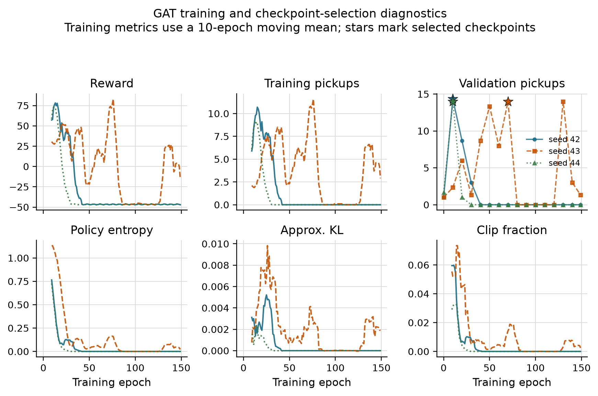
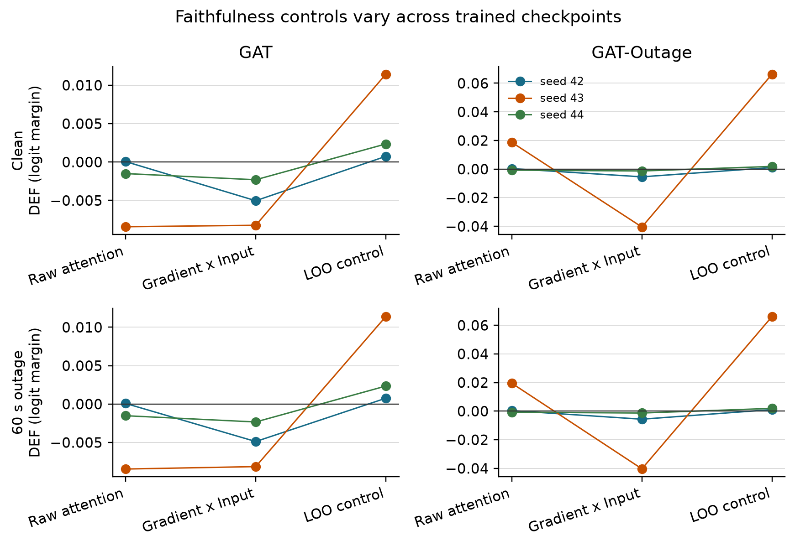
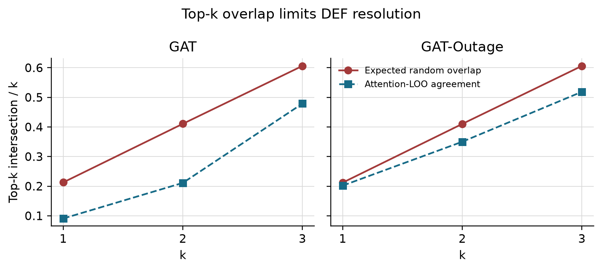
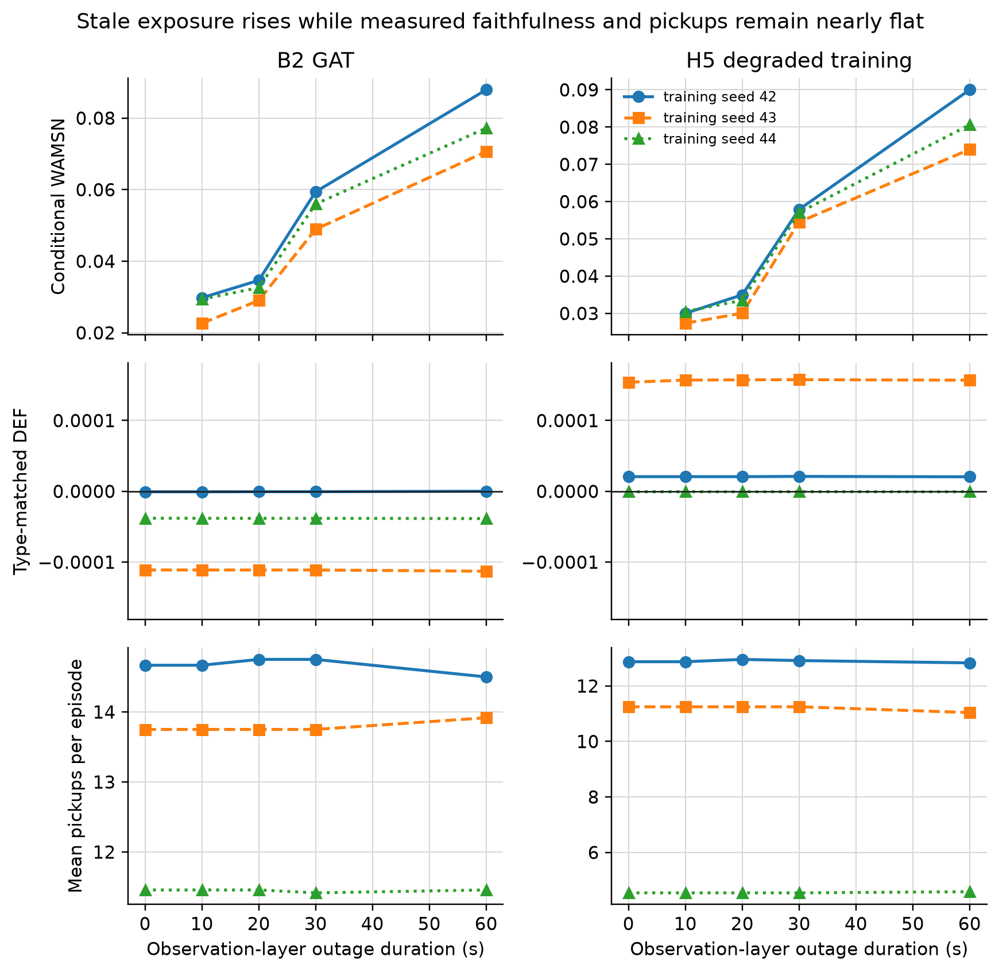
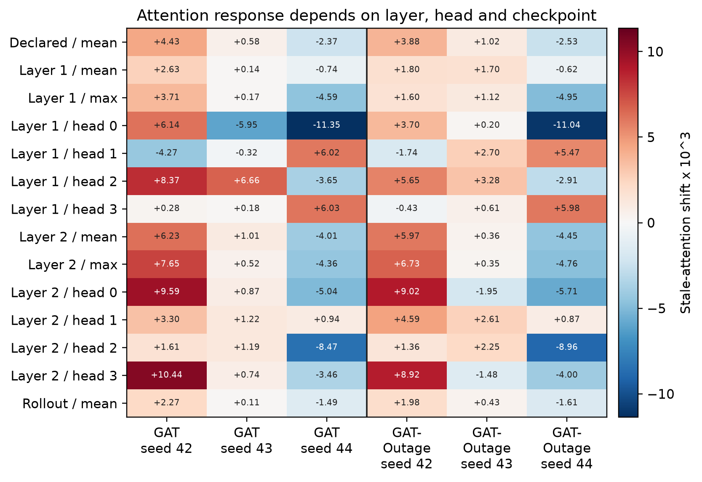
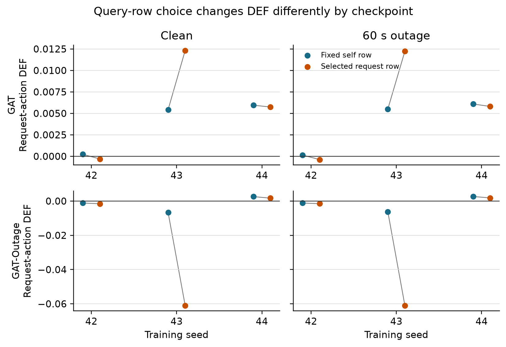
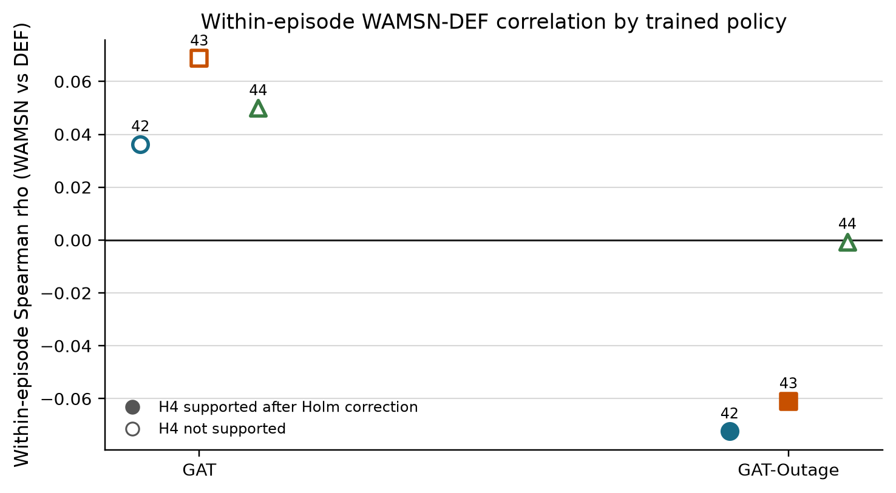

# 4. Results

The primary experiment outputs are stored in `results/dissertation_v4/`. The
additional baseline and faithfulness-control outputs are stored in
`results/dissertation_revision_v1/`. The source audit passed all 100 provenance
and protocol checks. Results are reported by training seed because decisions
and episodes from one checkpoint do not replace independent model replication.

## 4.1 Policy capability and training stability

Validation selected GAT epochs 10, 70, and 10 and GAT-Outage epochs 10, 90, and 10 for
seeds 42, 43, and 44. A fixed final epoch would therefore compare different
stages of learning.

**Figure 4.1.** GAT training metrics use a ten-epoch moving mean. Stars mark the
validation-selected checkpoints. Entropy falls early and the final policies
for seeds 42 and 44 collapse to zero pickups.

Unsmoothed GAT entropy first falls below 0.05 at epochs 15, 21, and 12. At the
selected checkpoints it is 0.140, 0.246, and 0.136, but at epoch 150 it is
0.000, 0.005, and 0.000, with zero pickups for all three runs. Validation
selection avoids presenting a failed final checkpoint as the audited policy.
It does not show that optimisation is stable.

Table 4.1 places the selected policies above two lower bounds evaluated on the
same held-out demand. Performance is reported only to establish that the audit
does not concern a random-level policy.

| Policy | Mean pickups | Uncertainty or replicate range |
|---|---:|---:|
| Legal random | 1.50 | 95% episode-cluster CI [1.08, 1.96] |
| Greedy nearest request | 2.00 | 95% demand-variant CI [1.00, 3.00] |
| MLP | 13.25 | training-seed range 11.50-14.67 |
| GAT | 13.29 | training-seed range 11.46-14.67 |
| GAT-Outage | 9.56 | training-seed range 4.54-12.88 |

The legal-random baseline has 24 independent episode clusters. Greedy nearest
is deterministic, so its effective sample is the three demand variants rather
than 24 repeated seed-episode records. GAT's seed means are 14.67, 13.75, and
11.46. It clearly exceeds both lower bounds, but its similarity to MLP does not
show that graph attention caused the task capability. GAT-Outage seed 44 remains a
weak replicate at 4.54 pickups and is retained rather than excluded.

**Figure 4.2.** Each point is one selected policy evaluated over 24 held-out
episodes. Horizontal lines show the cross-seed mean.

## 4.2 Construct-validity audit

Removing a request node can remove an available action, while removing a peer
taxi only hides information. A uniform random occlusion therefore compares
unlike interventions.

| Control baseline used to calculate DEF | Mean margin-DEF | 95% CI | Interpretation |
|---|---:|---:|---|
| Uniform random | -0.5540 | [-0.5808, -0.5288] | dominated by node-type and action-deletion imbalance |
| Type-matched random | -0.0093 | [-0.0159, -0.0013] | small negative result after matching node types |

The type-matched interval excludes zero, but its magnitude is about two orders
smaller than the uniform-control artefact. This earlier 1,199-decision audit
supports the measurement design; it is not a separate answer to the primary
research question. The final protocol uses type matching, protects the chosen
request in the margin variant, and logs action-margin clamps.

## 4.3 Evaluator sensitivity and ranking controls

The revision evaluates raw attention, Gradient x Input, and an LOO
perturbation ranking under clean and 60-second conditions. Each model, training
seed, and condition contains eight evaluation seeds and three episodes. Table
4.3 shows clean results. For each checkpoint, the 60-second DEF values differ
by less than 0.001 from clean; taxi-only rho changes by at most 0.012.

| Model | Seed | Raw DEF | GxI DEF | LOO DEF | Taxi-only rho |
|---|---:|---:|---:|---:|---:|
| GAT | 42 | +0.0001 | -0.0050 | +0.0007 | +0.022 |
| GAT | 43 | -0.0084 | -0.0082 | +0.0114 | +0.205 |
| GAT | 44 | -0.0015 | -0.0023 | +0.0024 | -0.411 |
| GAT-Outage | 42 | +0.0003 | -0.0054 | +0.0011 | +0.319 |
| GAT-Outage | 43 | +0.0187 | -0.0405 | +0.0663 | -0.710 |
| GAT-Outage | 44 | -0.0008 | -0.0013 | +0.0019 | -0.261 |

LOO is positive and larger than raw attention for all six checkpoints. This
shows that DEF responds to a ranking built from single-node margin loss. It is
still only a perturbation control: its gain is mainly expected in
comprehensiveness, and it does not prove that the combined DEF has an ideal
upper bound. Gradient x Input is negative for every checkpoint and is not a
better explanation under this evaluator.

Raw attention does not have one clean-telemetry result. It ranges from -0.0084
to +0.0187, with mixed signs. Taxi-only rank correlation with LOO ranges from
-0.710 to +0.319. The important result is therefore not that attention equals
random in every model. It is that its measured decision relevance does not
reproduce across independently trained checkpoints.

**Figure 4.3.** Episode means are first calculated within each checkpoint.
Lines identify training seeds; they are not population trends. LOO is positive
for every checkpoint, while raw attention and Gradient x Input vary.

## 4.4 Small-graph resolution

The scored graphs usually contain the maximum number of visible nodes.

| Model | Node count | Mean | Median | 5th percentile | 95th percentile |
|---|---|---:|---:|---:|---:|
| GAT | peer taxis | 5.00 | 5 | 5 | 5 |
| GAT | requests | 4.61 | 5 | 1 | 5 |
| GAT | non-self total | 9.61 | 10 | 6 | 10 |
| GAT-Outage | peer taxis | 4.99 | 5 | 5 | 5 |
| GAT-Outage | requests | 4.64 | 5 | 1 | 5 |
| GAT-Outage | non-self total | 9.63 | 10 | 6 | 10 |

Even so, type matching creates substantial top-k overlap. The expected random
intersection is about 0.21 for `k=1`, 0.41 for `k=2`, and 0.61 for `k=3`.
Attention-LOO agreement at `k=3` is 0.48 for GAT and 0.52 for GAT-Outage, below the
expected random overlap. Restricting analysis to at least six non-self nodes
does not change the sample because every scored decision already meets that
threshold.

**Figure 4.4.** Large expected overlap between the explanation and its matched
random set compresses DEF, especially at `k=3`.

## 4.5 Telemetry manipulation and stale exposure

Tunnel-triggered observation outages create increasing stale exposure. At 60
seconds, the degraded-decision rate is about 0.9-1.2% for GAT and 0.7-1.3% for
GAT-Outage. Exposure is sparse because it requires a taxi to enter a mapped tunnel.

Across the three checkpoints, stale-exposed decision counts for GAT are 86,
106, 182, and 266 at 10, 20, 30, and 60 seconds. GAT-Outage counts are 87, 101, 181,
and 259. Conditional WAMSN rises from about 0.023-0.031 at 10 seconds to
0.071-0.090 at 60 seconds. H3 is supported for all six policies. Since WAMSN
contains normalised AoI, this is a manipulation and exposure result, not proof
that AoI causes a change in faithfulness.

**Figure 4.5.** Conditional WAMSN rises with outage duration, while DEF and
pickups show little movement. Pickups are supporting context, not the research
outcome.

## 4.6 Attention reallocation and aggregation sensitivity

The declared two-layer, four-head mean gives opposite paired stale-attention
shifts across training seeds.

| Model | Training seed | Mean shift | 95% CI |
|---|---:|---:|---:|
| GAT | 42 | +0.002706 | [0.002395, 0.003036] |
| GAT | 43 | +0.000618 | [0.000424, 0.000780] |
| GAT | 44 | -0.001278 | [-0.001436, -0.001112] |
| GAT-Outage | 42 | +0.002374 | [0.002151, 0.002609] |
| GAT-Outage | 43 | +0.000783 | [0.000710, 0.000862] |
| GAT-Outage | 44 | -0.001231 | [-0.001410, -0.001072] |

**Figure 4.6.** The primary aggregation shifts toward stale nodes for seeds 42
and 43 and away from them for seed 44 in both training regimes.

Alternative aggregation rules make the dependence stronger. Across the 13
layer, head, maximum, and rollout choices, every checkpoint has at least one
positive and one negative result. For example, GAT seed 43 ranges from -0.0060
to +0.0067, while GAT-Outage seed 43 ranges from -0.0020 to +0.0033. GAT seed 44 and
GAT-Outage seed 44 are mainly negative, but individual heads remain positive.

**Figure 4.7.** Values are degraded-minus-clean stale-attention mass multiplied
by 1,000. The sign varies by checkpoint and, in some models, by layer or head.

The query row also matters. For request actions, changing from the declared
self row to the selected request row changes DEF by -0.0005, +0.0069, and
-0.0002 for GAT seeds 42-44 under clean telemetry. GAT-Outage changes are -0.0004,
-0.0543, and -0.0009. The 60-second values are almost identical. The request
row improves one GAT checkpoint but worsens the others, especially GAT-Outage seed 43.
It does not provide a general correction for the primary explanation channel.

**Figure 4.8.** Each grey line joins the self-row and selected-request-row DEF
for one checkpoint. The effect of changing query row is checkpoint-dependent.

## 4.7 Faithfulness hypotheses

H1 is unsupported for every GAT and GAT-Outage checkpoint. DEF-duration correlations
remain close to zero, with Holm-adjusted p-values above 0.67. H2 is also
unsupported: DEF does not decline faster than pickups. Because clean DEF can
be near zero, the original ratio is unstable and is kept only as an
exploratory, pre-declared check.

H4 is mixed. GAT within-episode WAMSN-DEF correlations are positive
(0.036-0.069), contrary to the prediction. GAT-Outage seeds 42 and 43 are negative
(-0.072 and -0.061, adjusted p=0.0004), but seed 44 is approximately zero.

**Figure 4.9.** Filled markers pass the within-checkpoint Holm-corrected H4
test. These tests do not establish consistency across trained policies.

| Hypothesis | GAT seeds supporting | GAT-Outage seeds supporting | Verdict |
|---|---:|---:|---|
| H1: outage duration increases, DEF decreases | 0/3 | 0/3 | not supported |
| H2: faithfulness declines faster than performance | 0/3 | 0/3 | not supported; exploratory |
| H3: outage duration increases, WAMSN increases | 3/3 | 3/3 | consistently supported |
| H4: higher WAMSN is associated with lower DEF | 0/3 | 2/3 | mixed |
| H5: degradation-aware training mitigates the effect | n/a | 0/3 | not supported |

## 4.8 Result summary

The experiment establishes three points. First, the evaluator can detect a
positive LOO perturbation ranking, but top-k overlap limits its resolution.
Second, longer outages reliably increase stale-data exposure, but not DEF loss.
Third, the direction and measured faithfulness of attention depend on the
trained checkpoint, aggregation rule, and query row. GAT-Outage does not remove these
dependencies. Raw attention is therefore not validated as a stable assurance
of either freshness or decision relevance.
