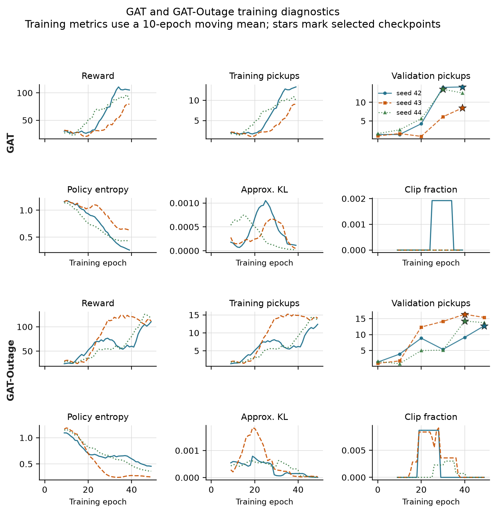
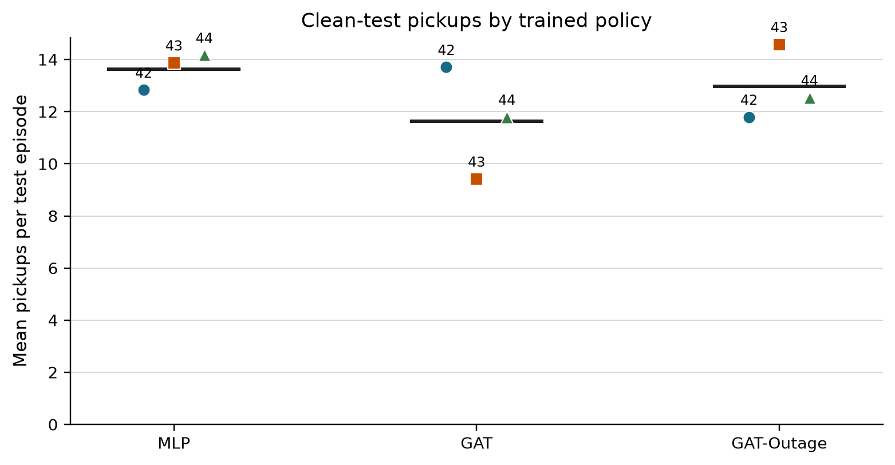
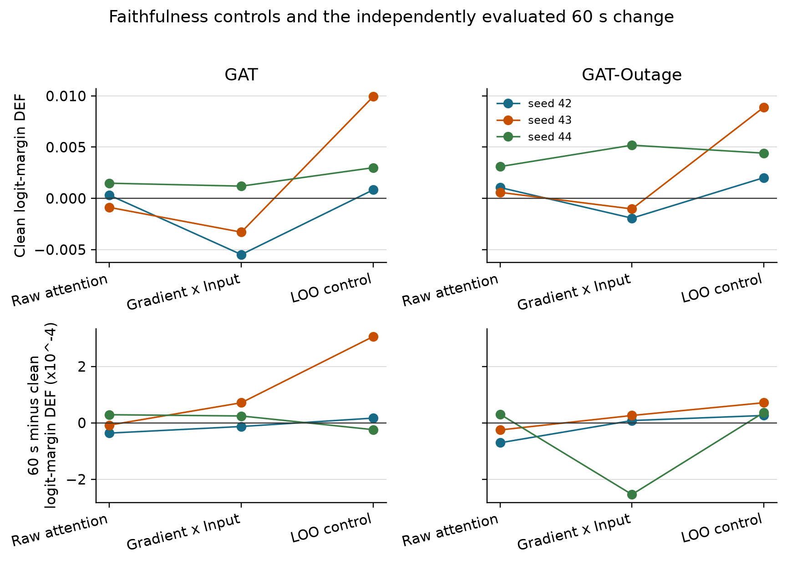
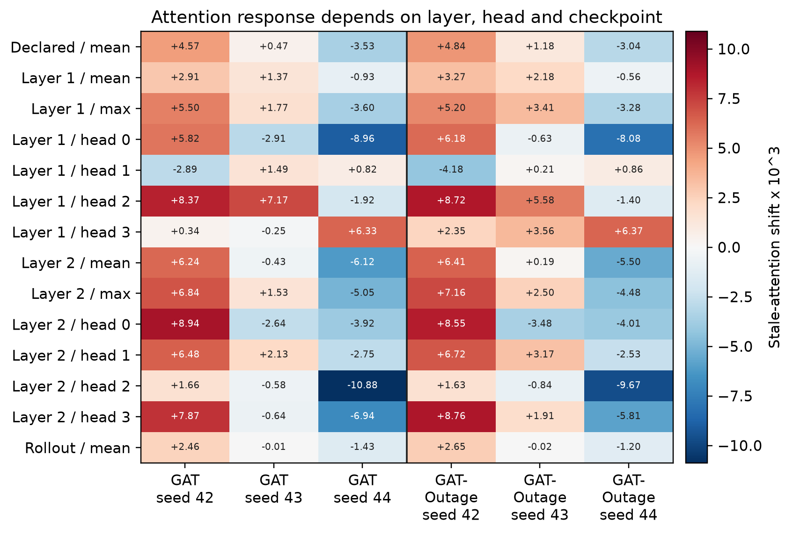
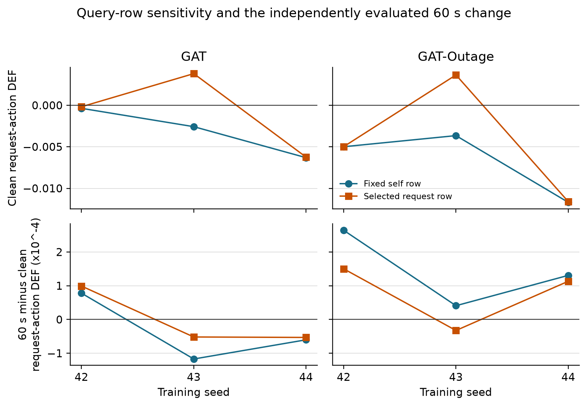
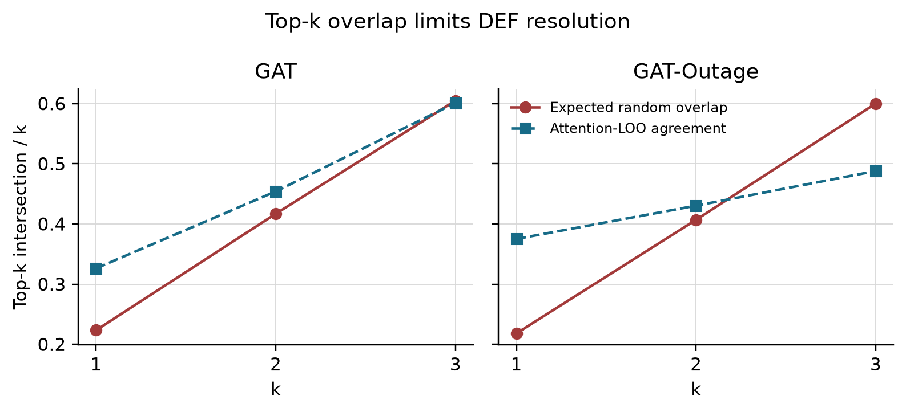
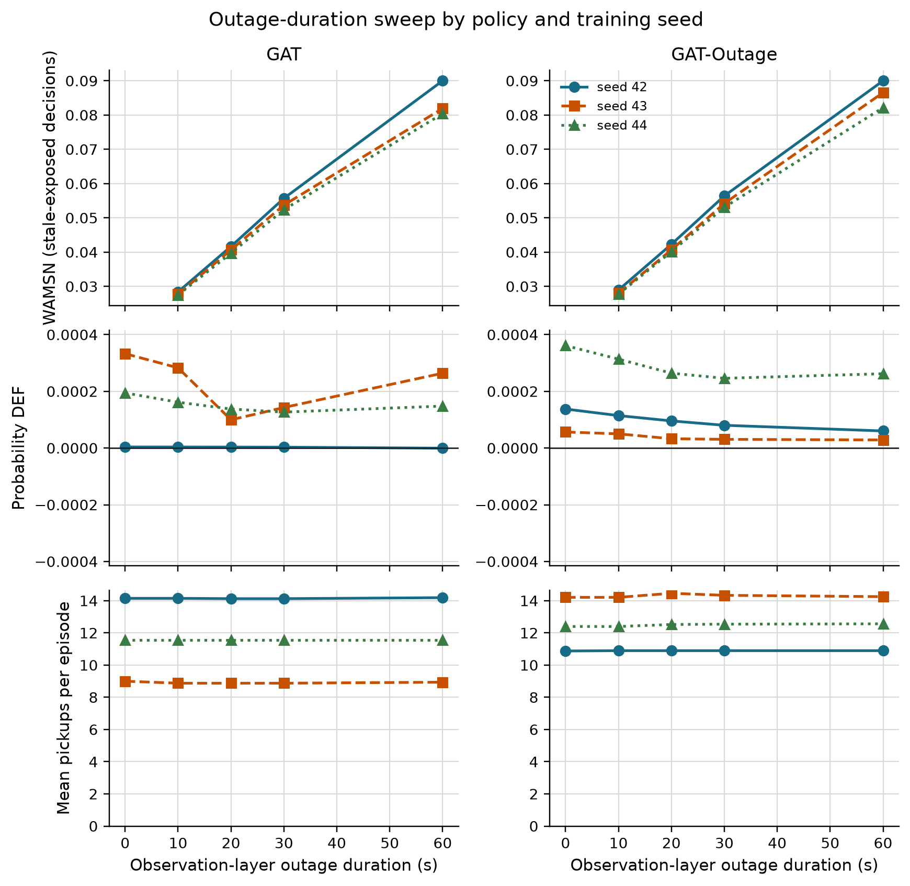
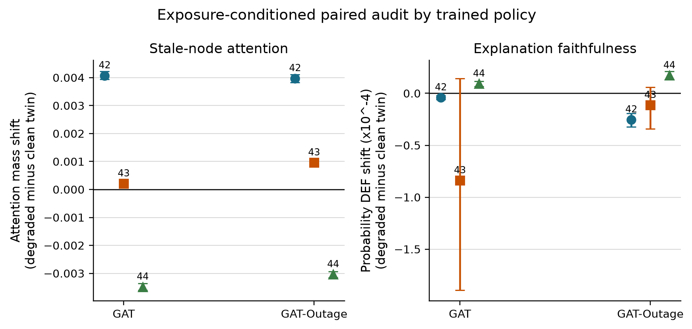
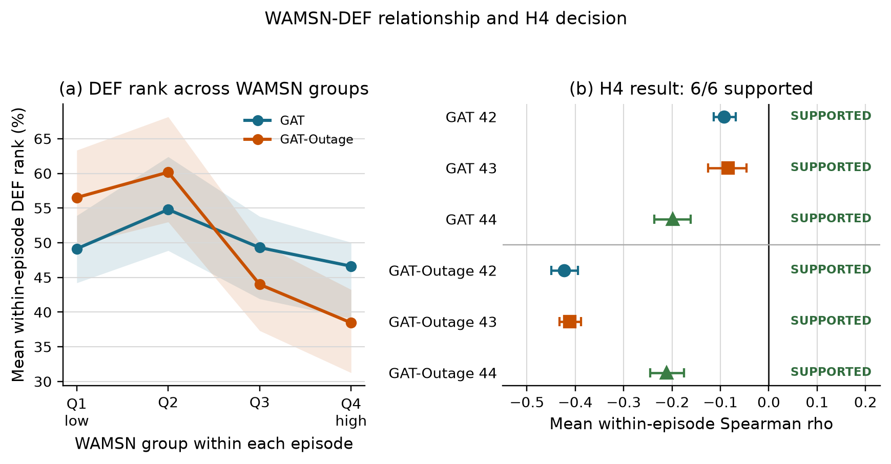

# 4. Results

The primary experiment outputs are stored in
`results/dissertation_v9_exposure_audit/`. The
additional baseline and faithfulness-control outputs are stored in
`results/dissertation_revision_v1/`. The source audit passed all 100 provenance
and protocol checks. Results are reported by training seed because decisions
and episodes from one checkpoint do not replace independent model replication.

## 4.1 Policy capability and training stability

Validation selected GAT epochs 39, 39, and 30 and GAT-Outage epochs 49, 40,
and 40 for seeds 42, 43, and 44. The selected epoch is reported for each
policy rather than hidden behind one common label.

**Figure 4.1.** GAT training metrics use a ten-epoch moving mean. Stars mark
validation-selected checkpoints. Reward and pickups still vary between
epochs, but entropy remains above the collapse threshold and PPO clipping is
limited.

All nine training runs pass the declared stability gates. For GAT, the final
ten-epoch mean pickups are 13.3, 9.0, and 9.9, and final validation retains
100%, 100%, and 92.6% of the selected validation score. The corresponding
GAT-Outage values are 12.4, 14.1, and 13.8 pickups, with validation retention
of 100%, 93.9%, and 96.5%. This does not make every epoch smooth, but it removes
the earlier zero-pickup collapse as an explanation for the audit result.

Table 4.1 places the selected policies above two lower bounds evaluated on the
same held-out demand. Performance is reported only to establish that the audit
does not concern a random-level policy.

| Policy | Mean pickups | Uncertainty or replicate range |
|---|---:|---:|
| Legal random | 1.50 | 95% episode-cluster CI [1.08, 1.96] |
| Greedy nearest request | 2.00 | 95% demand-variant CI [1.00, 3.00] |
| MLP | 13.63 | training-seed range 12.83-14.17 |
| GAT | 11.64 | training-seed range 9.42-13.71 |
| GAT-Outage | 12.97 | training-seed range 11.79-14.58 |

The legal-random baseline has 24 independent episode clusters. Greedy nearest
is deterministic, so its effective sample is the three demand variants rather
than 24 repeated seed-episode records. GAT's seed means are 13.71, 9.42, and
11.79. Every selected policy exceeds both lower bounds. This establishes task
capability for the policies under audit; it does not show that graph attention
caused that capability.

**Figure 4.2.** Each point is one selected policy evaluated over 24 held-out
episodes. Horizontal lines show the cross-seed mean.

## 4.2 Construct-validity audit

Removing a request node can remove an available action, while removing a peer
taxi only hides information. A uniform random occlusion therefore compares
unlike interventions.

| Control baseline used to calculate DEF | Mean margin-DEF | 95% CI | Interpretation |
|---|---:|---:|---|
| Uniform random | -0.5540 | [-0.5808, -0.5288] | dominated by node-type and action-deletion imbalance |
| Type-matched random | -0.0093 | [-0.0159, -0.0013] | small negative result after matching node types |

The type-matched interval excludes zero, but its magnitude is about two orders
smaller than the uniform-control artefact. This earlier 1,199-decision audit
supports the measurement design; it is not a separate answer to the primary
research question. The final protocol uses type matching, protects the chosen
request in the margin variant, and logs action-margin clamps.

## 4.3 Evaluator sensitivity and ranking controls

Raw attention, Gradient x Input, and an LOO perturbation ranking are evaluated
under clean and 60-second conditions. Each model, training seed, and condition
contains eight evaluation seeds and three episodes. Table 4.3 shows clean
results. The 60-second aggregate means remain close to clean.

| Model | Seed | Raw DEF | GxI DEF | LOO DEF | Taxi-only rho |
|---|---:|---:|---:|---:|---:|
| GAT | 42 | +0.0003 | -0.0055 | +0.0008 | +0.088 |
| GAT | 43 | -0.0009 | -0.0033 | +0.0099 | +0.404 |
| GAT | 44 | +0.0015 | +0.0012 | +0.0030 | +0.426 |
| GAT-Outage | 42 | +0.0011 | -0.0019 | +0.0020 | +0.472 |
| GAT-Outage | 43 | +0.0006 | -0.0010 | +0.0089 | +0.602 |
| GAT-Outage | 44 | +0.0031 | +0.0052 | +0.0044 | +0.699 |

LOO is positive and larger than raw attention for all six checkpoints. This
shows that DEF responds to a ranking built from single-node margin loss. LOO
is still a perturbation control, not a ground-truth explanation. Gradient x
Input changes sign across checkpoints and provides no uniform improvement.

Raw-attention DEF ranges from -0.0009 to +0.0031. Taxi-only rank correlation
with LOO is positive in all six checkpoints, but ranges from 0.088 to 0.699.
Attention therefore contains some decision-relevant ordering, while the size
of that agreement remains policy-dependent.

**Figure 4.3.** Episode means are first calculated within each checkpoint.
Lines identify training seeds; they are not population trends. LOO exceeds raw
attention for every checkpoint under clean and 60-second conditions.

The attention reduction rule remains important. Across the declared mean,
individual heads, layer maxima, and rollout, every checkpoint contains both a
positive and a negative stale-attention shift. The widest ranges are -0.0109
to +0.0063 for GAT seed 44 and -0.0097 to +0.0064 for GAT-Outage seed 44.

**Figure 4.4.** Stale-attention shift multiplied by 1,000. Selecting a layer,
head, or rollout rule after seeing the result could reverse the conclusion.

Changing from the declared self row to the selected request row has little
effect for seeds 42 and 44, but increases request-action DEF by about 0.0064
for GAT seed 43 and 0.0073 for GAT-Outage seed 43. The aggregate gap is +0.0022
for GAT and +0.0025 for GAT-Outage because it averages these different policy
responses.

**Figure 4.5.** Each grey line joins the two query-row results for one
checkpoint. The selected request row helps seed 43 but is not a general fix.

## 4.4 Small-graph resolution

The scored graphs usually contain the maximum number of visible nodes.

| Model | Node count | Mean | Median | 5th percentile | 95th percentile |
|---|---|---:|---:|---:|---:|
| GAT | peer taxis | 5.00 | 5 | 5 | 5 |
| GAT | requests | 4.51 | 5 | 1 | 5 |
| GAT | non-self total | 9.51 | 10 | 6 | 10 |
| GAT-Outage | peer taxis | 5.00 | 5 | 5 | 5 |
| GAT-Outage | requests | 4.52 | 5 | 1 | 5 |
| GAT-Outage | non-self total | 9.52 | 10 | 6 | 10 |

Even so, type matching creates substantial top-k overlap. The expected random
intersection is about 0.22 for `k=1`, 0.41 for `k=2`, and 0.60 for `k=3`.
Attention-LOO agreement at `k=1` exceeds random overlap for both models. At
`k=3`, it is 0.60 for GAT and 0.49 for GAT-Outage, compared with expected
overlap of about 0.60. Restricting analysis to at least six non-self nodes
does not change the sample because every scored decision already meets that
threshold.

**Figure 4.6.** Large expected overlap between the explanation and its matched
random set compresses DEF, especially at `k=3`.

## 4.5 Telemetry manipulation and stale exposure

Tunnel-triggered observation outages create increasing stale exposure. The
event-aware audit scores every decision that contains at least one stale taxi,
instead of relying on periodic sampling. Across GAT checkpoints, the number of
stale-exposed records ranges from 347-382 at 10 seconds and 1,476-1,806 at 60
seconds. The GAT-Outage ranges are 353-372 and 1,566-1,697. Every degraded cell
exceeds the pre-declared coverage gates.

Conditional WAMSN rises from 0.0275-0.0289 at 10 seconds to 0.0804-0.0900 at
60 seconds. H3 is supported for all six policies. Because WAMSN contains
normalised AoI, this verifies increasing stale exposure; it does not show that
AoI causes lower faithfulness.

**Figure 4.7.** Longer observation outages increase WAMSN for every policy.
DEF changes are much smaller, while pickups remain supporting context rather
than the research outcome.

## 4.6 Exposure-conditioned paired audit

The paired audit compares each degraded observation with its exact clean twin
at the same simulation step. Positive attention shift means more attention is
assigned to nodes marked stale. Negative DEF shift means lower measured
faithfulness under degradation.

| Model | Seed | Attention shift [95% CI] | Paired probability-DEF shift [95% CI] |
|---|---:|---:|---:|
| GAT | 42 | +0.004074 [+0.0039, +0.0042] | -0.0000041 [-0.0000060, -0.0000022] |
| GAT | 43 | +0.000208 [+0.0002, +0.0003] | -0.0000839 [-0.0001892, +0.0000143] |
| GAT | 44 | -0.003483 [-0.0036, -0.0034] | +0.0000092 [+0.0000068, +0.0000116] |
| GAT-Outage | 42 | +0.003975 [+0.0038, +0.0041] | -0.0000253 [-0.0000323, -0.0000193] |
| GAT-Outage | 43 | +0.000959 [+0.0009, +0.0010] | -0.0000114 [-0.0000343, +0.0000061] |
| GAT-Outage | 44 | -0.003038 [-0.0031, -0.0029] | +0.0000172 [+0.0000135, +0.0000212] |

**Figure 4.8.** Seeds 42 and 43 move attention toward stale nodes and have a
negative mean DEF shift. Seed 44 reverses both directions. Error bars are 95%
episode-block bootstrap intervals.

The same seed pattern appears in both training regimes: four of six policies
have a positive attention shift and four have a negative mean DEF shift. Only
the seed-42 DEF decrease is separated from zero in both models; both seed-43
intervals include zero, while both seed-44 policies show a small increase.
The effects are numerically small and directionally heterogeneous. This is not
evidence for a universal claim that telemetry degradation moves attention
toward stale nodes or always lowers faithfulness.

## 4.7 Faithfulness hypotheses

The denser audit changes the decision-level trend tests because stale exposure
is no longer represented by a small periodic sample. H1 is supported for two
of three GAT policies and all three GAT-Outage policies. H4 is supported for all
six: within-episode WAMSN-DEF correlations range from -0.199 to -0.084 for GAT
and from -0.423 to -0.212 for GAT-Outage. H3 remains consistently supported.

**Figure 4.9.** Every checkpoint has a negative within-episode WAMSN-DEF
association after Holm correction. This association does not remove the mixed
direction of the direct degraded-minus-clean paired effect.

| Hypothesis | GAT seeds supporting | GAT-Outage seeds supporting | Verdict |
|---|---:|---:|---|
| H1: outage duration increases, DEF decreases | 2/3 | 3/3 | strong but not universal |
| H2: faithfulness declines faster than performance | 1/3 | 3/3 | model-dependent; exploratory |
| H3: outage duration increases, WAMSN increases | 3/3 | 3/3 | consistently supported |
| H4: higher WAMSN is associated with lower DEF | 3/3 | 3/3 | consistently supported within episodes |
| H5: degradation-aware training mitigates the effect | n/a | 0/3 | not supported |

H1 and H4 are association tests within one trained policy. They do not by
themselves establish that AoI causes lower faithfulness. The paired clean-twin
audit supplies the more direct intervention contrast, and its sign still
changes with training seed. H2 is retained as exploratory because clean DEF is
close to zero and the relative-rate formulation is unstable.

## 4.8 Result summary

The experiment establishes three points. First, longer outages reliably
increase stale-data exposure. Second, higher exposure is associated with lower
DEF within episodes, but the direct paired change in attention and DEF reverses
for seed 44. Third, 30-second outage training does not remove this seed
dependence. The trustworthy conclusion is therefore not that degradation has
one fixed effect. It is that raw attention does not provide a reproducible
freshness or faithfulness guarantee across independently trained policies.
