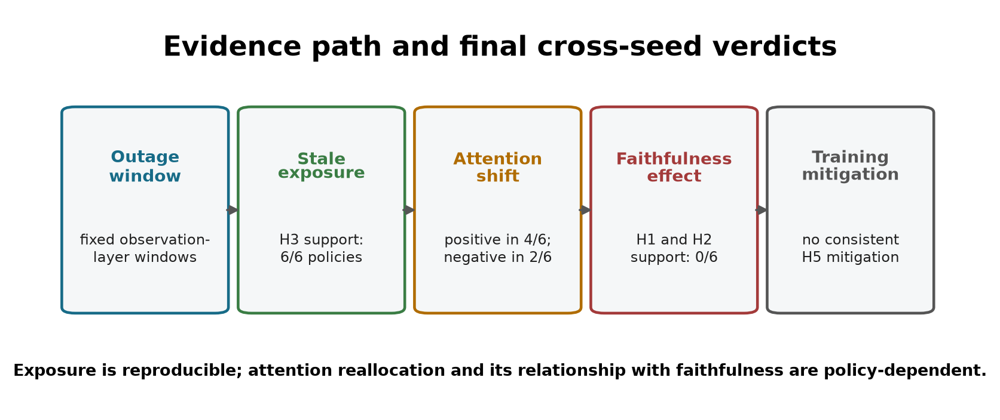

# 5. Discussion

## 5.1 Answer to the central problem

The central problem is whether a complete graph-attention map can be trusted
when some of its vehicle data are stale. The answer from this experiment is:
**not without separate validation**. The study does not validate raw attention
weights as dependable explanations under either clean or degraded telemetry.

Three results lead to this answer. First, clean-telemetry DEF is close to the
type-matched random baseline, so attention has no measured advantage over a
fair random ranking. Second, longer outages reliably increase stale-data
exposure, while the direction of attention reallocation differs between
trained policies. Third, neither a decline in DEF nor a consistent benefit from
degradation-aware training is observed.

The inconsistent attention shifts are therefore part of the answer, not a
failure to reach one. If equivalent training runs produce opposite explanation
responses to the same degradation, the explanation method provides no stable,
model-independent assurance. The thesis does not claim that larger AoI causes
lower faithfulness. It concludes that a visible attention map alone cannot
guarantee either data freshness or decision relevance.

**Figure 5.1.** The final evidence path separates the reproducible manipulation
check from the mixed or unsupported explanation effects. It summarises
cross-seed consistency without presenting outage duration as a direct causal
dose of faithfulness.

## 5.2 Why H3 is useful but limited

H3 is the most reproducible finding. WAMSN rises with outage duration for every
trained B2 and H5 policy. This makes WAMSN useful as an operational exposure
indicator: it can show when an explanation contains more stale-data weight.

WAMSN should not be described as proof that AoI harms faithfulness. The metric
itself weights attention by normalised AoI, so part of its increase follows
from the manipulation. The paired stale-attention shift asks a stronger
question about attention reallocation, and that result is seed-dependent. DEF
asks whether the ranked nodes are decision-relevant, and it does not decline
with duration. Keeping these measures separate prevents an exposure result
from becoming an unsupported causal claim.

## 5.3 Meaning of training-seed variation

Seeds 42 and 43 shift attention toward stale nodes, while seed 44 shifts it
away, under both clean and degradation-aware training. This is not noise at the
decision level: each within-seed estimate is precise. The disagreement occurs
between learned policies.

This distinction matters for trustworthy AI. An explanation method intended
for deployment should not change its qualitative response because the same
architecture was trained with a different random initialisation. A dashboard
validated on one checkpoint may therefore give false confidence about another
checkpoint produced by the same pipeline. Explanation validation needs to be
repeated for each trained model and monitored after retraining.

## 5.4 Role of the construct-validity audit

The audit does not replace the primary experiment. It ensures that the
faithfulness measure is meaningful enough to support it. In this graph,
request nodes are both information and actions. Removing one changes the
decision problem; removing a taxi only hides context. A uniform random
baseline can therefore compare unlike interventions.

Type matching and chosen-action protection make the comparison fairer. Once
those controls are used, DEF is near zero rather than strongly positive or
negative. This finding narrows the interpretation: attention is not shown to
be anti-faithful, but neither is it shown to outperform a fair random ranking.

## 5.5 Degradation-aware training

Training under 30-second tunnel-triggered outages does not solve the problem.
H5 retains the same seed-dependent paired shift as B2. It produces a negative
WAMSN-DEF association for two seeds, but not the third, and one H5 policy has
substantially lower test pickups. Task-reward optimisation gives no explicit
reason for the attention weights to become stable human explanations.

The result does not prove that all robustness training is ineffective. It
shows that this specific intervention is insufficient. A stronger approach
would optimise explanation consistency or faithfulness directly and validate
it across independent training runs.

## 5.6 Practical implications

An operator interface should not label graph-attention weights as reasons
without additional evidence. At minimum, a deployment should:

- display data freshness separately from attention strength;
- monitor stale-node exposure with a metric such as conditional WAMSN;
- run type-aware faithfulness tests for every released checkpoint;
- repeat the audit after retraining, because training seeds can change the
  direction of attention reallocation;
- avoid interpreting stable pickups as evidence that explanations remain
  trustworthy.

## 5.7 Limitations

The study uses one district, 20 taxis, 50 requests, and sparse tunnel exposure.
Only three independent training seeds are available for each policy. This is
enough to reveal heterogeneity but not to estimate a population distribution
of trained-model effects. H5 seed 44 is weak, so architecture and competence
effects cannot be cleanly separated.

The observation corruption freezes position and speed for fixed windows. Real
telemetry may also include delayed packets, partial sensor failure, map
matching errors, and asynchronous recovery. WAMSN depends on the chosen AoI
normalisation, while DEF depends on counterfactual occlusion. Other
faithfulness measures may behave differently.

Finally, the study audits attention as an explanation; it does not claim that
attention is useless inside the policy. A feature can support computation
without being a faithful human-readable reason.

## 5.8 Future work

Future experiments should use more training seeds, multiple cities, and higher
tunnel exposure. They should compare fixed outages with delayed and intermittent
telemetry, and test whether the seed-dependent result remains after policy
performance is improved. Explanation-specific training objectives, independent
post-hoc explainers, and human-facing freshness warnings should be evaluated on
held-out models as well as held-out episodes.
