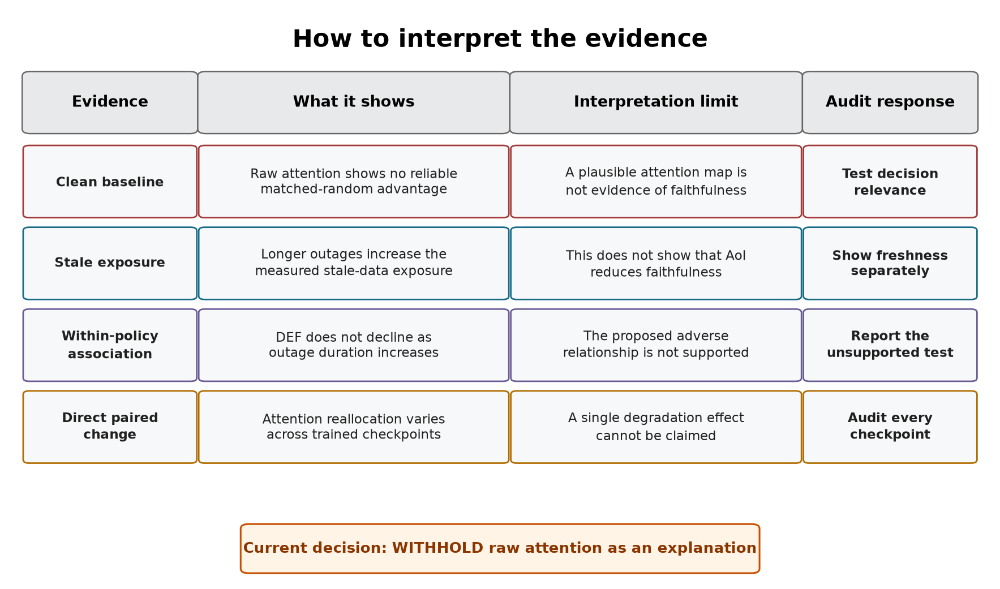
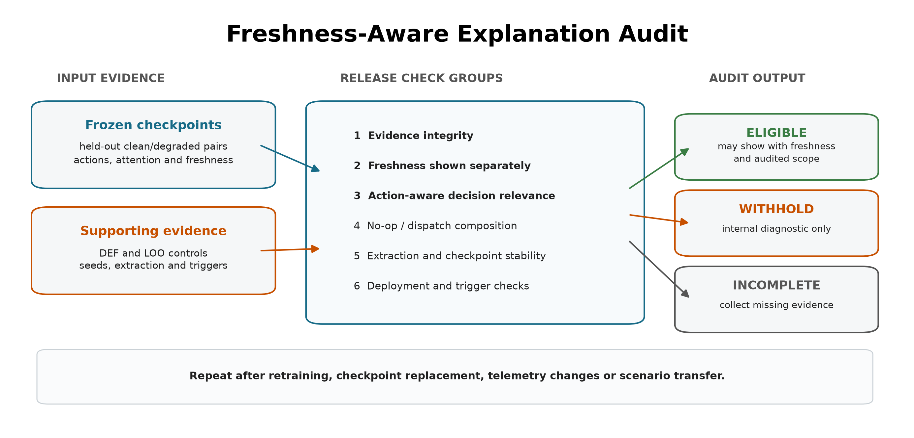

# 5. Discussion

## 5.1 Answer to the central problem

The central problem is whether a graph-attention map can still be trusted when
some vehicle readings are stale. In the tested setting, the averaged self-row attention channel does not
meet the specified explanation-release requirements. The attention map remains available during
an outage, but the results do not show that degradation reduces faithfulness: the clean dispatch control already fails, and paired probability DEF rises
slightly. The evidence is insufficient to show the tested attention map as an
explanation. It does not establish that stale data always cause attention
explanations to fail.

This finding is about explanation reliability, not dispatch performance. A
policy can still select an action while the evidence shown as its explanation
is stale or weakly related to that action. Stable task output therefore cannot
be used to validate the attention map.

The practical result is a release decision. Raw attention should remain an
internal diagnostic unless separate tests establish freshness visibility and
decision relevance. In this study, those tests do not provide sufficiently
consistent evidence, so every tested checkpoint receives `WITHHOLD`.

## 5.2 How to read the evidence

The experiment provides four related but different forms of evidence.

**Clean baseline.** Under clean telemetry, raw-attention margin-DEF is below
its type-matched random control for both models, while the LOO positive control
is clearly above zero. The evaluator can therefore reward a ranking built from
output changes, but raw attention does not provide the required evidence of
decision relevance.

**Stale-data exposure.** WAMSN rises as the outage becomes longer. This shows
that attention-weighted vehicle-information age increases. WAMSN can rise
without any attention reallocation when the same information becomes older;
reallocation is assessed separately using stale-attention share and mass. It does
not show that data age causes faithfulness to decline because AoI is part of the
WAMSN definition.

**Duration and within-policy association.** The proposed negative relationships
are not supported. DEF does not decline as outage duration or WAMSN increases.
The observed directions differ from those predicted, while the failed clean
dispatch control limits any interpretation as improved explanation quality.

**Direct paired change.** The clean/degraded pairs compare the same decision
before and after the observation-layer change. Three checkpoints show a clear
shift toward stale nodes, two show a clear shift away, and one is inconclusive.
DEF increases slightly in all six, which is opposite to the expected decline.
This does not validate attention: the clean decision-relevance control has
already failed.

**Figure 5.1.** How the four forms of evidence should be interpreted. Each form
answers a different question and leads to a separate audit requirement.

These measures answer different questions. WAMSN checks whether stale evidence
is present, the duration tests compare progressively longer outages, and paired shifts
measure the direct response of the same decision to a changed observation.
Keeping them separate prevents a freshness measure from being presented as a
faithfulness effect.

The negative clean result is consistent with the need to test attention rather
than equate it with explanation [12], [13]. It also fits the argument of Shin et al. [46] that naive attention aggregation can miss computation paths. It does
not independently validate their GAtt method, which was not implemented here.
The distinction matters: a failed raw self-row channel leaves room for better
attribution methods but choosing whichever row gives a favorable result after testing would not
validate it.

The separation between stable capability and weak explanation evidence is
also relevant to Li et al. [44] and Azzolin et al. [47]. Their settings show
that correct predictions alone do not guarantee reliable explanations. The present
study finds a similar problem in sequential decision-making.
The mechanisms differ, however: this experiment freezes telemetry features
and audits raw attention, rather than attacking graph edges or constructing
self-explaining classifiers. Its evidence should not be reported as a
replication of their mechanisms or as a comparable numerical effect size.

## 5.3 Why the result is not consistent

**Checkpoint dependence.** Independently trained checkpoints do not respond in
the same direction. The pattern appears under both tunnel and random triggers,
which reduces concern that it is produced only by the chosen tunnel. However,
the random trigger does not create identical stale-node populations and cannot
rule out scenario effects. The result therefore supports checkpoint dependence,
not a general effect of telemetry loss.

**Action composition.** Dispatch accounts for 80.2% of GAT and 69.8% of GAT-Outage
scorable decisions in the corrected experiment. Dispatch DEF increases slightly under degradation,
whereas no-op DEF decreases in every checkpoint. The combined positive shift conceals the decline for no-op decisions, which
require separate interpretation.

**Attention extraction.** Different heads, layers, aggregations, or query rows
can change the direction or strength of the result. The network does not supply
a single, uniquely defined attention map. Any map shown to an operator therefore needs a
predeclared extraction rule that has been tested for stability.

**Action rule.** The main audit samples actions from the learned policy,
matching the declared scope. The smaller deterministic diagnostic also
completes journeys, but it is not part of the confirmatory audit. A deployment
audit must use the same action rule that the deployed system will use.

## 5.4 Why the construct-validity controls matter

A passenger-request node represents both information and an available action.
Removing it can therefore remove the action being explained. A peer-taxi node
is different: removing it hides vehicle information but leaves the action space
unchanged. A uniform random baseline would mix these two effects and could make
an explanation appear stronger simply because an action disappeared.

The type-matched, action-protected baseline makes the comparison fairer. It
compares request nodes with request nodes and taxi nodes with taxi nodes, while
protecting the selected request action. A positive DEF can then be interpreted
as an advantage over comparable random information rather than an advantage
created by deleting the chosen action.

LOO serves as a positive control. It ranks each node by the output change caused
by removing that node, and it produces a clearer DEF response than raw attention
for every checkpoint. This shows that the evaluator can respond to a more
informative perturbation ranking. LOO is not a ground-truth explanation, and it
does not prove that the evaluator captures every form of decision relevance.

The overlap check adds one final limit. In a small graph, explanation and random
top-k sets increasingly share the same nodes as `k` grows. This reduces the
resolution of DEF. Within this limited resolution, the tested attention channel lacks
reproducible evidence of faithfulness. Other extraction or attribution methods
would require their own evaluation.

The controls address a specific instance of the broader evaluator problem
identified by Zheng et al. [43]: perturbations can change what the score
measures. Type matching controls node composition and selected-action
protection prevents deletion of the explained action. Neither guarantees
that every masked graph lies on the training distribution. Similarly,
Azzolin et al. [45] show why different definitions of faithfulness
should not be treated as equivalent. Here probability DEF, margin-DEF and WAMSN
have explicitly different roles. He et al. [65] further caution, through
their theoretical connections, that gradient and perturbation evidence may
share mechanisms. LOO therefore shows that the evaluator responds to the ranking; it does not
independently establish a causal explanation.

## 5.5 Why outage training did not solve the problem

The tested configuration trained with 30-second outages does not solve the
explanation problem. GAT-Outage does not make the direct clean/degraded response
more consistent across independently trained policies. Training with stale
observations may improve robustness for other purposes, but the present results
do not show that it makes raw attention a more reliable explanation.

The different training budgets also prevent us from isolating the effect of
training with degraded observations. In addition, the reward contains no term for
explanation stability or faithfulness. A future
test of model improvement would require a common training budget, independent
training runs, and an explicit explanation objective.

Recent delay-aware methods such as DFBT [56] and robust communication methods
such as MAGI [59] optimize state estimation or useful information exchange.
They suggest candidate model improvements, but their objectives differ from
the present release criteria. A future comparison would have to evaluate dispatch capability and apply the same action-aware explanation
protocol without changing its rules.
Cross-paper rewards or prediction accuracies cannot substitute for this
matched comparison because tasks, action spaces and degradation mechanisms
differ.

## 5.6 Proposed audit framework

### 5.6.1 Purpose and scope

The **freshness-aware explanation audit framework** combines these
checks to decide whether there is enough evidence to show an attention map
as an explanation to an operator. It evaluates the evidence for a frozen policy
within specified operating conditions.
Table 5.1 links each observed risk to the required evidence and decision rule.

| Observed risk | Required check | Evidence | Decision rule |
|---|---|---|---|
| Attention may be attached to stale data | Report freshness separately | AoI and WAMSN | Never infer freshness from attention strength |
| Attention may not identify decision-relevant nodes | Use action-aware, type-matched tests | DEF, margin-DEF, and LOO | Do not claim a reason without evidence of decision relevance |
| Combined results may be dominated by the majority action group | Report no-op and dispatch groups | Action counts and action-specific DEF | Do not generalize a combined result across action types |
| The result may depend on attention extraction | Test the query row, layer, head, and aggregation | Sensitivity audits | Predeclare the extraction rule and report material sensitivity |
| One checkpoint may not represent another | Audit each checkpoint before release | Per-checkpoint results | Repeat after retraining or replacement |
| A pattern may not reproduce | Compare independent training runs | Results across seeds | Require a consistent conclusion across runs |
| The audited action may differ from deployment | Test the intended deployment action rule | Sampled-policy or argmax capability evidence | Require argmax capability only when deployment uses argmax |
| A tunnel-specific pattern may not transfer | Compare tunnel and random triggers | Paired shifts and 95% confidence intervals | Withhold when supported directions conflict or remain indeterminate |

The framework is intended for offline release review before an attention map is
shown to a dispatcher or other operator. It should be repeated after retraining,
checkpoint replacement, changes to the telemetry or graph pipeline, transfer to
a new operating scenario, and during periodic model review. It is not a live
freshness monitor. A deployed system must still display freshness separately and
suppress or warn about explanations based on stale inputs. Figure 5.2 shows the
corresponding offline audit workflow.

**Figure 5.2.** Saved evidence from frozen checkpoints passes through nine
release checks, grouped here into six categories. The output controls whether
attention may be presented as an explanation; it does not alter the model or
selected action.

### 5.6.2 Inputs, outputs and use

The framework accepts evidence rather than raw attention alone. Table 5.2
summarizes its inputs and outputs.

| Component | Contents | Role in the audit |
|---|---|---|
| Candidate scope | frozen checkpoints, model names, training seeds, and held-out conditions | defines exactly what the decision covers |
| Freshness evidence | paired clean/degraded records, AoI, stale-node masks, WAMSN, and stale-attention shift | separates data age from attention strength |
| Faithfulness evidence | type-matched and action-protected DEF, LOO, and dispatch-action results | tests whether highlighted nodes matter to the action |
| Stability evidence | action groups, extraction alternatives, checkpoint synthesis, deployment-action diagnostic, and trigger comparison | tests whether the conclusion survives relevant choices |
| Audit output | per-check status, per-checkpoint decision, model decision, failed reasons, and permitted use | supports a traceable explanation-release decision |

The operating procedure is:

1. freeze the candidate checkpoint and evaluation protocol;
2. generate paired freshness, action-aware faithfulness, action-composition, and
   sensitivity evidence on held-out demand;
3. run preflight to establish that the evidence is complete and valid to
   analyze;
4. apply every release check to each checkpoint and then compare independent
   training runs;
5. present attention externally only if the result is `ELIGIBLE`, together with
   its freshness indicator and audited scope.

A preflight `PASS` is not an explanation-release pass. It only confirms that the
evidence can be analyzed. The release output is `ELIGIBLE`, `WITHHOLD`, or
`INCOMPLETE`. Individual checks may also be `INDETERMINATE` when the evidence is
complete but does not support a direction. A failed or indeterminate required
check produces `WITHHOLD`; missing evidence produces `INCOMPLETE`. In both
cases, attention must not be presented as the reason for the action.

### 5.6.3 Application to this study

Applying the framework to the completed evidence gives `WITHHOLD` for GAT and
GAT-Outage and for all six individual checkpoints. The decision follows from
insufficient support for explanation release: the dispatch-action
decision-relevance intervals do not exceed the matched-random boundary,
attention extraction can reverse the stale-attention direction, and the
stale-attention response changes direction across training seeds. The random
trigger check passes for GAT-Outage but is indeterminate for GAT because one
checkpoint interval crosses zero. The argmax diagnostic completes journeys,
but it remains descriptive because the audit scope uses sampled actions.

The supplementary no-op results (Section 4.12) include positive absolute
margin-DEF for some checkpoints in both clean and degraded conditions. The
whole-channel WITHHOLD decision should therefore not be read as a universal
no-op failure. H5 also describes weaker associations rather than reduced
variation; consistency is assessed from per-checkpoint results.

Sampled dispatch performance provides evidence of task capability, but it
cannot show that the displayed reason is current or decision-relevant.

The framework checks whether an explanation has enough evidence to be shown; it
does not make the model itself more faithful. Improving the model would require
an explicit explanation objective and independent evaluation, as discussed in
Section 5.8.

The current study demonstrates the framework's rejection path but does not show
that a real trained model can reach `ELIGIBLE`. The LOO positive control shows
that the evaluator can reward a more informative ranking, while software tests
confirm that complete passing evidence produces an `ELIGIBLE` decision. A future model trained for faithfulness is still needed to demonstrate that
a trained policy can meet all the release requirements. Future evaluations should retain criteria fixed before testing. The audit's confidence intervals
also differ from the formal model-level sufficiency certificates of Saha and
Bandyopadhyay [55]. The present framework provides release checks for the stated operating
conditions, but it offers no equivalent distribution-free guarantee.

## 5.7 Limitations

The study uses one simulated district, 20 taxis, and 50 requests. Tunnel
exposure remains scenario-dependent, although the event-aware audit scores
every observed stale-exposed decision. It evaluates three independent training
seeds per model. Three seeds reveal variation but cannot estimate the wider
distribution of training outcomes. The selected policies pass the training
stability gates, but their held-out completed-journey results overlap the
legal-random CI and the simple greedy range. These baselines show that the policies can complete journeys, but do not
establish a performance advantage. The experiment also
does not isolate the contribution of graph edges to policy capability.

Clean GAT and GAT-Outage also use different maximum training budgets and
learning-rate decay horizons, selected from validation-only stability
diagnostics. Their matched-seed comparison describes the two fitted
configurations but cannot isolate the effect of degraded training observations.

The local graph is small. Type matching makes random top-k sets overlap heavily
with the explanation, which compresses DEF. LOO is based on the same
single-node perturbation as comprehensiveness and is not an independent ground
truth explanation. Other perturbation choices or post-hoc explainers may give
different results.

The degradation layer freezes position and speed for fixed windows. Real
telemetry may include delayed packets, partial failures, map-matching errors,
and readings that resume updating at different times. The study audits attention as an explanation; it
does not claim that attention is useless inside the policy computation.

The paired clean/degraded comparison supports internal validity for the tested
observation-layer change because both observations come from the same simulated
traffic state. Simulation and scenario-design bias remain. Road-network choice,
generated demand, vehicle behavior, and
tunnel placement may affect which taxis become stale and how those taxis are
positioned in the local graph. In particular, taxis exposed at a fixed tunnel may differ from those elsewhere if traffic
conditions at the tunnel differ from the rest of the network. The conclusions are therefore limited to the tested SUMO setting and
should not be read as population estimates for real fleets or cities.

The descriptive EDA adds another boundary: test demand has a lower median
straight-line origin-destination separation than training demand, while all
splits share taxi initialization, background traffic and road geometry.
Repeating evaluation with different seeds varies the sampled actions; it
does not test new cities or independently generated demand processes. Historical CPU model,
installed memory and complete stage timings were not retained, limiting
assessment of computational cost and exact hardware reproducibility.

## 5.8 Future work

Three directions follow from these limitations. The first is a matched
comparison of clean and outage training using common budgets, learning-rate
schedules and checkpoint-selection rules, with more independent training
seeds. Per-seed capability and paired DEF should be evaluated on untouched
demand. Recording CPU/GPU details, memory use and elapsed time for each stage
would also allow computational cost to be assessed.

The second is broader evaluation across road networks, demand processes,
public mobility traces and telemetry failures. Varying tunnel placement and calibrating random-loss rates
on development data would help separate trigger location, exposure frequency
and outage duration. Delayed, intermittent and biased telemetry should be
compared with fixed freezes, with realized exposure reported alongside
faithfulness. Disconnected-edge and message-passing ablations would clarify
the contribution of the graph to dispatch capability.

The third is to evaluate alternative graph explainers and training objectives
that reward explanation consistency. Computation-path attribution and
graph-specific post-hoc methods could be compared with LOO on independent
checkpoints using release criteria fixed before testing. Both rejected and
eligible candidates are needed to evaluate the framework fully. A subsequent
human-factors study could assess whether freshness warnings help operators
interpret the explanations; COViz [63] illustrates why human understanding
requires a separate evaluation.
