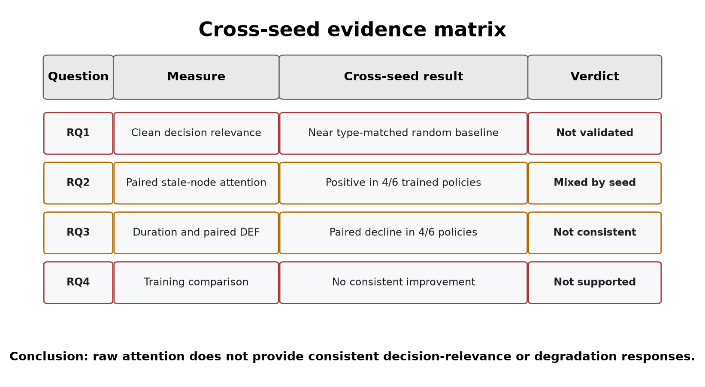

# 5. Discussion

## 5.1 Answer to the central problem

The central problem is whether a complete graph-attention map can be trusted
when some of its vehicle data are stale. The results show that **separate
validation is required**. Raw attention alone provides no reliable evidence of
freshness or decision relevance.

This conclusion is based on several results, not one p-value. Longer outages increase stale-data
exposure, and the combined within-policy tests associate that exposure with
lower DEF in all six checkpoints. The direct clean-twin comparison is less
uniform: attention reallocation and paired DEF shift have the expected signs
in their point estimates for checkpoints trained with seeds 42 and 43, but
both signs reverse for checkpoints trained with seed
44 under both training regimes. The measured effects are also small.

The action-stratified results limit how broadly this finding can be interpreted. Chosen
no-op actions account for 93.0% of eligible decisions, and the combined H1 and
H4 patterns are not reproduced among dispatch actions. Four checkpoints also
change paired-DEF direction between the combined and dispatch strata. The
primary statistics describe the sampled action mixture, not a
universal explanation response for both dispatch and no-op decisions.

The supporting controls make the interpretation stronger and narrower. The
LOO-ranked control produces a positive DEF for every checkpoint, so the
evaluator has some sensitivity to a perturbation-based ranking. However,
expected top-k overlap reaches about
60% at `k=3`, which limits resolution. Taxi-only attention-LOO correlation is
positive but varies substantially in strength. These checks do not show that
the evaluator is perfect and attention fails. They show that, within the
evaluator's measured but limited resolution, raw attention lacks reproducible
evidence of explanation faithfulness.

**Figure 5.1.** Cross-seed results for the four research questions. The matrix
keeps clean faithfulness, paired attention response, paired DEF response, and
the effect of degradation-aware training as separate findings.

## 5.2 What the stale-exposure result means

WAMSN rises with outage duration for every GAT and GAT-Outage checkpoint. It is
useful as an operational exposure indicator: it shows when an attention map
contains more weight attached to old vehicle readings.

WAMSN is not evidence that AoI causes lower faithfulness. The metric itself
weights attention by normalized AoI, so part of the increase follows directly
from the manipulation. H1 and H4 show that DEF tends to be lower at greater
exposure within most frozen policies. The paired audit asks a stricter
question: does replacing the current observation with its degraded twin
change attention and DEF at the same decision? That result changes sign across
checkpoints trained with different seeds. Exposure, within-policy association,
and paired intervention answer different questions and should be reported
separately.

## 5.3 Dependence on checkpoint and analysis choice

The primary aggregation gives positive stale-attention shifts for checkpoints
trained with seeds 42 and 43 and negative shifts for checkpoints trained with
seed 44. The values are small: approximately
-0.0035 to +0.0041 of total attention mass. Paired probability-DEF shifts are
also small and reproduce the same direction in both training regimes. This
shared pattern across the two model conditions suggests sensitivity to the
trained checkpoint, not a stable response created by outage-aware training.
The between-checkpoint range is larger than the observed difference between
the two training-condition means. With only three training seeds, this is a
descriptive comparison of selected checkpoints, not a variance decomposition
or evidence that the seed value itself causes the response.

The random-trigger sensitivity analysis checks whether this pattern is only an
artifact of the fixed tunnel location. The same attention-shift direction
appears in five of six checkpoints, and the same probability-DEF direction in
four of six. The
seed-42 positive attention pattern and seed-44 negative pattern appear under
both triggers and both training regimes. This makes a tunnel-only explanation
less plausible, but it is not a complete location control. A fixed trigger
probability produces different realized exposure rates after each policy
changes taxi trajectories, and the identity of the stale taxis also changes.
The result supports checkpoint dependence but cannot establish one general
effect of random or tunnel-triggered loss.

The paired probability-DEF effects are small and may have little operational
importance. The concern is not a large universal decline. Instead, even these
small changes reverse direction across independently trained checkpoints, while
raw clean-telemetry DEF is already near its matched control. Together, these
results do not provide a consistent basis for trusting the explanations, but
they also do not show large damage from telemetry degradation.

The aggregation audit identifies a second problem. Individual heads can reverse
the sign within the same checkpoint. The six checkpoint ranges extend from
-0.0109 to +0.0089 across the tested reductions. Selecting another head or
layer after seeing the data could change the verbal conclusion. The
declared mean remains the primary result, but the sensitivity analysis shows
that it is not a unique explanation produced by the network.

Query-row choice is similarly checkpoint-dependent. The selected request row
improves request-action DEF by about 0.0064 for GAT seed 43 and 0.0073 for
GAT-Outage seed 43, but changes little for the other four checkpoints. One
query-row change therefore cannot be assumed to correct near-zero or negative
DEF. An operator-facing attention map needs a declared and tested rule for
choosing its query, layer, and heads.

The deterministic diagnostic reveals a related policy limitation. All six GAT
checkpoints choose no-op in all 18 argmax episode evaluations, although their
sampled policies outperform the declared lower bounds. This limitation does not
invalidate the faithfulness calculations for sampled actions, but it means that
the experiment audits stochastic policy decisions rather than a deployable
deterministic dispatcher. The audit framework should report action composition
and deterministic behavior before showing an attention map to an operator.

## 5.4 Role of the construct-validity audit

The construct-validity audit supports the primary experiment. Request nodes
are both information and actions; peer taxis are context only. Uniform random
deletion therefore creates a large action-removal artifact. Type matching and
chosen-request protection make the comparison fairer.

The LOO control checks a different question: can DEF respond when nodes are
ranked by their own single-node margin loss? Its consistently positive result
shows limited sensitivity, mainly for comprehensiveness. It is a positive
control, not ground truth for the combined comprehensiveness-sufficiency score.
Gradient x Input changes
sign across checkpoints and is not automatically a stronger explanation in
this task.

Together, these checks change the conclusion from a simple “attention is near
random” statement to a more defensible one. Raw attention remains below the
LOO control in all six checkpoints and has positive taxi-only agreement with
LOO, but both DEF and rank agreement vary by trained policy. The aggregation
and query-row audits add further sensitivity. This provides some evidence of
decision relevance, but not enough to treat attention as reliable by default.

The top-k diagnostic further limits this interpretation. Attention-LOO overlap
is above the expected matched-random overlap at `k=1`, but it offers no clear
advantage over that baseline at `k=3`. This is consistent with reduced
resolution as larger subsets overlap, not proof that the top attention node is
the model's true reason or that every three-node display is random.

## 5.5 Degradation-aware training

Training with 30-second outages does not solve the explanation problem.
GAT-Outage shows the same seed-dependent attention and paired DEF directions
as GAT. It strengthens the H1 and H4 associations, but does not make the direct
degraded-minus-clean response consistent across independently trained
policies.

These findings apply only to the tested form of robustness training. The reward
contains no term for explanation stability or faithfulness, so task-reward
optimization alone is not designed to align attention with a human explanation.
A future intervention would need an explicit explanation objective and
evaluation on independently trained models.

## 5.6 Proposed audit framework

To address this risk, the thesis proposes a **freshness-aware explanation audit
framework**. The framework leaves the trained policy unchanged and does not
claim to make attention faithful. Instead, it sets rules for deciding when an
attention map has enough evidence to be shown as a trustworthy explanation.
Table 5.1 links each observed risk to the required evidence and decision rule.

| Observed risk | Required check | Evidence | Decision rule |
|---|---|---|---|
| Attention may be attached to stale data | Report freshness separately | AoI and WAMSN | Never infer freshness from attention strength |
| Attention may not identify decision-relevant nodes | Use action-aware, type-matched tests | DEF, margin-DEF, and LOO | Do not claim a reason without evidence of decision relevance |
| Combined results may be dominated by no-op | Report no-op and dispatch strata | Action counts and stratified DEF | Do not generalize a combined result across action types |
| The result may depend on attention extraction | Test the query row, layer, head, and aggregation | Sensitivity audits | Predeclare the extraction rule and report material sensitivity |
| One checkpoint may not represent another | Audit each checkpoint before release | Per-checkpoint results | Repeat after retraining or replacement |
| A pattern may not reproduce | Compare independent training runs | Results across seeds | Require a consistent conclusion across runs |

Apply the checks in order: report freshness and action composition separately;
run the action-aware audit; predeclare and test the attention extraction rule;
audit every candidate checkpoint; and require a consistent conclusion across
independent training runs. If any check fails, the attention map remains an
internal diagnostic.

Sampled dispatch performance provides evidence of task capability, but it
cannot show that the displayed reason is current or decision-relevant.

The framework checks whether an explanation has enough evidence to be shown; it
does not make the model itself more faithful. Improving the model would require
an explicit explanation objective and independent evaluation, as discussed in
Section 5.8.

## 5.7 Limitations

The study uses one simulated district, 20 taxis, and 50 requests. Tunnel
exposure remains scenario-dependent, although the event-aware audit scores
every observed stale-exposed decision. It evaluates three independent training
seeds per model. Three seeds reveal variation but cannot estimate the wider
distribution of training outcomes. The selected policies
pass the training stability gates and their stochastic evaluations outperform
random and greedy lower bounds. However, every selected GAT checkpoint
collapses to no-op under the small deterministic check. The study therefore
cannot establish deterministic deployment capability or isolate the
contribution of graph edges to sampled capability.

The local graph is small. Type matching makes random top-k sets overlap heavily
with the explanation, which compresses DEF. LOO is based on the same
single-node perturbation as comprehensiveness and is not an independent ground
truth explanation. Other perturbation choices or post-hoc explainers may give
different results.

The degradation layer freezes position and speed for fixed windows. Real
telemetry may include delayed packets, partial failures, map-matching errors,
and asynchronous recovery. The study audits attention as an explanation; it
does not claim that attention is useless inside the policy computation.

The paired clean/degraded comparison supports internal validity for the tested
observation-layer change because both observations come from the same simulated
traffic state. Simulation and scenario-design bias remain. Road-network choice,
generated demand, vehicle behavior, and
tunnel placement may affect which taxis become stale and how those taxis are
positioned in the local graph. In particular, a fixed tunnel can create an
exposure-selection effect if its traffic conditions differ from the rest of the
network. The conclusions are therefore limited to the tested SUMO setting and
should not be read as population estimates for real fleets or cities.

## 5.8 Future work

Future experiments should add training seeds and use multiple road networks,
demand levels, tunnel placements, and public mobility traces. The present
random-trigger control should be extended to several calibrated exposure rates
and persistent loss processes so that trigger location, exposure frequency,
and outage duration can be separated. Experiments should also include
disconnected-edge and message-passing ablations to establish how much the policy uses its
graph channel. Delayed, intermittent, and biased telemetry should be compared
with fixed freezes.

The explanation audit should also compare LOO with graph-specific post-hoc
methods and evaluate objectives that directly reward explanation consistency.
Any proposed improvement should be tested on held-out checkpoints, not only on
more episodes from one trained model. A human-factors study could then test
whether explicit freshness warnings lead operators to interpret the map more
appropriately.
